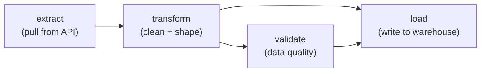

# Day 11 — What is Pipeline Orchestration? DAGs Explained

> Module 2: Workflow Orchestration

## The problem orchestration solves

You can get a long way with a cron job and a script. `0 2 * * * python load_data.py` runs
your job at 2am, and for a while that's fine. Then reality shows up:

- The job has **three steps**, and step 2 must not run if step 1 failed — but cron doesn't
  know about steps, it just fires the script.
- Step 2 **failed at 2:03am** because an API was down. Did anyone notice? Did it retry?
  When you find out at 9am, how do you re-run *just* that step?
- Marketing asks you to **re-process last March**. Your script only knows "now".
- A second pipeline needs to run **only after** the first one finishes. Now you're
  hard-coding `sleep` statements and hoping.
- Someone asks "**did last night's run succeed?**" and your answer is to SSH in and grep logs.

Every one of those is a scheduling-and-dependencies problem, and that's what an
**orchestrator** is for. Orchestration is the discipline of turning ad-hoc scripts into
**reliable, repeatable, observable** pipelines. A good orchestrator gives you:

- **Dependency management** — "run B only after A succeeds", expressed explicitly.
- **Scheduling** — time-based *and* event/dependency-based, not just cron.
- **Retries & alerting** — automatic retries with backoff, and a shout when something fails.
- **Backfilling** — re-run a pipeline over a historical date range on purpose.
- **Observability** — a UI showing every run, every task, every log, and its state.
- **Parameterisation & idempotency** — the same pipeline run for any date, safely re-runnable.

## DAGs: the core idea

The model almost every orchestrator uses is the **DAG** — a **Directed Acyclic Graph**.
Break that down:

- **Graph** — a set of **tasks** (nodes) connected by **dependencies** (edges).
- **Directed** — the edges have a direction: A → B means "A must finish before B starts."
- **Acyclic** — no cycles. You can't have A → B → A; that would be a pipeline that can never
  finish. Acyclic guarantees there's always a valid order to run things in.

A simple ingestion pipeline as a DAG:

That picture *is* the schedule. The orchestrator reads it and knows: run `extract`; when it
succeeds run `transform`; then run `validate` and `load`, but only start `load` once *both*
`transform` and `validate` have passed. If `extract` fails, nothing downstream runs, you get
alerted, and you can re-run from the failure — not from scratch.

The tasks themselves can be anything: a Python function, a SQL query, a Spark job, a
container. The DAG doesn't care *what* a task does — only *when* it should run and *what it
depends on*. That separation is the whole trick.

## Where Airflow fits

**Apache Airflow** is the most widely-used orchestrator — the de-facto industry standard —
and it's what this course uses. Its defining choice is **"pipelines as code"**: you define
DAGs in Python, so they're versioned, reviewed, and tested like any other software.

It's not the only option, and it's worth knowing the landscape:

- **Dagster** — asset-centric, strong typing and local dev experience.
- **Prefect** — Pythonic, dynamic workflows, lighter-weight feel.
- **Argo Workflows** — Kubernetes-native, container-per-step, less data-specific.

We use Airflow because it's ubiquitous (you'll meet it everywhere), has an enormous
ecosystem of integrations, and runs cleanly on Kubernetes — which is the foundation this
whole series is built on.

## Summary

Orchestration turns scripts into dependable pipelines: dependencies, scheduling, retries,
backfills, and observability. The model is the **DAG** — tasks connected by directed,
acyclic dependencies — and the DAG defines exactly what runs, in what order, and what
happens when something fails. Tomorrow (Day 12) we open up **Airflow specifically** — its
core concepts and the moving parts that make it work — before we start writing DAGs against
the instance we deployed in Day 13.
