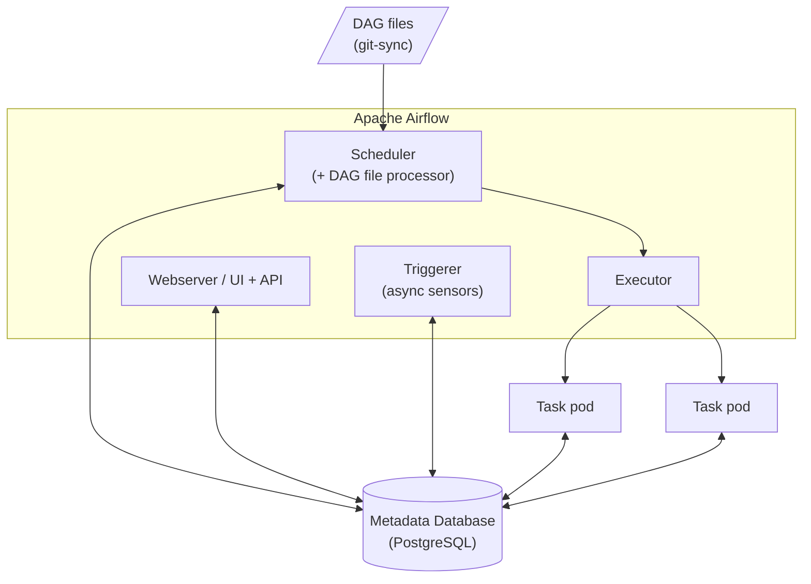

# Day 12 — Apache Airflow: Core Concepts & Architecture

> Module 2: Workflow Orchestration

Yesterday (Day 11) we covered orchestration and DAGs in the abstract. Today we make it
concrete: the vocabulary you need to read and write Airflow, and the moving parts that run
it — the same parts we deployed in Day 13.

## The core concepts (the vocabulary)

- **DAG** — a pipeline, defined in a Python file. It has an `dag_id`, a `schedule`, a
  `start_date`, and a set of tasks with dependencies. The Python file is called a *DAG file*
  and lives in Airflow's `dags/` folder.
- **Task** — a single unit of work in a DAG (a node in the graph).
- **Operator** — the *template* a task is built from; it defines what the task actually does.
  The common families:
  - **Action operators** — do something: `BashOperator` (run a command), `PythonOperator`
    (run a function), and provider operators like `PostgresOperator` or a Spark submit.
  - **Sensors** — *wait* for something: a file to land, a partition to appear, a time to pass.
  - **Transfer operators** — move data between systems.
- **Dependencies** — how tasks are wired: `extract >> transform >> load`. The `>>` operator
  literally builds the DAG's edges.
- **DAG Run** — one execution of a DAG for a particular *logical date* (e.g. "the run for
  2026-08-20"). A DAG has many runs over time.
- **Task Instance** — one task within one DAG run. This is the thing that has a *state*:
  `queued`, `running`, `success`, `failed`, `up_for_retry`, `skipped`…
- **Scheduling** — `schedule` (cron, a preset like `@daily`, or a dataset trigger),
  `start_date` (when the schedule begins), and `catchup` (whether to run all the intervals
  since `start_date`, or just go forward — usually you want `catchup=False`).
- **Connections & Hooks** — a **Connection** stores credentials/endpoints for an external
  system (a database, S3, an API); a **Hook** is the client code that uses it. This keeps
  secrets out of your DAG code.
- **XComs** — small pieces of data passed *between* tasks ("cross-communication"). Good for
  a filename or an ID; not for passing large datasets around.
- **Variables & Pools** — Variables are key/value config; Pools limit how many tasks of a
  kind run concurrently (e.g. "at most 3 hits to this fragile API at once").

A minimal DAG ties several of these together:

```python
with DAG(dag_id="daily_load", schedule="@daily",
         start_date=datetime(2026, 1, 1), catchup=False) as dag:
    extract  = PythonOperator(task_id="extract",  python_callable=pull_api)
    load     = PythonOperator(task_id="load",     python_callable=write_db)
    extract >> load          # dependency: load runs after extract succeeds
```

## The architecture (the moving parts)

Airflow isn't one process — it's a few cooperating components, all coordinating through a
central database:



- **Metadata Database** — the single source of truth. Every DAG, run, task-instance state,
  connection, and variable lives here. *This is why it matters that it's reliable and backed
  up* — lose it and you lose all pipeline state. (In this series it's the highly-available,
  Barman-backed CloudNativePG cluster from Module 1.)
- **Scheduler** — the brain. It reads the DAG files, works out which task instances are due
  (dependencies met, schedule hit), and hands them to the executor. A built-in **DAG file
  processor** continuously parses the `dags/` folder so new/changed DAGs show up.
- **Executor** — *how* tasks run. This is the big architectural choice:
  - **LocalExecutor** — tasks as subprocesses on the scheduler's node. Simple, single-node.
  - **CeleryExecutor** — a pool of persistent worker processes fed by a Redis/RabbitMQ broker.
  - **KubernetesExecutor** — **one pod per task**, created on demand, no idle workers, no
    broker. This is what we run — it's the natural fit when you already have a cluster, and
    it's why in Day 13 you see a fresh pod appear for every task and vanish when it's done.
- **Webserver** — the UI and REST API. It renders the DAGs, run history, logs, and lets you
  trigger/pause DAGs. It reads everything from the metadata DB.
- **Triggerer** — runs *deferrable* operators/sensors asynchronously, so a task that's just
  "waiting for something" doesn't tie up a whole worker slot.
- **DAG files** — your pipelines, delivered into the components. We use **git-sync**: a
  sidecar pulls the `dags/` folder from Git, so pushing a DAG makes it appear.

The flow, end to end: git-sync drops a DAG file → the scheduler parses it and, when a run is
due, sends its tasks to the executor → the KubernetesExecutor launches a pod per task → each
task reports its state back to the metadata DB → the webserver shows you all of it.

## A principle to carry forward: idempotency

Because Airflow re-runs things — retries, backfills, manual re-triggers — tasks should be
**idempotent**: running the same task for the same logical date twice should produce the
same result, not duplicate data. Design tasks to *overwrite the partition for their date*
rather than *append blindly*. We'll come back to this hard in later modules, but it starts
here — it's a direct consequence of the orchestration model.

## Summary

Airflow is a Python-defined orchestrator built from a **scheduler**, an **executor**, a
**webserver**, and a **metadata database**, with your **DAGs** delivered in as code. The
vocabulary — DAGs, tasks, operators, DAG runs, task instances, connections — is the language
of every later module. You've already deployed this architecture (Day 13) with the
KubernetesExecutor on top of your Module 1 storage and database; next (Day 14) we write a
real DAG against it.
