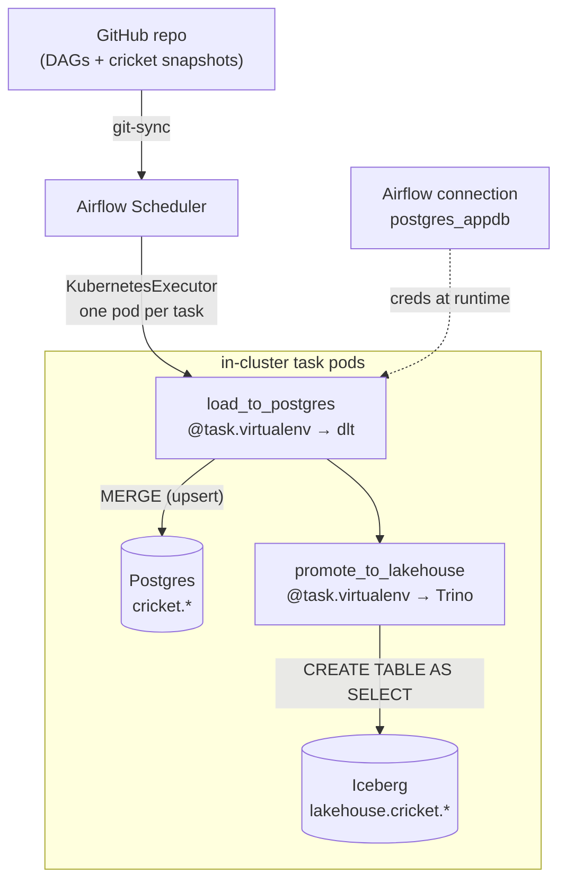
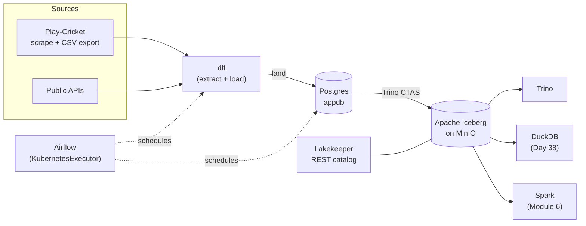

# Day 27 — Running dlt inside Airflow

> Workshop: Data Ingestion (finale)

Days 22–26 ran dlt from a laptop. Real ingestion runs **on a schedule, in the cluster, next to
the data**. Today we put dlt under Airflow — closing the loop between Module 2 (orchestration)
and the ingestion workshop.

## The idea

Airflow runs on **KubernetesExecutor**, so every task becomes its own pod. A task pod can reach
`pg-rw.postgres.svc`, `trino.lakehouse.svc` and the internet directly — no LoadBalancers, no
laptop. Two wrinkles to handle cleanly:

- **dlt isn't in the Airflow image.** We use `@task.virtualenv`: Airflow builds a fresh
  virtualenv *inside the task pod*, pip-installs dlt, and runs the function there. Setting
  `system_site_packages=True` also exposes Airflow to that venv, so the code can read Airflow
  **connections**.
- **No secrets in a public repo.** Credentials come from the Airflow connection `postgres_appdb`
  (created back in Module 2), fetched at runtime with `BaseHook.get_connection(...)`. Trino needs
  no auth. Nothing sensitive is written into the DAG.

## How a scheduled dlt run executes



## Generic example

[`dlt_in_airflow.py`](../examples/module2-airflow/dags/dlt_in_airflow.py) — the smallest possible
"dlt as a scheduled task": pull a public API into Postgres, daily. It's the Day 22 pipeline,
unchanged, wrapped in `@task.virtualenv`. *Where* it runs changed; the dlt code didn't.

## Applied example (🏏)

[`cricket_lakehouse.py`](../examples/module2-airflow/dags/cricket_lakehouse.py) runs the **whole
platform on a schedule** (Mondays, after the weekend's fixtures):

1. **`load_to_postgres`** — dlt fetches the batting/bowling/fielding snapshots and **merges** them
   into Postgres `cricket.*` (Day 24's incremental, now scheduled — re-run after each match, rows
   upsert).
2. **`promote_to_lakehouse`** — Trino CTAS materialises them as Iceberg tables (Day 26).

So the same flow we built by hand across the workshop now runs itself, unattended.

## The whole platform, one picture



## Running it

DAGs reach Airflow via **git-sync**, so:

```bash
git add examples/module2-airflow/dags && git commit -m "Day 27 DAGs" && git push   # git-sync picks them up
```

Then in the Airflow UI (`https://airflow.192.168.169.190.nip.io`): unpause **`dlt_in_airflow`**
and **`cricket_lakehouse`** and trigger a run. First run is slower (each task pip-installs dlt in
its venv, ~1–2 min); a prebuilt image is the production optimisation.

## Summary

dlt runs unchanged as an Airflow task on **KubernetesExecutor** (one pod per task), using
`@task.virtualenv` to bring dlt in and Airflow **connections** to keep secrets out of the repo.
The cricket DAG now orchestrates the full path — **fetch → dlt merge → Postgres → Trino CTAS →
Iceberg** — on a weekly schedule. That completes the ingestion workshop: from a hand-run laptop
script to a scheduled, in-cluster pipeline feeding the lakehouse. Next: **Module 4 (dbt)** turns
`lakehouse.cricket.*` into tested, documented models.
