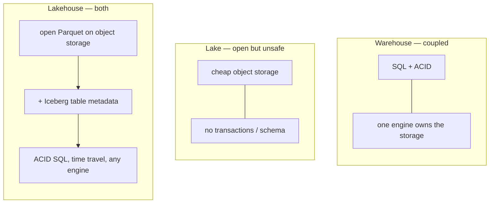

# Day 28 — Data Lake vs Data Warehouse vs Lakehouse

> Module 3: Data Lakehouse

Module 2 landed data in two very different places without ever naming the pattern. dlt dropped
**raw JSON files into MinIO** (`datalake` bucket, Day 14) *and* loaded **typed rows into Postgres**
(`cricket.*`, Days 22–25). Those are the two classic architectures — a **data lake** and a **data
warehouse** — and the **lakehouse** we built in Module 3 is the attempt to get the best of both.

## The three, and what actually differs

| | Data warehouse | Data lake | Lakehouse |
|---|---|---|---|
| **Stores** | Tables (proprietary format) | Files (Parquet/JSON/CSV) on object storage | Files on object storage **+ a table layer** |
| **Schema** | On write (strict) | On read (whatever the query assumes) | On write, but **open** (Iceberg metadata) |
| **Strengths** | Fast SQL, ACID, governance | Cheap, any data, any engine | Both — cheap storage **and** ACID SQL |
| **Weaknesses** | Expensive, storage+compute coupled, one engine | No transactions, no schema safety, "data swamp" | More moving parts (catalog + engine + storage) |
| **Our stack** | PostgreSQL (`appdb`) | MinIO (`datalake` raw files) | Iceberg on MinIO + Lakekeeper + Trino |

The warehouse gives you `SELECT` with guarantees but locks data inside one engine and bills you to
keep compute next to storage. The lake gives you cheap, open storage but no `UPDATE`, no
transactions, and nothing stopping today's file from silently breaking yesterday's query.

## What the lakehouse actually adds

A lakehouse is **a lake with a table format on top**. The bytes are still open Parquet in object
storage (lake economics, any engine can read them), but a metadata layer — **Apache Iceberg** —
turns a directory of files into a *table* with:

- **ACID transactions** — an `INSERT`/`UPDATE`/`DELETE` either fully happens or doesn't; no reader
  ever sees a half-written state.
- **schema on write + evolution** — add/rename/drop columns safely, tracked in metadata.
- **snapshots & time travel** — every commit is a version you can query or roll back to (Day 30).
- **engine independence** — Trino, DuckDB, Spark all read the *same* table (no re-export).

## Applied example (🏏)

The cricket data has already lived in all three:

- **Lake** — the raw scrape/exports (`batting_2026_v*.json`, `bowling_2026_v*.xlsx`) and the raw
  weather JSON dlt wrote to `s3://datalake/`. Cheap, but you can't `SELECT` them with guarantees.
- **Warehouse** — dlt loaded typed, merged rows into Postgres `cricket.batting/bowling/fielding`.
  Great for SQL, but locked in Postgres and coupled to that one server.
- **Lakehouse** — Day 26 promoted those into **Iceberg** tables (`lakehouse.cricket.*`) on MinIO.
  Same open Parquet bytes a data lake would hold, but now with ACID, snapshots, and readable by
  Trino today, DuckDB on Day 38, Spark in Module 6 — no copies.

So "warehouse vs lake vs lakehouse" isn't academic here: it's the exact journey one dataset took,
and the lakehouse is where it settles because it keeps the lake's economics and openness while
adding the warehouse's guarantees.

## Summary

Warehouses give SQL guarantees but couple compute to storage and lock data in; lakes give cheap
open storage but no transactions or schema safety. A **lakehouse** = open files on object storage
**plus** a table format (Iceberg) that adds ACID, time travel, and schema evolution — so many
engines share one copy. Our stack is MinIO (storage) + Iceberg/Lakekeeper (table layer) + Trino
(engine). Next: **Day 29 — how Iceberg actually represents a table** (the metadata files that make
all this work).
