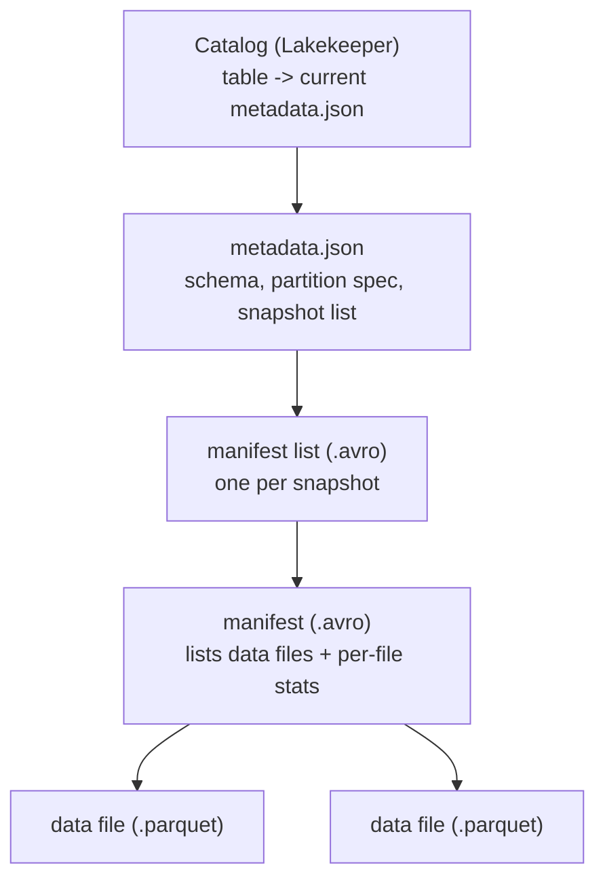

# Day 29 — Apache Iceberg: Architecture & Core Concepts

> Module 3: Data Lakehouse

Day 28 said a lakehouse is "open files **plus a table format**." Today we open the hood on that
table format. Apache Iceberg's whole trick is that a *table* is nothing but a **tree of small
metadata files** sitting next to the Parquet, all in the same object-storage bucket — and a
**catalog** (Lakekeeper) that holds a single pointer to the top of that tree.

## The metadata tree

An Iceberg table is four layers. Reading top-down is how every query engine plans a scan:



1. **Catalog** — maps `lakehouse.cricket.batting` → the *current* `metadata.json`. This is the only
   mutable pointer; an atomic swap of it is what makes a commit atomic (Day 30).
2. **metadata.json** — the table's schema, partition spec, properties, and the list of all
   snapshots. A **new one is written on every commit** (immutable, versioned).
3. **manifest list** — one per snapshot; points at the manifests that make up that snapshot.
4. **manifest** — lists the actual data files **with per-file column stats** (min/max/null counts)
   so engines can skip files without opening them.
5. **data files** — the Parquet. The only "big" files; everything above is tiny.

## Seen live on our lakehouse

Every layer is a real object in MinIO. The `cricket.batting` table's own DDL shows the format and
its location prefix:

```sql
SHOW CREATE TABLE lakehouse.cricket.batting;
-- WITH ( format = 'PARQUET', format_version = 2,
--        location = 's3://lakehouse/warehouse/01a03486-.../batting-79cbd1c2...' )
```

Trino exposes the tree through **metadata tables** (`table$metadata_log_entries`, `$snapshots`,
`$manifests`, `$files`). On a small demo table that took six commits, the versioned `metadata.json`
files are right there — one per commit:

```sql
SELECT file FROM lakehouse.demo."tt$metadata_log_entries";
--  00000-01a034d0-....gz.metadata.json   <- CREATE
--  00001-....gz.metadata.json            <- INSERT
--  00002 / 00003 / 00004 / 00005 ...     <- each later commit
```

…and the manifest → data-file chain for a snapshot:

```sql
SELECT path, added_data_files_count FROM lakehouse.demo."tt$manifests";
--  0bc89b3f-...-m0.avro   files=1        <- one manifest, pointing at...
SELECT file_path, record_count FROM lakehouse.demo."tt$files";
--  ...c10.parquet   records=2            <- the actual data
```

## Why "stats in the metadata" matters

Because manifests carry per-file min/max, an engine prunes files **before** reading them. Iceberg
tracks these even on an *unpartitioned* table:

```sql
SELECT record_count, data.total_runs FROM lakehouse.cricket."batting$partitions";
--  20   (min: 5, max: 754, null_count: 0)
```

So `WHERE total_runs > 700` can skip any data file whose max is below 700 — no directory listing,
no full scan. This is **metadata-level pruning**, and it's why Iceberg scales where a bare data
lake (which must list and open files) does not.

## Applied example (🏏)

`lakehouse.cricket.batting` is exactly this tree: one `metadata.json` (pointed to by Lakekeeper),
a manifest list for its single `append` snapshot, one manifest, and one 4.9 KB Parquet holding 20
players — all under `s3://lakehouse/warehouse/…/batting-…/`. When the Day-27 Airflow DAG re-promotes
after a game, Iceberg writes **new** metadata + data files and atomically swaps the catalog pointer;
the old files stay put as the previous snapshot. Nothing is edited in place — that's the whole design.

## Summary

An Iceberg table is a **catalog pointer → metadata.json → manifest list → manifests → Parquet**
tree, all open files in the same bucket. Metadata is immutable and versioned (new files per commit);
manifests carry column stats for file pruning; the catalog's single mutable pointer makes commits
atomic. We saw each layer live via Trino's `$metadata_log_entries`/`$manifests`/`$files` tables.
Next: **Day 30 — snapshots, time travel & ACID**, the behaviour this architecture unlocks.
