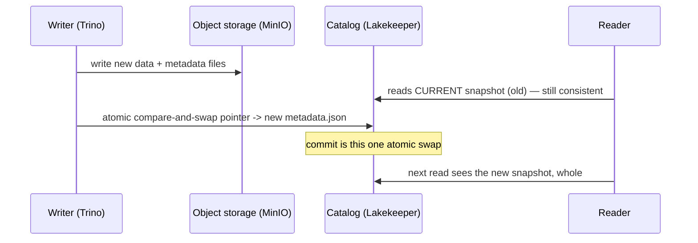

# Day 30 — Iceberg: Snapshots, Time Travel & ACID Transactions

> Module 3: Data Lakehouse

Day 29 showed that every commit writes a **new** `metadata.json` and leaves the old data files in
place. That single fact is what gives Iceberg its superpowers: every version of the table still
exists, so you can **query the past**, **roll back a mistake**, and get **ACID transactions** — on
plain Parquet in object storage, something a bare data lake simply cannot do.

## A snapshot per commit

Every `INSERT`/`UPDATE`/`DELETE` creates a **snapshot** — an immutable pointer to the exact set of
data files that made up the table at that instant. Built live on a demo table (create → insert →
insert → update → delete):

```sql
SELECT committed_at, operation FROM lakehouse.demo."tt$snapshots" ORDER BY committed_at;
```

```
committed_at              operation
18:28:26.165              append      <- CREATE (empty)
18:28:26.569              append      <- INSERT (1,alpha),(2,beta)
18:28:27.138              append      <- INSERT (3,gamma)
18:28:27.730              overwrite   <- UPDATE note='BETA' WHERE id=2
18:28:28.441              delete      <- DELETE WHERE id=1
```

The `operation` column is the story: an **UPDATE is an `overwrite`**, a **DELETE is a `delete`** —
Iceberg rewrote/tombstoned the affected files and recorded a new snapshot, never editing the old
ones. `UPDATE`/`DELETE` on object storage is exactly what a data lake can't give you.

## Time travel — query the past

Because old snapshots still point at real files, you can read the table **as of** any version or
timestamp. After the update-then-delete above, the *current* table is `{(2,BETA),(3,gamma)}` — but
the snapshot right after the first insert is still queryable:

```sql
SELECT * FROM lakehouse.demo.tt FOR VERSION AS OF 3123887605319651950;
--  1 | alpha
--  2 | beta          <- lower-case: this is before the UPDATE, before the DELETE
```

`FOR TIMESTAMP AS OF TIMESTAMP '2026-08-24 18:28:27 Europe/London'` works the same way. This is
gold for debugging ("what did the table look like when that dashboard was wrong?") and for
reproducible reports (pin a query to a snapshot).

## Rollback — undo a bad write

If a load goes wrong, you don't restore from backup — you re-point the table at a good snapshot:

```sql
ALTER TABLE lakehouse.demo.tt EXECUTE rollback_to_snapshot(3123887605319651950);
SELECT * FROM lakehouse.demo.tt ORDER BY id;
--  1 | alpha
--  2 | beta          <- the UPDATE and DELETE are undone, instantly
```

Verified: the table came back to `{(1,alpha),(2,beta)}`. No data copy — just a metadata pointer
moving back to files that were never deleted.

## Where the ACID comes from



Atomicity + isolation come from that **single atomic swap of the catalog pointer**. Readers always
see one complete snapshot — never a half-written table — and if two writers race, only one swap
wins; the other retries. Consistency and durability ride on the immutable, versioned files.

## Applied example (🏏)

`lakehouse.cricket.batting` currently has one `append` snapshot (its Day-26 promotion). Each time
the Day-27 Airflow DAG re-promotes after a game, it adds a snapshot — so mid-season you can ask
"what were the averages *before* Saturday's match?" with `FOR TIMESTAMP AS OF`, diff two snapshots
to see who moved, and if a bad scrape ever lands, `rollback_to_snapshot` reverts it in one
statement. (Snapshots accumulate forever until you expire them — that's Day 33's housekeeping.)

## Summary

Every Iceberg commit is an immutable **snapshot**; `UPDATE`=`overwrite`, `DELETE`=`delete`, old
files untouched. That buys **time travel** (`FOR VERSION/TIMESTAMP AS OF`), **rollback**
(`rollback_to_snapshot`), and **ACID** — atomicity/isolation from the single atomic catalog-pointer
swap. All verified live on the lakehouse. Next: **Day 31 — partitioning strategies**, so those
scans stay fast as the tables grow.
