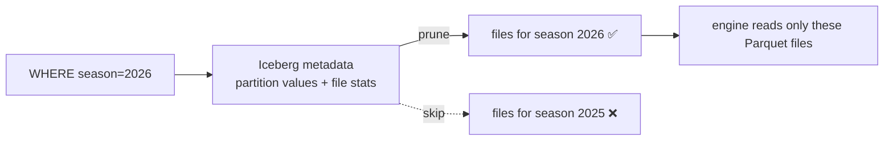

# Day 31 — Iceberg: Partitioning Strategies & Performance

> Module 3: Data Lakehouse

Day 29 showed manifests carry per-file min/max so engines skip files. **Partitioning** is how you
make that skipping dramatic: group rows by a column so a `WHERE` on that column reads only the
files it needs. Iceberg's twist over old Hive-style partitioning is that it's **hidden** and
**evolvable** — you never see partition columns in the path, and you can change the scheme without
rewriting the table.

## Hidden partitioning

In Hive you partitioned by writing `.../season=2026/...` directories and every query *had* to
filter on that exact column, spelled that exact way, or it scanned everything. Iceberg instead
records the partition in **metadata** and derives it from a real column via a **transform**:

```sql
CREATE TABLE lakehouse.demo.batting_p (season int, player varchar, total_runs int)
WITH (partitioning = ARRAY['season']);
```

Query on the natural column — no special syntax, and the engine prunes automatically:

```sql
SELECT partition.season, record_count FROM lakehouse.demo."batting_p$partitions";
--  2025 | 3
--  2026 | 3          <- two partitions, three rows each
```

```sql
EXPLAIN (TYPE IO) SELECT * FROM lakehouse.demo.batting_p WHERE season = 2026;
--  constraint: season EXACTLY 2026
--  estimate:   outputRowCount = 3.0        <- plans to read ONE partition (3 rows), not all 6
```

Verified live: the IO plan constrains the scan to `season = 2026` and estimates 3 rows — the 2025
partition's files are never touched.

## Partition transforms

You rarely partition on a raw high-cardinality column (that makes millions of tiny partitions).
Iceberg gives **transforms** that bucket sensibly:

| Transform | Use for | Example |
|---|---|---|
| `year/month/day/hour` | timestamps | `partitioning = ARRAY['month(event_time)']` |
| `bucket(N, col)` | high-cardinality keys, even spread | `ARRAY['bucket(16, player_id)']` |
| `truncate(N, col)` | prefixes / ranges | `ARRAY['truncate(10, postcode)']` |
| identity | low-cardinality columns | `ARRAY['season']` |

Rule of thumb: partition on what you **filter by**, aim for partitions in the **hundreds of MB to
low GB**, and keep the count modest. Over-partitioning (the small-files problem) hurts more than no
partitioning — which is why Day 33 exists.

## Partition evolution (the killer feature)

Business grows, `season` is too coarse, you want `month`. In Hive that's a full rewrite. In Iceberg
you just change the spec:

```sql
ALTER TABLE lakehouse.demo.batting_p SET PROPERTIES partitioning = ARRAY['season','bucket(8, player)'];
```

Old data keeps its old layout; **new** writes use the new one; queries span both because each data
file records which spec it was written under. No rewrite, no downtime.



## Applied example (🏏)

The cricket tables are one season today, so `lakehouse.cricket.batting` is unpartitioned — correct,
because a 4.9 KB table with 20 rows should **not** be partitioned (you'd add metadata overhead for
nothing). But the design scales: as seasons accumulate year over year, partitioning the promoted
tables by `season` (identity transform) means "2026 averages" reads only 2026's files, and adding
`bucket(N, player)` later — via partition evolution — would speed per-player history without
touching the years already written. Partition when the data earns it, not before.

## Summary

Iceberg partitioning is **hidden** (derived from columns via transforms, recorded in metadata — no
magic paths) and **evolvable** (change the spec without rewriting). Partition on your filter
columns, size partitions in the hundreds-of-MB range, and don't over-partition small tables — the
20-row cricket table stays unpartitioned on purpose. Verified live: a `season`-partitioned table
prunes to a single partition on `WHERE season=2026`. Next: **Day 32 — encryption & security**.
