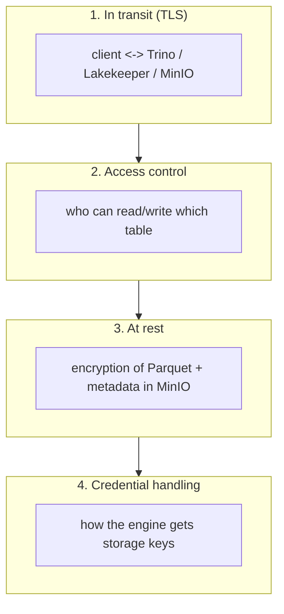

# Day 32 — Iceberg & the Lakehouse: Encryption & Security

> Module 3: Data Lakehouse

An open lakehouse spreads one dataset across three systems — object storage (MinIO), a catalog
(Lakekeeper), and an engine (Trino). Security is therefore **defence in depth across all three**,
not one setting. Today: the layers that protect lakehouse data, where our stack sits on each, and
an honest look at Iceberg's *native* encryption (which is real in the spec but young in the engines).

## The layers

## 1. In transit

UIs and APIs should only be reachable over TLS. On the cluster the web surfaces (K10, MinIO
console, Airflow) are exposed via **Traefik `websecure` + TLS** on `*.nip.io` hosts — the same
pattern documented for Airflow (needs `base_url` + `enable_proxy_fix` so HTTPS works end-to-end).
Trino's SQL port, by contrast, is on an **internal MetalLB LoadBalancer (192.168.169.192:8080) with
no auth** — fine for an inside-the-cluster analytics engine, **not** something to expose publicly.
Hardening step when it needs to leave the cluster: enable Trino TLS + `PASSWORD`/OAuth2
authentication and put it behind the ingress.

## 2. Access control (authorization)

Two enforcement points:

- **Catalog (Lakekeeper)** — it's the gatekeeper for *table* operations and supports project /
  warehouse / namespace scoping and (in its authz builds) OpenFGA-based RBAC. Because every engine
  goes *through* the catalog to resolve a table, this is the natural place to centralise "who can
  see `cricket`".
- **Engine (Trino)** — access control on catalogs/schemas/tables (file-based or via a connector),
  independent of who can reach the storage bucket.

## 3. At rest

Two options, and they compose:

- **Storage-level (what to reach for first): MinIO server-side encryption** — SSE-S3 (MinIO-managed
  keys) or SSE-KMS (KMS-managed). Turn it on per-bucket and *all* objects — Parquet **and** Iceberg
  metadata — are encrypted at rest transparently, no table changes. This is the pragmatic default
  for our `lakehouse` bucket.
- **Table-level: Iceberg native encryption** — the Iceberg spec defines per-table envelope
  encryption (a table key wrapping per-file data-encryption keys), so files are encrypted
  *independently of the storage backend*. It's powerful (encryption travels with the table across
  any storage) but **engine support is still maturing** — Trino's write/read support for native
  Iceberg encryption is not something to depend on in production today. Honest take: **use MinIO
  SSE now; watch native Iceberg encryption for later.** (Same spirit as the Day-26 finding — pick
  the mature path, note the emerging one.)

## 4. Credential handling

How does Trino get the MinIO keys to read files? Today: **static credentials** baked into the Trino
catalog config (`s3.aws-access-key-id` / `-secret-key` in `trino-values.yaml`) — simple and
reliable. The upgrade is **Lakekeeper credential vending / remote signing**: the catalog hands the
engine short-lived, scoped credentials per request, so no long-lived keys sit in engine config.
That's the recommended hardening once multiple engines/tenants share the warehouse.

> **Operational security also bit us for real:** before pushing `trino-values.yaml` to the public
> repo we had to replace the literal MinIO secret key / Postgres password with placeholders
> (`<MINIO_SECRET_KEY>`). A pre-push secret scan is now standard — the cheapest security control
> there is.

## Applied example (🏏)

The cricket stats are *already public* (that's why the repo commits them), so confidentiality isn't
the driver here — but the same table could hold members' contact details or junior-player data,
where it very much would be. The posture that protects it: MinIO SSE on the `lakehouse` bucket
(at rest), TLS on every exposed surface (in transit), Lakekeeper/Trino access control on the
`cricket` schema (authorization), and — the next hardening — credential vending instead of the
static MinIO keys Trino uses today.

## Summary

Lakehouse security is defence in depth across **transit** (TLS — our UIs have it, Trino's SQL port
is internal-only and unauthenticated by design), **authorization** (Lakekeeper as catalog gatekeeper
+ Trino access control), **at rest** (reach for **MinIO SSE** now; Iceberg **native** encryption is
spec'd but engine-immature), and **credentials** (static keys today → catalog **credential vending**
as the upgrade). Plus the boring, essential one: scan for secrets before you push. Next: **Day 33 —
compaction, expiry & table maintenance.**
