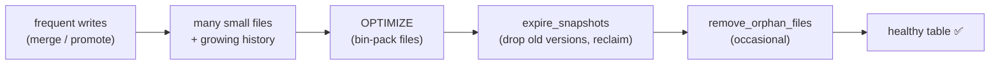

# Day 33 — Iceberg: Compaction, Expiry & Table Maintenance

> Module 3: Data Lakehouse

Every good Iceberg feature has a cost that accrues quietly. Snapshots (Day 30) never delete old
files. Streaming or frequent `merge` writes (like the cricket refresh) leave lots of **small
files**. Left alone, a table slowly gets slower and its bucket fills with dead objects. **Table
maintenance** is the housekeeping that keeps a lakehouse healthy — and it's all SQL.

## The two problems

1. **Small files.** Each `INSERT`/`merge` writes new data files. Many small files = many manifest
   entries to plan over and many object-store round-trips to read. Query planning and scan time
   degrade.
2. **Unbounded history.** Snapshots and their data/metadata files pile up forever (great for time
   travel, bad for storage and metadata size). Orphan files (from failed writes) accumulate too.

## Compaction — `OPTIMIZE`

`OPTIMIZE` (Trino's name for Iceberg `rewrite_data_files`) bin-packs many small files into fewer big
ones. Verified live — five separate inserts made five files; one command collapsed them:

```sql
-- 5 inserts -> 5 small data files, 6 snapshots
ALTER TABLE lakehouse.demo.small_files EXECUTE optimize;
-- after: 1 data file, +1 snapshot (the rewrite)   <- 5 files -> 1
```

```
before optimize: data files = 5   snapshots = 6
after  optimize: data files = 1   snapshots = 7
```

Compaction itself **creates a new snapshot** (it's a normal, atomic Iceberg commit) and doesn't
delete the old small files yet — time travel to before the compaction still works. Those old files
only go away when you **expire** the snapshots that reference them. You can scope big compactions
with a filter, e.g. `... EXECUTE optimize WHERE season = 2026`.

## Expiry — reclaim storage

`expire_snapshots` drops snapshots older than a retention window and deletes the data/metadata files
no live snapshot needs any more:

```sql
ALTER TABLE lakehouse.demo.small_files EXECUTE expire_snapshots(retention_threshold => '7d');
```

Verified (with a 0-day threshold to prove the mechanism): history collapsed to the current snapshot
and the pre-compaction files were reclaimed — **rows untouched**:

```
after expire: data files = 1   snapshots = 1   rows = 5   ✅
```

> **Trade-off to state out loud:** expiry is what makes time travel *finite*. A 7-day retention
> means you can roll back within a week, not forever. Set it to your actual recovery need.

`remove_orphan_files` is the third broom — it deletes files in the table's storage location that no
metadata references at all (leftovers from failed/aborted writes). Run it sparingly and with a
retention window, since it lists the whole prefix.

## Where maintenance runs

These aren't one-offs — they're **scheduled jobs**. The natural home on our stack is **Airflow**
(Module 2): a weekly DAG that, per table, runs `optimize` → `expire_snapshots` → occasionally
`remove_orphan_files`. It sits right alongside the Day-27 ingestion DAG.



## Applied example (🏏)

The cricket tables are refreshed by `merge` after every game and re-promoted by the Day-27 DAG —
exactly the write pattern that breeds small files and snapshot sprawl over a season. The maintenance
recipe: after the weekly promotion, `OPTIMIZE` each of `lakehouse.cricket.batting/bowling/fielding`,
then `expire_snapshots(retention_threshold => '30d')` to keep a month of time travel (enough to
answer "before last month's games") while reclaiming the rest. Add it as a final task on the
existing ingestion DAG and the lakehouse maintains itself.

## Summary

Iceberg's strengths (snapshots, frequent writes) create small files and unbounded history. Fix them
with SQL maintenance: **`OPTIMIZE`** to compact (verified 5 files → 1), **`expire_snapshots`** to
drop old versions and reclaim storage (verified history → 1, rows intact — but this bounds how far
time travel reaches), and **`remove_orphan_files`** occasionally. Schedule them in Airflow next to
ingestion. Next: **Day 34 — MinIO advanced configuration, buckets & policies** (the storage layer
underneath all of this).
