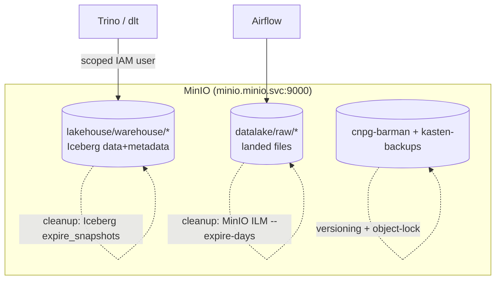

# Day 34 — MinIO: Advanced Configuration, Buckets & Policies

> Module 3: Data Lakehouse

Everything in this module — Iceberg data, Iceberg metadata, raw landing files, even the Postgres
backups — ultimately lands as **objects in MinIO**. It's the S3-compatible storage floor of the
whole platform. Today we look past "it's a bucket" at the configuration that makes it production-
grade: bucket layout, least-privilege policies, versioning, and lifecycle rules.

## What's actually in MinIO on this cluster

MinIO runs in namespace `minio`, reachable in-cluster at `minio.minio.svc:9000` (the endpoint Trino
and dlt use). The buckets each map to a job we've built across the modules:

| Bucket | Written by | Holds |
|---|---|---|
| `lakehouse` | Trino (Iceberg) | Iceberg data + metadata under `warehouse/` (Module 3) |
| `datalake` | Airflow/dlt | raw landed files, e.g. `raw/weather/<ds>/` (Day 14) |
| `cnpg-barman` | CNPG/Barman | Postgres base backups + WAL (Module 1) |
| `kasten-backups` | K10 | exported Kasten restore points (Module 1) |

One MinIO, many tenants-by-bucket — clean separation without standing up separate storage systems.

## Least-privilege access (the important bit)

Trino currently authenticates to MinIO with the **admin** key (`minio-admin`). That's convenient and
what the Module 3 stand-up used, but the right production posture is a **scoped user per consumer**.
MinIO speaks AWS-style IAM policies, so you create a policy that can touch only the `lakehouse`
bucket and attach it to a dedicated `trino` user:

```json
{
  "Version": "2012-10-17",
  "Statement": [
    { "Effect": "Allow",
      "Action": ["s3:GetObject","s3:PutObject","s3:DeleteObject"],
      "Resource": ["arn:aws:s3:::lakehouse/*"] },
    { "Effect": "Allow",
      "Action": ["s3:ListBucket","s3:GetBucketLocation"],
      "Resource": ["arn:aws:s3:::lakehouse"] }
  ]
}
```

```bash
mc alias set local http://minio.minio.svc:9000 minio-admin '<pw>'
mc admin policy create local lakehouse-rw lakehouse-rw.json
mc admin user  add    local trino '<trino-pw>'
mc admin policy attach local lakehouse-rw --user trino
```

Now Trino's blast radius is one bucket, not the whole object store — and rotating that key never
touches backups or the data lake. (Pairs with Day 32's "credential vending" as the next step up.)

## Versioning & object lock

Bucket **versioning** keeps every version of an object, so an overwrite or delete is recoverable at
the storage layer — a safety net *underneath* Iceberg's own snapshots, and essential for the
backup buckets:

```bash
mc version enable local/cnpg-barman        # protect backups from accidental overwrite
```

For compliance you can go further with **object lock** (WORM — write once, read many) so backups
can't be deleted before a retention date even by an admin.

## Lifecycle (ILM) — automatic cleanup

MinIO can expire or transition objects on a schedule, which is how you stop the data-lake and backup
buckets growing forever:

```bash
# delete raw landing files older than 30 days
mc ilm rule add local/datalake --expire-days 30 --prefix "raw/"
```

Note the division of labour: **Iceberg's `expire_snapshots` (Day 33)** manages the *table's* file
lifecycle inside `lakehouse/`; **MinIO ILM** manages *non-table* buckets like `datalake` raw files
and old backups. Don't point ILM at the `warehouse/` prefix — deleting files Iceberg still
references breaks the table. Let each layer own its own cleanup.



## Applied example (🏏)

`lakehouse.cricket.*` lives entirely under `s3://lakehouse/warehouse/…/` — you can see the exact
prefix in `SHOW CREATE TABLE` (Day 29). The cricket raw snapshots, if landed to the lake instead of
committed to git, would sit in `datalake/` under an ILM rule; the Postgres copy is protected by the
versioned `cnpg-barman` bucket. Same storage system, three retention policies, each owned by the
layer that understands the data.

## Summary

MinIO is the S3 floor under the whole platform — `lakehouse`, `datalake`, and backup buckets, one
system, separated by bucket. Production-grade means **least-privilege IAM** (a scoped `trino` user,
not admin), **versioning/object-lock** on backup buckets, and **ILM** for non-table cleanup — while
Iceberg's own `expire_snapshots` owns the `warehouse/` prefix. Next: **Day 35 — Trino, the
distributed SQL engine that reads all of this.**
