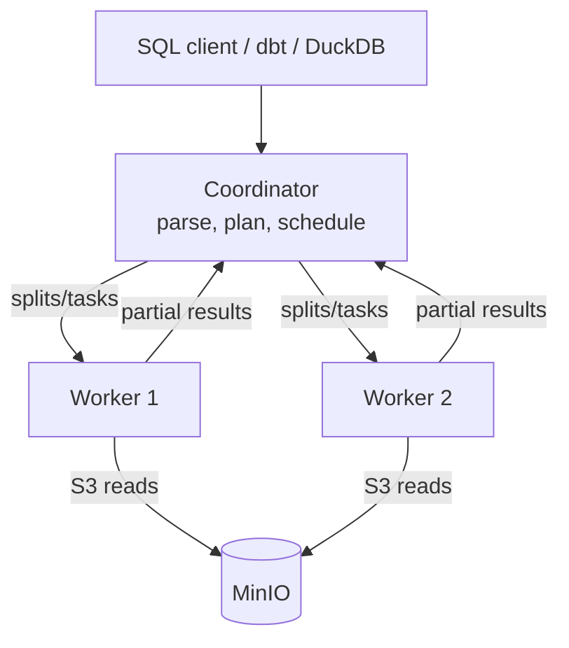

# Day 35 — Trino: Distributed SQL Engine on Kubernetes

> Module 3: Data Lakehouse

MinIO stores bytes; Iceberg makes them a table; **Trino** is the engine that runs the SQL. It's a
**distributed, massively-parallel (MPP) query engine** that doesn't store any data itself — it
connects to sources through **connectors** and processes queries across a cluster of workers. On
Kubernetes that maps cleanly onto pods.

## Coordinator + workers



- **Coordinator** — parses SQL, builds and optimises the plan, splits it into tasks, schedules them,
  and assembles results. One per cluster.
- **Workers** — execute tasks in parallel; each reads a slice (a *split*) of the data straight from
  storage. Add workers → more parallelism.

Verified on our cluster:

```sql
SELECT node_id, coordinator, node_version, state FROM system.runtime.nodes;
--  trino-coordinator-...   true    480   active
--  trino-worker-...-9qbpl   false   480   active
--  trino-worker-...-zfx8c   false   480   active
```

One coordinator, **two workers**, all Trino **480**. Deployed via the official Helm chart
(`trino/trino` 1.42.2) with 3 GB heaps — see `examples/module3-lakehouse/trino-values.yaml`.

## Catalogs & connectors

Trino reaches every source through a **catalog** (a configured connector instance). Ours:

```sql
SHOW CATALOGS;   -->  lakehouse, postgres, system, tpch, tpcds
```

- `lakehouse` — **Iceberg** connector → Lakekeeper (REST catalog) → MinIO.
- `postgres` — **PostgreSQL** connector → CNPG `appdb` (added Day 26 for the promotion CTAS).
- `tpch` / `tpcds` — built-in data generators (great for zero-setup demos).
- `system` — Trino's own runtime/metadata (the `nodes` query above).

## Federation — one query, many sources

Because a catalog is just a connector, a single query can join across **completely different
systems**. Verified live — an Iceberg table joined to a Postgres table in one statement:

```sql
SELECT b.player, b.total_runs
FROM   lakehouse.cricket.batting b          -- Iceberg on MinIO
JOIN   postgres.cricket.bowling  w          -- PostgreSQL
  ON   w.player = b.player
ORDER BY b.total_runs DESC LIMIT 3;
--  Jonathan Dalley | 754
--  Nathan Botes    | 275
--  Harry Carter    | 269
```

The coordinator pushed each scan to the right connector and joined the streams in the workers — no
ETL to co-locate the data first. That's the superpower that makes Trino the *query* layer of a
lakehouse: it doesn't care that batting is Iceberg and bowling is Postgres.

## Why Kubernetes suits it

Coordinator and workers are just pods. Scaling out is `replicas: N` on the worker deployment; the
coordinator is a Service other tools hit (our MetalLB LB `192.168.169.192:8080`). Workers are
stateless and disposable — a killed worker's tasks reschedule — which is exactly the failure model
K8s is built for. (Autoscaling workers on query load is a natural extension.)

## Applied example (🏏)

Every cricket query so far has run through this: `dbt build` (Module 4), the Day-26 promotion CTAS,
and ad-hoc `SELECT`s all hit the coordinator at `192.168.169.192:8080`, which planned them and
fanned the work across the two workers reading Parquet from MinIO. The dataset is tiny, so it's one
split on one worker — but the *same* SQL and the *same* cluster scale to billions of rows by adding
workers, nothing else changing.

## Summary

Trino is a storage-less MPP SQL engine: a **coordinator** plans and schedules, **workers** read
splits from storage in parallel, and **catalogs/connectors** let one engine query Iceberg, Postgres,
and generators alike — even **federating a join across them** in a single query (verified). On K8s
it's pods you scale with `replicas`. Next: **Day 36 — the Iceberg connector in depth** (time travel,
metadata tables, DDL from SQL).
