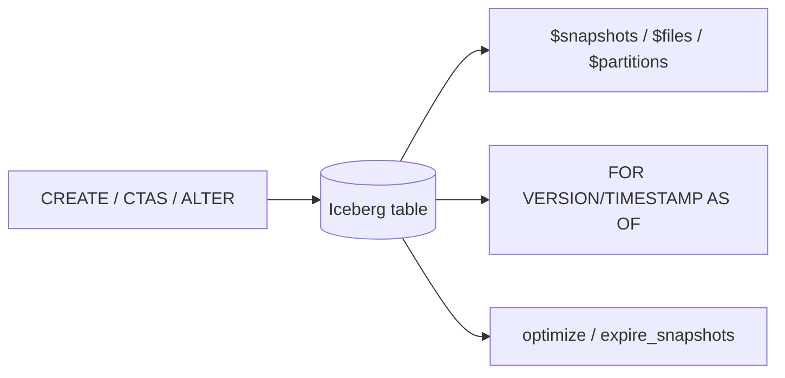

# Day 36 — Trino: Querying Iceberg Tables

> Module 3: Data Lakehouse

Day 35 covered Trino the engine. Today we use its **Iceberg connector** properly — the SQL that
turns "a catalog of Parquet" into a full table experience: DDL, the metadata tables, time travel,
and the maintenance procedures — all things we've touched across the module, now collected as the
working reference.

## DDL — tables are just SQL

The Iceberg connector creates real Iceberg tables from Trino:

```sql
CREATE SCHEMA IF NOT EXISTS lakehouse.demo;
CREATE TABLE lakehouse.demo.t (id int, name varchar) WITH (partitioning = ARRAY['id']);
CREATE TABLE lakehouse.demo.copy AS SELECT * FROM tpch.tiny.nation;   -- CTAS (also federates)
ALTER TABLE lakehouse.demo.t ADD COLUMN added_at timestamp(6);        -- schema evolution
```

`SHOW CREATE TABLE` reflects the physical truth (from Day 29):

```
WITH ( format = 'PARQUET', format_version = 2,
       location = 's3://lakehouse/warehouse/…/batting-…' )
```

## Metadata tables — introspect everything

Append `$<name>` to any table to query its Iceberg internals as normal tables. These are how we
verified the whole module:

| Metadata table | Answers |
|---|---|
| `"t$snapshots"` | every commit + `operation` (append/overwrite/delete) — Day 30 |
| `"t$history"` | snapshot lineage / parent ids |
| `"t$manifests"` | manifest files for the current snapshot — Day 29 |
| `"t$files"` | data files, record counts, sizes — Day 29 |
| `"t$partitions"` | per-partition record counts + column stats — Day 31 |
| `"t$metadata_log_entries"` | the versioned `metadata.json` files — Day 29 |

```sql
SELECT committed_at, operation FROM lakehouse.cricket."batting$snapshots";
SELECT file_path, record_count FROM lakehouse.cricket."batting$files";
```

## Time travel & rollback (recap, as SQL)

```sql
SELECT * FROM lakehouse.demo.tt FOR VERSION AS OF 3123887605319651950;      -- by snapshot id
SELECT * FROM lakehouse.demo.tt FOR TIMESTAMP AS OF TIMESTAMP '2026-08-24 18:28:27 Europe/London';
ALTER TABLE lakehouse.demo.tt EXECUTE rollback_to_snapshot(3123887605319651950);
```

## Maintenance procedures (recap, as SQL)

```sql
ALTER TABLE t EXECUTE optimize;                                    -- compact small files (Day 33)
ALTER TABLE t EXECUTE expire_snapshots(retention_threshold => '30d');
ALTER TABLE t EXECUTE remove_orphan_files(retention_threshold => '7d');
```

## The scan reads a specific snapshot

A subtle, important detail visible in the query plan: a Trino scan of an Iceberg table is bound to a
**snapshot id**, not "the files in a folder". From `EXPLAIN ANALYZE` on the cricket table:

```
TableScan[table = lakehouse:cricket.batting$data@4551150190666394712]
Input: 20 rows (360B), Physical input: 4.81kB, Splits: 1
```

The `@4551150190666394712` is the snapshot the query is pinned to — which is *why* time travel and
consistent reads work: every scan names a version. Physical input 4.81 kB across 1 split for 20
rows; on a real table those numbers are where partition pruning and stats (Day 31) pay off.

## Applied example (🏏)

The cricket analytics ride entirely on this connector: dlt→Postgres→**CTAS into Iceberg** (Day 26),
`$snapshots`/`$files` to prove what landed, `FOR TIMESTAMP AS OF` to compare pre/post-match states
(Day 30), and `OPTIMIZE`/`expire_snapshots` after each weekly refresh (Day 33) — and the same tables
are what dbt-trino models in Module 4. One connector, the whole lifecycle.



## Summary

Trino's Iceberg connector gives the full table experience in plain SQL: **DDL** (create, CTAS,
schema evolution), **`$` metadata tables** to introspect snapshots/files/partitions, **time travel &
rollback**, and **maintenance procedures**. Every scan is pinned to a snapshot id
(`…batting$data@<id>`), which is what makes reads consistent and time travel possible. Next: **Day 37
— performance optimization & cost awareness** (making these scans fast and cheap).
