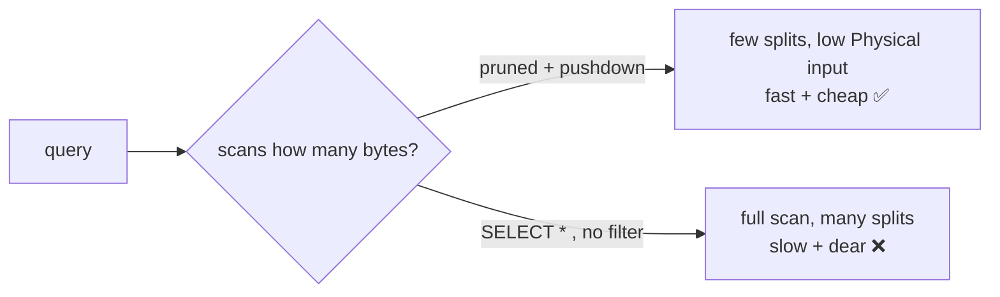

# Day 37 — Trino: Performance Optimization & Cost Awareness

> Module 3: Data Lakehouse

In a lakehouse, storage is cheap and **compute is the cost** — every query spins up worker CPU and
reads bytes from object storage. So performance *is* cost: the fewer bytes scanned and the less work
shuffled, the faster **and** cheaper the query. Today: the levers Trino gives you, and how to read a
plan to know which one to pull.

## Read the plan first — `EXPLAIN` / `EXPLAIN ANALYZE`

Never optimise blind. `EXPLAIN (TYPE IO)` shows what a query *plans* to read (Day 31's pruning
proof); `EXPLAIN ANALYZE` runs it and reports real timings and bytes. From the cricket aggregation:

```
Aggregate[type = FINAL, keys = [season]]
  └─ Aggregate[type = PARTIAL, keys = [season]]
       └─ TableScan[table = lakehouse:cricket.batting$data@4551…]
          Input: 20 rows (360B), Physical input: 4.81kB, Splits: 1
```

Two things to notice: the aggregation is **two-phase** (PARTIAL on each worker, then FINAL on the
coordinator — that's MPP minimising the data shuffled), and **Physical input** (4.81 kB) is the
number that costs money. Optimisation = drive Physical input and shuffle down.

## The levers, roughly in order of impact

1. **Partition pruning** (Day 31) — filter on partition columns so whole partitions are skipped.
   Biggest win on big tables; verified reducing a scan to one partition.
2. **Predicate & projection pushdown** — Trino pushes `WHERE` and column selection down to the
   Iceberg connector, which uses per-file min/max stats to skip files and reads only the Parquet
   columns you `SELECT`. **`SELECT *` is a cost bug** on a wide table — name your columns.
3. **File sizing / compaction** (Day 33) — many small files = many splits = overhead. `OPTIMIZE`
   keeps files in the tens-to-hundreds-of-MB sweet spot so each split does real work.
4. **Dynamic filtering** — on a join, Trino builds a filter from the small (build) side and pushes
   it into the large (probe) side's scan at runtime, so the big table skips files that can't match.
   Huge for star-schema joins; on by default.
5. **Join distribution & order** — `PARTITIONED` (shuffle both sides) vs `BROADCAST` (ship the small
   side to every worker). Trino's cost-based optimiser picks using table stats, so **keep stats
   fresh** (Iceberg maintains them on write; `ANALYZE` can augment).
6. **Resource control** — `resource groups` cap concurrency/memory per workload so a heavy report
   can't starve everything; `spill` lets big joins/aggregations spill to disk instead of failing.

## Cost awareness



- **Physical input bytes** is the cost proxy — watch it in `EXPLAIN ANALYZE`.
- **Right-size the cluster**: our two 3 GB workers suit this dataset; scale workers for concurrency
  and big scans, not for tiny tables (idle workers still cost).
- **Push work to the source** where a connector can do it (aggregate pushdown to Postgres, file
  skipping in Iceberg) — moving less data beats processing more.

## Applied example (🏏)

The cricket tables are kilobytes, so every query is one split and already instant — optimisation
here is about **habits that scale**: name columns instead of `SELECT *`, filter on `season` (which
becomes a partition column as seasons accumulate — Day 31), and let dbt's marts (Module 4)
pre-aggregate the expensive shapes once so dashboards read small tables instead of re-scanning raw.
The 4.81 kB scan needs none of it today; a multi-season, multi-club table would need all of it.

## Summary

Performance and cost are the same axis in a lakehouse: **fewer bytes scanned, less data shuffled**.
Read `EXPLAIN ANALYZE` (watch **Physical input** and the two-phase aggregation), then pull the
levers — partition pruning, predicate/projection pushdown (no `SELECT *`), compaction, dynamic
filtering, cost-based joins on fresh stats, and resource groups/spill for stability. Right-size the
cluster to the workload. Next: **Day 38 — DuckDB reading the same Iceberg tables locally** (a second
engine, zero infrastructure).
