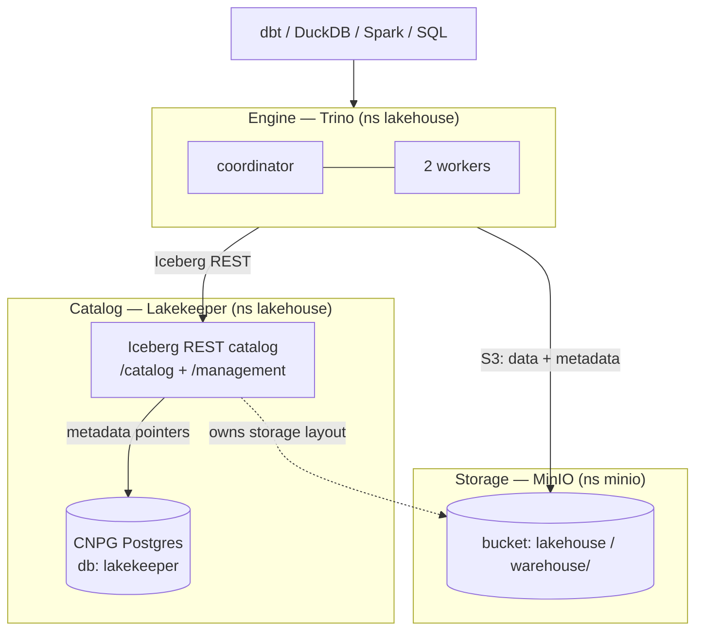
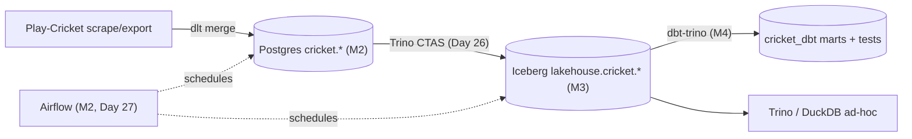

# Day 39 — Hands-On: Build a Lakehouse on Kubernetes

> Module 3: Data Lakehouse

Time to assemble the module. Days 28–38 covered the pieces — the lakehouse pattern, Iceberg's
architecture and behaviours, MinIO, Trino, DuckDB. Day 39 is the **build**: the three components
that make an open lakehouse, the order to stand them up, and the checks that prove it works. The
full deploy detail lives in
[`examples/module3-lakehouse/README.md`](../examples/module3-lakehouse/README.md); this is the
hands-on map over it.

## The three components



Each has one job: **MinIO** stores the bytes, **Lakekeeper** is the Iceberg REST catalog that turns
files into named tables (its pointers live in Postgres), **Trino** is the engine. Swap any one and
the others don't care — that's the openness.

## Build order (what actually worked)

1. **Object storage** — a MinIO bucket `lakehouse` (warehouse prefix `warehouse/`). Ideally a
   scoped IAM user, not admin (Day 34).
2. **Catalog database** — a `lakekeeper` role + database on the existing CNPG cluster
   (`lakekeeper-database.yaml`); Lakekeeper stores only *pointers* here, not data.
3. **Lakekeeper** — Helm `lakekeeper/lakekeeper`, external CNPG DB, OSS core edition
   (`lakekeeper-values.yaml`). Then **bootstrap** and **create the warehouse** via its management
   API (the `curl` calls in the README) — this is where MinIO creds + `path-style-access` +
   `flavor: s3-compat` get wired in.
4. **Trino** — Helm `trino/trino` with a `lakehouse` Iceberg-REST catalog pointing at Lakekeeper
   (`trino-values.yaml`), reachable on the MetalLB LB `192.168.169.192:8080`.

Order matters: storage → catalog DB → catalog → engine. Each layer needs the one below it live.

## The gotchas that bite (collected)

- **Trino 480 uses `fs.native-s3.enabled=true`** (+`s3.*`); the property was renamed `fs.s3.enabled`
  in a later release — the wrong one crash-loops the coordinator ("property … was not used").
- **MinIO needs `path-style-access: true` + `flavor: s3-compat`** in Lakekeeper's storage profile,
  and `s3.path-style-access=true` in Trino.
- **Lakekeeper `delete-profile: soft`** requires `expiration-seconds`; `hard` doesn't (we used hard).
- **Static MinIO creds** in Trino are simplest; credential vending is the later hardening (Day 32).

## Verify end-to-end (the checklist)

Run these against the LB and you've proven every layer — each is a check we actually used this
module:

```sql
-- engine up, workers present (Day 35)
SELECT count(*) FROM system.runtime.nodes WHERE coordinator = false;   -- 2

-- catalog wired (Day 35)
SHOW CATALOGS;                                                          -- lakehouse, postgres, ...

-- write path: create a real Iceberg table, data lands in MinIO (Day 26/36)
CREATE SCHEMA IF NOT EXISTS lakehouse.demo;
CREATE TABLE lakehouse.demo.smoke AS SELECT * FROM tpch.tiny.nation;   -- 25 rows
SELECT * FROM lakehouse.demo."smoke$files";                            -- Parquet under s3://lakehouse/warehouse/

-- table behaviours (Days 29-31)
SELECT operation FROM lakehouse.demo."smoke$snapshots";                -- append
SELECT record_count FROM lakehouse.demo."smoke$partitions";            -- stats present

-- federation: one query across Iceberg + Postgres (Day 35)
SELECT b.player FROM lakehouse.cricket.batting b
JOIN postgres.cricket.bowling w ON w.player=b.player LIMIT 3;
```

## The whole platform, assembled (🏏)

With the lakehouse standing, the cricket data flows the full modern-ELT path — and every arrow is
something built and verified across Modules 1–4:



dlt lands and merges (Module 2), Trino promotes to Iceberg (Day 26), dbt models and tests
(Module 4), Airflow schedules it (Day 27) — all on MinIO + Lakekeeper + Trino, on Kubernetes, no
cloud and no vendor lock-in.

## Summary

An open lakehouse is three swappable components — **MinIO** (storage), **Lakekeeper** (Iceberg REST
catalog, pointers in Postgres), **Trino** (engine) — stood up storage-first and verified with a
handful of SQL checks (workers up, catalogs wired, a table's files in MinIO, snapshots/stats
present, a federated join). That completes Module 3: the cricket data now lives as open Iceberg
tables the rest of the stack builds on. **Module 4 (dbt)** already turns them into tested models;
next comes **Module 5 — data quality** (Soda + Pandera + dbt tests) enforcing the invariants in the
pipeline.
