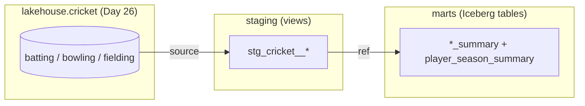

# Day 40 — Analytics Engineering & the dbt Philosophy

> Module 4: Analytics Engineering

Module 3 got real data into the **Iceberg lakehouse** — `lakehouse.cricket.batting/bowling/fielding`,
open Parquet on MinIO, queryable by Trino ([Day 26](Day26.md)). But those are *landing* tables:
raw shapes, cryptic columns (`_0_9`, `strike_rate__v_text`), no metrics, no guarantees. Turning
them into numbers a captain would actually trust is a different discipline — **analytics
engineering** — and its standard tool is **dbt**.

## What analytics engineering actually is

It's applying **software-engineering practice to SQL transformations**. Instead of a pile of
ad-hoc queries, your business logic becomes:

- **version-controlled models** — each is a `SELECT` in a `.sql` file; dbt wraps it in
  `CREATE TABLE/VIEW` for you. No DDL by hand.
- **a dependency graph** — models `ref()` each other, so dbt knows the build order and draws the
  lineage. Rename a source once; every downstream model follows.
- **tests that run with the build** — not-null, uniqueness, ranges, and custom invariants execute
  every time, so a broken assumption fails loudly instead of silently poisoning a dashboard.
- **documentation + lineage** generated from the same files.

The shape is **ELT**: extract-load already happened (dlt → Postgres → Iceberg). dbt is the **T** —
the reshaping — and it runs *inside* the warehouse/lakehouse, pushing the compute down to the
engine that already holds the data. On our stack that engine is Trino, so the adapter is
**dbt-trino** and dbt's models become views and Iceberg tables in the lakehouse.

## The layering: sources → staging → marts



- **sources** declare the raw tables once, so models reference `source('cricket','batting')`
  rather than a hard-coded name.
- **staging** does light, one-per-source cleaning — the boring, reusable layer.
- **marts** hold the metrics people query, joined and denormalised for read convenience.

## Generic example (the mechanism, zero domain)

A model is just a `SELECT` that names its parents with `ref`/`source`:

```sql
-- models/staging/stg_orders.sql
select id, cast(amount as double) as amount_usd
from {{ source('shop', 'orders') }}

-- models/marts/daily_revenue.sql   (depends on the model above via ref)
select date_trunc('day', ordered_at) as day, sum(amount_usd) as revenue
from {{ ref('stg_orders') }}
group by 1
```

`dbt build` topologically sorts them, creates `stg_orders` then `daily_revenue`, and runs any
tests attached — one command, correct order, every time.

## Applied example (🏏) — the cricket lakehouse, modelled

Full project:
[`examples/module4-dbt/cricket_lakehouse/`](../examples/module4-dbt/cricket_lakehouse/). It reads
the Day-26 Iceberg tables and builds a tested set of metrics into `lakehouse.cricket_dbt.*`:

- **Conversion %** = hundreds ÷ (fifties + hundreds) — do you turn starts into big scores?
- **Early Exit %** = single-digit (0–9) innings ÷ innings — soft-dismissal risk.
- **Economy vs strike rate** — containment vs penetration, side by side, labelled by `bowling_style`.
- **Catch %** by keeper/fielder role.
- **Cleaning the `-` strike rates** — wicketless bowlers can't have one; dlt parked the `'-'` in a
  variant column and left the number NULL. Staging gives that NULL a *meaning* (`is_wicketless`),
  and a singular test asserts the NULL appears in **exactly** those rows.

Built live against the lakehouse:

```
$ dbt build --profiles-dir .
...
Done. PASS=42 WARN=0 ERROR=0 SKIP=0 TOTAL=42
  (3 staging views, 4 Iceberg mart tables, 35 data tests)
```

And the numbers now mean something:

```
batting_summary — best conversion (2+ fifty-plus scores):
  Jonathan Dalley  30 inns  754 runs  7×50+  conversion 42.9%  early-exit 33.3%

bowling_summary:
  Harry Carter  37 wkts  econ 3.75  SR 16.95  -> "both — economical strike bowler"
  5 wicketless bowlers  -> strike_rate NULL (was '-'), flagged is_wicketless

fielding_summary:
  Joe Genever (keeper)  13 victims  12 catches  catch 92.3%
```

## Why this is worth the ceremony

The raw table could already answer "who scored most runs" with a `SELECT`. What dbt adds is
**trust and repeatability**: the metric definitions live in one place, the run order is derived
not remembered, and 35 tests assert the invariants (percentages in 0–100, one row per
player/season, the `-`-cleaning holds) *every* build. When next week's game updates the source,
`dbt build` reshapes and re-checks everything in five seconds — and tells you if an assumption
broke.

## Summary

Module 4 begins: dbt (via **dbt-trino**) turns the raw cricket Iceberg tables into a layered,
tested set of models — staging views + Iceberg marts — with real cricket metrics and 35 passing
tests, all materialised back into the lakehouse. Extract-load was dlt's job; the **T** is dbt's,
run down in the engine that already holds the data. Next: **Day 41** drills into models, sources
and refs; **Day 43** into generic vs singular tests; **Day 48** into running dbt-trino on K8s.
