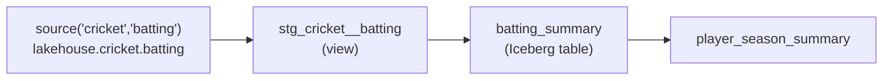

# Day 41 — dbt Core Concepts: Models, Sources & Refs

> Module 4: Analytics Engineering

Day 40 built the whole cricket dbt project at once. Today we slow down on the three primitives that
everything else is made of: a **model**, a **source**, and the **ref**. Get these and you can read
any dbt project.

## A model is a SELECT

A dbt model is a single `.sql` file containing one `SELECT`. That's it. dbt wraps it in the right
DDL for you — `CREATE VIEW` or `CREATE TABLE` — based on its **materialization**. You never write
`CREATE`/`INSERT`; you write the query that defines the data, dbt handles how it's persisted.

```sql
-- models/marts/batting_summary.sql  -> becomes CREATE TABLE lakehouse.cricket_dbt.batting_summary AS (...)
select player, season, innings, ...
from {{ ref('stg_cricket__batting') }}
```

Materializations (set in `dbt_project.yml` or per-model `config()`):

| Materialization | dbt does | We use it for |
|---|---|---|
| `view` | `CREATE VIEW` | staging — cheap, always fresh |
| `table` | `CREATE TABLE AS` | marts — Iceberg tables people query |
| `ephemeral` | inlines as a CTE (no DB object) | throwaway intermediate logic |
| `incremental` | `INSERT`/`MERGE` only new rows | big append-only tables |

## `source()` — the raw inputs, declared once

Raw tables you didn't build are declared in a `.yml` and referenced with `source()`:

```yaml
sources:
  - name: cricket
    catalog: lakehouse
    schema: cricket
    tables: [{name: batting}, {name: bowling}, {name: fielding}]
```

```sql
from {{ source('cricket', 'batting') }}   -- compiles to lakehouse.cricket.batting
```

Why not just type `lakehouse.cricket.batting`? Because the source declaration is a **single point of
change** (move the schema once, every model follows), a place to attach **tests** and **freshness**
checks, and a node dbt can draw on the lineage graph.

## `ref()` — how models depend on models

Models never name each other directly — they use `ref()`:

```sql
from {{ ref('stg_cricket__batting') }}   -- compiles to lakehouse.cricket_dbt.stg_cricket__batting
```

`ref` does two jobs at once:

1. **Resolves the real name** — dbt fills in the catalog/schema for the current target (dev vs prod
   get different schemas from the *same* code — Day 47).
2. **Builds the dependency edge** — dbt now knows `batting_summary` depends on `stg_cricket__batting`,
   so it builds them in the right order and can draw the DAG (Day 44).

This is the whole magic: **write logical names, dbt computes physical names and build order.**



## Seen in the project

`dbt ls` reports exactly what dbt parsed from the files — no manifest to maintain by hand:

```
$ dbt ls
Found 7 models, 35 data tests, 3 sources, 585 macros
  cricket_lakehouse.staging.stg_cricket__batting
  cricket_lakehouse.marts.batting_summary
  ...
```

Ask for a model's **ancestors** with the `+` graph operator and `ref`/`source` give you the answer
for free:

```
$ dbt ls --select +batting_summary
  source:cricket_lakehouse.cricket.batting      <- the raw source
  cricket_lakehouse.staging.stg_cricket__batting <- the staging view
  cricket_lakehouse.marts.batting_summary        <- the mart
  (+ all the tests attached along the way)
```

## Applied example (🏏)

The cricket project is nothing but these three primitives stacked: three `source()` declarations
(batting/bowling/fielding in `lakehouse.cricket`), three staging **views** that `source()` them, and
four mart **tables** that `ref()` staging — with `player_season_summary` `ref`-ing the other marts.
Change the source schema in one YAML line and all seven models re-point; no query edits.

## Summary

dbt is three primitives: a **model** (a `SELECT` dbt wraps in DDL per its materialization —
view/table/ephemeral/incremental), **`source()`** (raw inputs declared once, testable, on the graph),
and **`ref()`** (model-to-model dependency that resolves physical names *and* builds the DAG). Write
logical names; dbt computes the rest. Next: **Day 42 — how to shape the marts** (star schema vs OBT).
