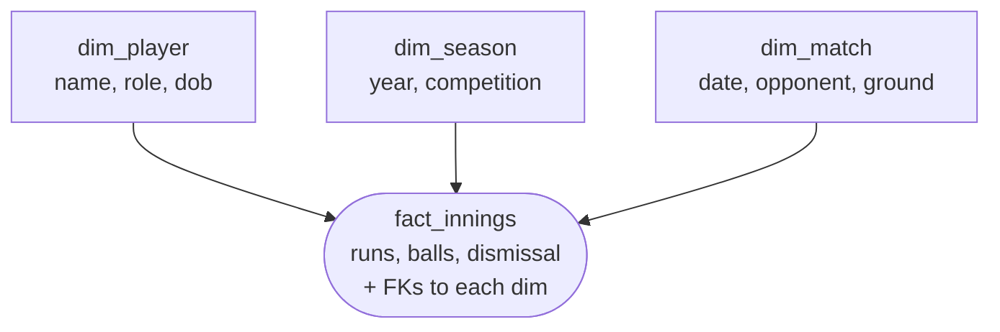

# Day 42 — dbt Data Modeling: Star Schema & OBT Patterns

> Module 4: Analytics Engineering

Staging cleans; **marts model**. The question a mart answers is *how should the numbers be shaped
for the people who query them?* Two dominant patterns: the **star schema** (the classic dimensional
model) and the **OBT** (one big table). They're not rivals — modern lakehouses often use both — and
the cricket project has an example of the second.

## The star schema

Split the world into **facts** (measurable events — a sale, a match innings) and **dimensions**
(the descriptive context — a customer, a player, a date). Facts hold foreign keys to dimensions;
queries join them. Drawn out, the fact sits in the middle with dimensions around it — a star.



- **Strengths:** no duplication (a player's details live in one row), easy to slice by any
  dimension, and it's what BI tools expect.
- **Cost:** every query joins. On huge tables those joins add up.

Grain is everything: **one row of a fact table = one event** at a stated grain (e.g. one row per
player per innings). Get the grain wrong and every metric downstream is wrong.

## OBT — one big table

Pre-join everything into a single wide, denormalised table: one row per entity with all its facts
and dimension attributes as columns. Readers just filter and aggregate — no joins.

- **Strengths:** dead simple to query, and **fast on columnar engines** — Trino/Iceberg (and DuckDB)
  read only the columns you touch, so a wide table isn't the penalty it is in a row store. This is
  why OBT has surged in the lakehouse era.
- **Cost:** duplication (a player's details repeat on every row) and it must be rebuilt when logic
  changes. Fine for a curated serving table, bad as your only source of truth.

## Which, when

| | Star schema | OBT |
|---|---|---|
| Storage | normalised, compact | denormalised, wider |
| Query | joins required | no joins |
| Best on | any engine, BI tools | columnar (Trino/DuckDB), dashboards |
| Rule of thumb | shared core model | serving layer for a specific consumer |

Common real answer: **build a dimensional core, then materialise an OBT on top** for the dashboards.
Star for truth, OBT for convenience.

## Applied example (🏏)

The cricket marts show the layering. The per-discipline marts (`batting_summary`, `bowling_summary`,
`fielding_summary`) are focused fact-like tables at the grain **one row per player per season**.
Then `player_season_summary` is a textbook **OBT** — it `ref`s the three marts and FULL-joins them
into one wide row per player/season, so a coaching dashboard reads runs, wickets, catch %, and an
all-rounder flag from a single table with zero joins:

```sql
-- player_season_summary: OBT built on the focused marts
select k.player, k.season,
       bat.total_runs, bat.conversion_pct,      -- batting facts
       bowl.wickets, bowl.economy_rate,          -- bowling facts
       field.catch_pct,                          -- fielding facts
       (if(bat...)+if(bowl...)+if(field...)) as disciplines_contributed
from keys k
left join bat ... left join bowl ... left join field ...
```

The dataset is one season and 20-ish players, so a full star schema (separate `dim_player`,
`dim_season`) would be **ceremony without payoff** — the OBT-on-marts shape is right-sized. As the
data grew to many seasons, clubs, and per-match grain, splitting out real dimensions would start to
earn its keep. Model to the data you have, with a clear path to the model you'll need.

## Summary

**Star schema** = facts + dimensions joined at query time (normalised, engine-agnostic, BI-friendly);
**OBT** = one wide denormalised table (no joins, fast on columnar engines, great for serving). Grain
— one row per event — is the thing to nail first. The cricket project uses focused per-discipline
marts plus an **OBT** (`player_season_summary`) for the dashboard, right-sized to a small dataset
with room to grow into real dimensions later. Next: **Day 43 — testing these models.**
