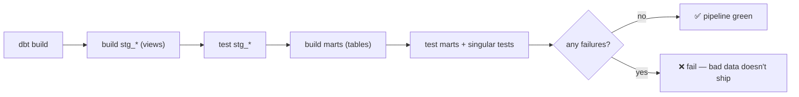

# Day 43 — dbt: Generic & Singular Tests

> Module 4: Analytics Engineering

A model that isn't tested is a guess. dbt's headline feature isn't the SQL templating — it's that
**tests run as part of the build**, so a broken assumption fails the pipeline instead of quietly
corrupting a dashboard. dbt has two kinds, and the cricket project uses both (35 tests in total).

## Generic tests — parametrised, reusable, declared in YAML

A generic test is a query template you apply to a column by naming it in a `.yml`. The four built-in
ones cover most of reality:

```yaml
columns:
  - name: player
    data_tests: [not_null, unique]          # two of the four built-ins
```

| Built-in | Asserts |
|---|---|
| `not_null` | no NULLs in the column |
| `unique` | no duplicate values |
| `accepted_values` | column ∈ a fixed set |
| `relationships` | every value exists in a parent (referential integrity) |

**Packages add more.** The cricket project pulls in **dbt_utils** (`packages.yml`) for
`accepted_range` and `unique_combination_of_columns`:

```yaml
- name: conversion_pct
  data_tests:
    - dbt_utils.accepted_range:            # a percentage must be 0–100
        arguments: { min_value: 0, max_value: 100 }
- name: player_season_summary              # a compound key
  data_tests:
    - dbt_utils.unique_combination_of_columns:
        arguments: { combination_of_columns: [player, season] }
```

> **dbt 1.10 note:** generic-test arguments now nest under an `arguments:` key — otherwise you get a
> deprecation warning per test (the project uses the new form).

## Singular tests — a SQL file that finds bad rows

When the rule is specific to *your* business logic, write a `.sql` file in `tests/` that **selects
the offending rows**. The convention is the inverse of a normal query: **zero rows returned = pass.**

The cricket project's marquee singular test is the `-`-cleaning invariant (Day 40): a bowler's strike
rate must be NULL for *exactly* the wicketless bowlers:

```sql
-- tests/assert_bowling_strike_rate_null_iff_wicketless.sql  (pass = 0 rows)
select player, wickets, strike_rate, is_wicketless
from {{ ref('stg_cricket__bowling') }}
where (is_wicketless      and strike_rate is not null)   -- wicketless but has an SR
   or (not is_wicketless  and strike_rate is null)        -- took wickets but SR missing
```

The other (`assert_batting_ranges_reconcile`) asserts the 0–9 count and milestone counts can't
exceed innings. Both are pure SQL — anyone who reads SQL can read the test.

## How they run



`dbt build` interleaves **run then test in dependency order** — a model's tests run right after it's
built, and a failure stops its downstream. (`dbt test` runs just the tests against what's already
built.) Verified on the project:

```
Done. PASS=42 WARN=0 ERROR=0 SKIP=0 TOTAL=42
  (35 data tests alongside the 7 models)
```

## Severity & debugging

- **`severity: warn`** turns a test into a warning instead of a failure — use for "watch this" rules
  that shouldn't block the pipeline; `error` (default) fails the build.
- **`--store-failures`** writes failing rows to a table so you can inspect *what* broke, not just
  that something did.
- Thresholds: `error_if: ">100"` / `warn_if` let a test tolerate a known level of noise.

## Applied example (🏏)

The 35 cricket tests encode what "correct" means for this data: keys are unique per
`(player, season)`, percentages sit in 0–100, `bowling_style`/`role` only take known values, every
mart player traces back to staging (`relationships`), and the two singular tests guard the
domain-specific invariants (the `-` cleaning; ranges reconcile). When next Saturday's scrape lands a
surprise — a negative economy, a duplicate player, a stray `'-'` in a new place — `dbt build` goes
red *before* the coaching dashboard shows a wrong number.

## Summary

Two kinds of test, both run by `dbt build` in dependency order: **generic** (parametrised,
YAML-declared — `not_null`/`unique`/`accepted_values`/`relationships` built-in, plus dbt_utils'
`accepted_range`/`unique_combination_of_columns`) and **singular** (a `.sql` that selects bad rows;
zero rows = pass). Tune with `severity`, `--store-failures`, and thresholds. The cricket project's 35
tests make "correct" executable. Next: **Day 44 — documentation, lineage & the DAG.**
