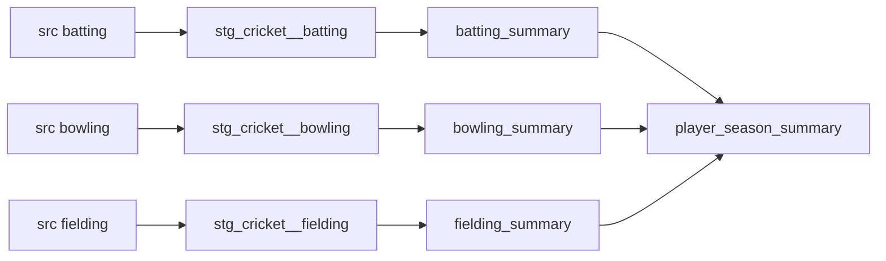

# Day 44 — dbt: Documentation, Lineage & the DAG

> Module 4: Analytics Engineering

The dependency graph dbt builds from `ref`/`source` (Day 41) isn't just for ordering the build — it's
the backbone of **documentation** and **lineage**. Because dbt already knows how every model connects
and what every column is, it can generate a browsable catalog and a visual lineage graph from the
same files you already wrote. No separate wiki to rot.

## The DAG is free

Every `ref()` and `source()` is an edge; every model/source is a node. That directed acyclic graph
(DAG) is what orders the build *and* what you navigate with **graph selectors** — verified on the
project:

```
$ dbt ls --select +batting_summary          # ancestors: what feeds it
  source:...cricket.batting -> stg_cricket__batting -> batting_summary

$ dbt ls --select stg_cricket__bowling+      # descendants: what it feeds
  stg_cricket__bowling -> bowling_summary -> player_season_summary
```

| Selector | Means |
|---|---|
| `+model` | the model **and all its ancestors** (upstream) |
| `model+` | the model **and all its descendants** (downstream) |
| `+model+` | the full lineage both ways |
| `tag:nightly`, `path:models/marts` | select by tag or folder |

These power real workflows: `dbt build --select +batting_summary` rebuilds only what a change
touches; `dbt build --select state:modified+` (with a stored manifest) rebuilds only what changed and
its downstream — the basis of fast CI.

## The whole cricket DAG



## Documentation from the same files

Descriptions live next to the models, in the `.yml`:

```yaml
- name: conversion_pct
  description: "hundreds / (fifties+hundreds) as a %. NULL only when the player has no 50+ score."
```

Those strings, plus the schema dbt reads back from the warehouse, become a searchable site:

```bash
dbt docs generate   # writes target/manifest.json (graph+docs) + target/catalog.json (columns/types)
dbt docs serve      # serves an interactive site: every model, its columns, description,
                    # compiled SQL, tests, and a clickable lineage graph
```

Verified on the project:

```
$ dbt docs generate
Building catalog
Catalog written to .../target/catalog.json
```

`manifest.json` is the graph + metadata (also what BI tools and `state:` selection consume);
`catalog.json` is the actual columns/types pulled from the warehouse. The docs site's lineage view is
the Mermaid graph above, but clickable and always in sync — because it's generated, not drawn.

## Why generated docs beat a wiki

- **Never stale** — regenerated from the code every run; a renamed column can't drift from its doc.
- **Column-level truth** — types come from the warehouse (`catalog.json`), not someone's memory.
- **Lineage for impact analysis** — "if I change this source, what breaks?" is `+source:...+`, not a
  guess.
- **`docs blocks`** (``) let you write longer Markdown once and reuse it across columns.

## Applied example (🏏)

The cricket project's YAML already carries descriptions on the tricky bits — why `strike_rate` is
NULL (wicketless), what `conversion_pct` means, that `disciplines_contributed` is 0–3. Run
`dbt docs serve` and a new analyst sees the four marts, that `player_season_summary` is fed by the
other three, and can click `stg_cricket__bowling` to read *why* the `-` becomes NULL — without
reading a line of SQL or asking anyone. The lineage graph makes the "raw → staging → mart → OBT"
story self-evident.

## Summary

dbt turns the `ref`/`source` **DAG** into three things for free: **build ordering**, **graph
selectors** (`+model`, `model+`, `state:modified+`) for surgical runs and fast CI, and **generated
docs + lineage** (`dbt docs generate` → `manifest.json`+`catalog.json` → `dbt docs serve`) that can't
go stale because they're rebuilt from the code and the warehouse. Documentation stops being a chore
and becomes a byproduct. Next: **Day 45 — macros, packages & Jinja** (the templating under all this).
