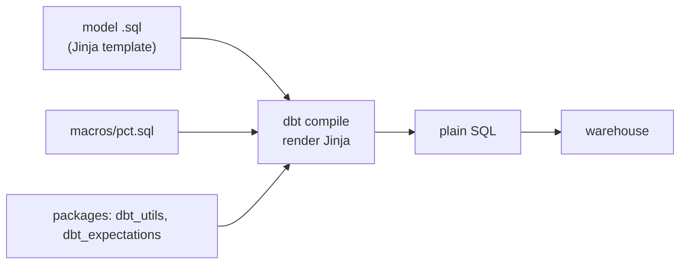

# Day 45 — dbt: Macros, Packages & Jinja Templating

> Module 4: Analytics Engineering

Every dbt model is run through **Jinja** before it hits the database — that's how `{{ ref(...) }}`
and `{{ source(...) }}` work. Once you see models as *templates*, you get the tools that keep a
project DRY: **macros** (your own reusable SQL functions) and **packages** (other people's macros
and tests). Today we add a real macro to the cricket project.

## Jinja: models are templates

`{{ ... }}` evaluates an expression; `` is a statement (if/for/set). dbt renders the
template to plain SQL (**compile**), then runs it. `ref`/`source` are just macros that return a
table name and record a dependency. You can see the rendered result in `target/compiled/…` — the
SQL the warehouse actually receives.

## A macro removes repetition

The cricket marts computed "a guarded percentage" three times — the same
`case when denom > 0 then round(100 * num / denom, 1) end`, once each for conversion %, early-exit %,
and catch %. That's a macro waiting to happen:

```sql
-- macros/pct.sql

case when ({{ denominator }}) > 0
     then round(100e0 * ({{ numerator }}) / ({{ denominator }}), {{ precision }})
end

```

The three call sites collapse to one readable line each:

```sql
{{ pct('hundreds', 'fifties + hundreds') }} as conversion_pct,
{{ pct('single_digit_scores', 'innings') }} as early_exit_pct,   -- batting_summary
{{ pct('total_catches', 'total_victims') }} as catch_pct,        -- fielding_summary
```

**Verified** — `dbt compile` shows the macro renders to exactly the SQL we hand-wrote before:

```sql
case when (fifties + hundreds) > 0
     then round(100e0 * (hundreds) / (fifties + hundreds), 1)
end as conversion_pct,
```

…and `dbt build` produces identical numbers (Dalley conversion 42.9% / early-exit 33.3%, Genever
catch 92.3% — unchanged). The macro also **centralises a bug fix**: the `100e0`-not-`100.0` Trino
gotcha (Day 40) now lives in one place instead of three.

## Why macros matter

- **DRY** — fix or change a calculation once, everywhere follows.
- **Consistency** — every percentage is guarded and rounded the same way, guaranteed.
- **Abstraction** — hide a warehouse quirk (the `100e0` cast) behind a clean name.
- Macros can do far more: generate columns in a loop (``), branch on `{{ target.name }}`
  (dev vs prod), or run operations via `dbt run-operation`.

## Packages: don't write what exists

A **package** is a dbt project you import for its macros/tests. Declared in `packages.yml`, pulled by
`dbt deps`. The cricket project already uses two:

```yaml
packages:
  - package: dbt-labs/dbt_utils          # accepted_range, unique_combination_of_columns, ...
    version: [">=1.1.0", "<2.0.0"]
  - package: metaplane/dbt_expectations   # Great-Expectations-style tests (Day 46)
    version: [">=0.10.0", "<0.11.0"]
```

`dbt deps` vendored them into `dbt_packages/` — which is why `dbt ls` reported **907 macros** for a
project with only a handful of models: the rest come from the packages. Standing on that shoulder is
the norm; hand-rolling a range test is the exception.



## Applied example (🏏)

The `pct()` macro is small but earns its place: three metrics across two marts now share one
definition, so when someone asks "are these percentages rounded consistently?" the answer is one
file. Packages carry the heavy lifting — `dbt_utils` for the range/uniqueness tests, `dbt_expectations`
for the distribution checks in Day 46 — none of which the project had to write.

## Summary

dbt models are **Jinja templates** compiled to SQL. **Macros** (`macros/*.sql`) are your reusable
SQL functions — we extracted a guarded-percentage `pct()` macro, verified it compiles to the same SQL
and yields identical numbers, and centralised the `100e0` gotcha. **Packages** (`packages.yml` +
`dbt deps`) import others' macros/tests — `dbt_utils` and `dbt_expectations` give this small project
907 macros. Write logical templates; reuse everything you can. Next: **Day 46 — dbt-expectations**
for extended test coverage.
