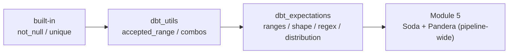

# Day 46 — dbt-expectations: Extended Test Coverage

> Module 4: Analytics Engineering

The built-in tests (Day 43) and `dbt_utils` cover the basics: not-null, unique, ranges, accepted
values. But real data quality often needs richer assertions — *distributions*, *string formats*,
*table shape*. **dbt-expectations** is a package that ports the [Great Expectations](https://greatexpectations.io)
catalogue into dbt's YAML tests, and it's the bridge into Module 5 (data quality).

## Install

It's a package like any other — add to `packages.yml`, `dbt deps`:

```yaml
packages:
  - package: metaplane/dbt_expectations
    version: [">=0.10.0", "<0.11.0"]
```

```
$ dbt deps
Installing metaplane/dbt_expectations   Installed from version 0.10.10
Installed from version 0.21.0           (dbt_date, its dependency)
```

## What it adds over the basics

dbt-expectations has ~60 tests. The families that matter most:

| Family | Example | Catches |
|---|---|---|
| **Value ranges** | `expect_column_values_to_be_between` | out-of-range numbers |
| **Table shape** | `expect_table_row_count_to_be_between` | empty / exploded loads |
| **String format** | `expect_column_values_to_match_regex` | malformed identifiers/codes |
| **Distribution** | `expect_column_stdev_to_be_between`, `_mean_` | drift, anomalies |
| **Set / type** | `expect_column_values_to_be_of_type` | schema regressions |

## Added to the cricket project (verified)

Three new tests, chosen to catch real failure modes, all passing live:

```yaml
# marts/_marts.yml — batting_summary
data_tests:
  - dbt_expectations.expect_table_row_count_to_be_between:   # a sane squad size
      arguments: { min_value: 1, max_value: 200 }
columns:
  - name: total_runs
    data_tests:
      - dbt_expectations.expect_column_values_to_be_between:
          arguments: { min_value: 0, max_value: 2000 }
  - name: economy_rate                                        # bowling_summary
    data_tests:
      - dbt_expectations.expect_column_values_to_be_between:
          arguments: { min_value: 0, max_value: 15 }         # >15 runs/over = data error
```

```yaml
# staging/_cricket__models.yml — the "best figures" string must be "wickets/runs"
- name: best_bowling
  data_tests:
    - dbt_expectations.expect_column_values_to_match_regex:
        arguments: { regex: '^[0-9]+/[0-9]+$' }
```

Result — the suite grew from 35 to 39 tests and stayed green:

```
Found 7 models, 39 data tests, 3 sources, 907 macros
...
Done. PASS=46 WARN=0 ERROR=0 SKIP=0 TOTAL=46
```

The `expect_table_row_count_to_be_between` is a shape check no column test gives you — if a bad load
wiped the table to 0 rows or duplicated it to thousands, *that's* what trips first. The regex is the
same instinct as the `-`-cleaning singular test (Day 43), but declarative and reusable.



## When to reach for it (and when not)

- **Use dbt-expectations** for distribution/shape/format rules that basic tests can't express, and
  when you want a recognised vocabulary the whole team knows.
- **Prefer a singular test** when the rule is genuinely bespoke to your domain (the `-`-cleaning
  invariant reads more clearly as five lines of SQL than as a config).
- **Don't over-test** — every test is query cost on each build. Assert what would actually hurt if
  wrong, not every column "just in case".

## Applied example (🏏)

The cricket suite now spans the full ladder: built-ins for keys and nulls, `dbt_utils` for 0–100
percentages, and `dbt_expectations` for "is the squad a believable size, are runs/economy in human
range, does `best_bowling` still look like `4/15`". Between them, next Saturday's scrape can't quietly
introduce a 900-run innings, a 40-runs-per-over economy, or a mangled best-figures string without
`dbt build` going red.

## Summary

**dbt-expectations** brings Great-Expectations-style assertions to dbt YAML — value ranges, **table
shape**, **string-format regex**, and distribution checks beyond the built-ins and `dbt_utils`. We
added four (verified: 35 → 39 tests, still green), including a row-count shape check and a
`best_bowling` regex. Use it for richer rules, singular tests for bespoke ones, and don't over-test.
This is the on-ramp to **Module 5 — pipeline-wide quality** (Soda + Pandera). Next: **Day 47 — dbt
with DuckDB for fast local development.**
