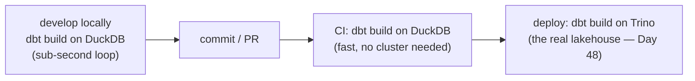

# Day 47 — dbt with DuckDB: Fast Local Development

> Module 4: Analytics Engineering

Every `dbt build` so far ran against the cluster's Trino — a network round-trip per model, shared
with everyone else. For *developing* models that's slower than it needs to be. Because dbt separates
**what** a model is (SQL) from **where** it runs (the adapter), you can point the exact same project
at **DuckDB** — an in-process engine, no server — and iterate in milliseconds. This is the local-dev
counterpart to Day 38.

## Same dbt, different adapter

dbt-core is the engine; the **adapter** is the plug. `dbt-trino` talks to the cluster; `dbt-duckdb`
runs everything inside a single local file. Swapping is a profile change, not a code change:

```yaml
# profiles.yml
cricket_duckdb:
  target: dev
  outputs:
    dev:
      type: duckdb
      path: dev.duckdb      # the whole "warehouse" is this one file
      threads: 4
```

`pip install dbt-duckdb`, and there's nothing else to stand up — no coordinator, no catalog, no
object store.

## A local project, verified

The repo has a self-contained DuckDB version at
[`examples/module4-dbt/duckdb-local/`](../examples/module4-dbt/duckdb-local/): a **seed** (the batting
data as CSV) → `stg_batting` → `batting_summary`, with the *identical* metric logic as the Trino
project. Build it end to end:

```bash
cd examples/module4-dbt/duckdb-local
dbt deps --profiles-dir .
dbt build --profiles-dir .
```

```
Found 2 models, 1 seed, 3 data tests, 572 macros
1 of 6 OK loaded seed file main.cricket_batting ......... [INSERT 20 in 0.04s]
2 of 6 OK created sql table model main.stg_batting ...... [OK in 0.04s]
3 of 6 OK created sql table model main.batting_summary .. [OK in 0.02s]
Finished ... 1 seed, 2 table models, 3 data tests in 0.30 seconds
Done. PASS=6 WARN=0 ERROR=0 TOTAL=6
```

**0.30 seconds** for the whole graph — seed, two models, three tests. And the numbers are identical
to the lakehouse:

```
DuckDB batting_summary:  Jonathan Dalley  conversion 42.9%  early-exit 33.3%   ✅ (matches Trino)
```

Same SQL, same results, a fraction of the time and zero infrastructure — that's the point.

## The workflow



Prototype a metric on DuckDB in a tight loop, let CI run the same project on DuckDB (no shared
warehouse to contend for), then run it for real on Trino against the full lakehouse. One codebase,
three environments.

## The honest caveat (from Day 38)

The cleanest version would have DuckDB read the **same Iceberg tables** the cluster uses, so local
and prod share not just code but data. On this cluster that's blocked by networking: Lakekeeper and
MinIO are **in-cluster only** (verified Day 38 — `minio.minio.svc` doesn't resolve from the laptop),
so laptop DuckDB can't reach the lakehouse's Parquet. So this demo uses a **seed** (a committed CSV
slice) as the local stand-in. The two ways to get true local-reads-prod-data are the same as Day 38:
expose MinIO + Lakekeeper with credential vending, or run DuckDB in-cluster. Seeds/local copies are
the pragmatic default until then — and for fast iteration they're often *better* (deterministic, no
dependency on cluster state).

## Applied example (🏏)

To add a new batting metric — say "boundary %" — you don't queue behind the shared Trino cluster:
edit `batting_summary.sql` in `duckdb-local/`, `dbt build` in 0.3s, eyeball the numbers against the
seed, iterate until right. Then lift the identical SQL into the Trino project's mart, where it runs
against the live Iceberg tables for real. DuckDB for the feedback loop, Trino for the shared truth.

## Summary

dbt separates model logic from the execution engine, so the **same project runs on DuckDB locally**
(`dbt-duckdb`, one file, no server) and **Trino in production** — verified: the local DuckDB build
does seed + 2 models + 3 tests in **0.30s** with numbers identical to the lakehouse. Use it for a
sub-second dev loop and cluster-free CI; seeds stand in for cluster data that's not reachable from the
laptop (the Day-38 networking boundary). Next: **Day 48 — dbt-trino in production on K8s** (running
the real thing on a schedule).
