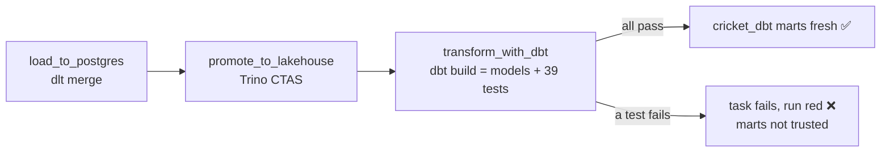

# Day 48 — dbt with Trino: Production Deployment on Kubernetes

> Module 4: Analytics Engineering

Every `dbt build` so far was run by hand from a laptop. That's fine for development — but a
production transformation has to run **on a schedule**, **in the cluster**, and **gate on its own
tests** so bad data never reaches the marts. Today we operationalise dbt: wire it into the existing
`cricket_lakehouse` Airflow DAG as the final, tested step.

## The gap to close

Modules 2–3 already schedule the front of the pipeline:

```
fetch snapshots ─dlt(merge)─► Postgres cricket.* ─Trino CTAS─► Iceberg lakehouse.cricket.*
```

…but the dbt models (`lakehouse.cricket_dbt.*`) only existed when someone ran dbt. So after a
Monday-morning refresh, the raw Iceberg tables were current but the *tested marts a dashboard reads*
were stale. The fix is one more task on the same DAG.

## How to run dbt in production (the options)

| Approach | What it is | When |
|---|---|---|
| **Airflow task** (ours) | a task runs `dbt build` in-cluster | you already have Airflow — reuse it |
| **astronomer-cosmos** | renders each dbt model as its own Airflow task | large projects wanting per-model retries/observability |
| **K8s CronJob / container** | a scheduled dbt image | no orchestrator, or dbt standalone |
| dbt Cloud | managed SaaS runner | not a self-hosted stack |

For a project this size, a **single Airflow task** is the right weight — one retry unit, minimal
overhead. Cosmos earns its keep when you have dozens of models and want the DAG to *show* each one.

## The implementation

A new `transform_with_dbt` task, chained after the promotion, following the DAG's established
pattern — **KubernetesExecutor pod + `@task.virtualenv`** (pip-installs `dbt-trino` in the task):

```python
@task.virtualenv(requirements=["dbt-trino==1.10.3"], system_site_packages=True)
def transform_with_dbt():
    # the dbt project isn't in the git-synced dags/ subPath, so fetch it from the public repo
    # as an HTTPS tarball (stdlib urllib+tarfile) — no git needed (see the gotcha below)
    with urllib.request.urlopen(".../90DaysOfDataEngineering/tar.gz/refs/heads/main") as resp:
        with tarfile.open(fileobj=io.BytesIO(resp.read()), mode="r:gz") as tar:
            tar.extractall(work, filter="data")
    project = f"{work}/90DaysOfDataEngineering-main/examples/module4-dbt/cricket_lakehouse"

    # in-cluster profile: Trino *service* DNS (same host the CTAS uses), no auth
    write profiles.yml -> host: trino.lakehouse.svc.cluster.local, catalog: lakehouse, schema: cricket_dbt

    runner = dbtRunner()                       # drive dbt in-process, no CLI on PATH to depend on
    for cmd in (["deps"], ["build"]):
        res = runner.invoke([*cmd, "--project-dir", project, "--profiles-dir", profiles_dir])
        if not res.success:
            raise RuntimeError(f"dbt {cmd[0]} failed")     # a failed test fails the task
```

```python
load_to_postgres() >> promote_to_lakehouse() >> transform_with_dbt()
```

Three deliberate choices:

- **Fetch the project as a tarball, not `git clone`.** git-sync only syncs the `dags/` subPath, so
  the dbt project isn't on the pod. The first version shelled out to `git clone` — and the task
  failed with `PermissionError: [Errno 13] Permission denied: 'git'`: the worker image *has* a `git`
  file but it isn't executable by the `airflow` user. So we download the repo as an HTTPS tarball
  with stdlib `urllib`+`tarfile` — zero external binaries. (This mirrors how the dlt task pulls
  snapshots over HTTPS — "the pipeline starts at what the repo holds.")
- **`dbtRunner`, not a shell `dbt`.** Driving dbt in-process (`from dbt.cli.main import dbtRunner`)
  avoids depending on a `dbt` binary being on the pod's PATH, and lets us check `res.success`
  directly.
- **Service DNS, generated profile.** The committed `profiles.yml` targets the laptop LoadBalancer;
  in-cluster we write a `prod` profile pointing at `trino.lakehouse.svc.cluster.local` — the same
  host `promote_to_lakehouse` uses.

## The quality gate

`dbt build` runs models **and** tests in dependency order. If any of the 39 tests fails, `dbtRunner`
returns `success = False`, the task raises, and the DAG run goes red — **so a bad load can't produce
green marts.** That's the whole point of putting dbt *inside* the pipeline rather than beside it.



## Verified

The dbt-build logic the task runs is verified via the same programmatic call, against Trino:

```python
dbtRunner().invoke(["build", "--project-dir", ".", "--profiles-dir", "."])
# success: True   nodes: 46 -> all ok   (7 models + 39 tests)
```

The DAG parses and chains cleanly. The full in-cluster run fires on the next schedule (or a manual
trigger) once the DAG is pushed and git-synced — exactly the Day-27 workflow: **push → git-sync
(~30s) → unpause → trigger**, and the first run is slower while the pod pip-installs dbt and
downloads the repo tarball.

## Applied example (🏏)

From next Monday at 07:00, one DAG does the lot: pull the latest scrape/exports, dlt-merge into
Postgres, CTAS into Iceberg, then **dbt build** the tested marts — and if Saturday's data broke an
invariant (a duplicate player, a 900-run innings, a mangled `best_bowling`), the run fails at the dbt
step and the coaching dashboard keeps last week's trusted numbers instead of showing wrong ones.

## Summary

Production dbt = **scheduled, in-cluster, test-gated**. We added `transform_with_dbt` to the
`cricket_lakehouse` DAG (KubernetesExecutor + `@task.virtualenv`), cloning the project from the repo
and driving it with `dbtRunner` against the Trino service, so a failing test fails the run. The build
logic is verified (46 nodes, all pass); the live in-cluster run follows the push→git-sync→trigger
flow. dbt is now part of the platform, not a manual step. Next: **Day 49 — the Module 4 hands-on**,
assembling everything.
