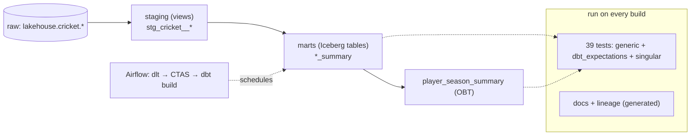
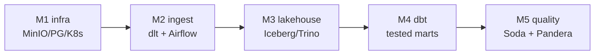

# Day 49 — Hands-On: End-to-End Analytics Engineering Project

> Module 4: Analytics Engineering

Module 4 built a complete analytics-engineering project across Days 40–48. Day 49 assembles it into
one hands-on map: **from an empty folder to tested, documented models that build on a schedule** —
the checklist you'd follow to do this on any warehouse, with the cricket project as the worked
example.

## What "done" looks like



## The build checklist

**1. Scaffold + connect.** `dbt_project.yml` + a `profiles.yml` pointing at the engine (dbt-trino →
`192.168.169.192:8080`, catalog `lakehouse`). Verify with `dbt debug`. (Day 40)

**2. Declare sources.** One `_sources.yml` naming the raw tables (`lakehouse.cricket.*`), so models
`ref` logical names, not hard-coded ones. (Day 41)

**3. Stage.** One view per source — light cleaning + the derivations marts need: batting `innings`
(Σ buckets), the bowling `is_wicketless` flag that *interprets* the `-`-cleaned NULLs, `best_bowling`
split, fielding role. Views = cheap, always fresh. (Days 40–41)

**4. Model the marts.** Decide the shape (Day 42): focused per-discipline marts at grain
*one row per player per season*, plus an **OBT** (`player_season_summary`) for the dashboard. Materialise
as **Iceberg tables**.

**5. Make it DRY.** Extract repeated logic into a macro — `pct()` for guarded percentages — and lean
on packages (`dbt_utils`, `dbt_expectations`) instead of reinventing tests. (Day 45)

**6. Test everything that matters.** Generic (`not_null`, `unique_combination_of_columns`,
`accepted_range`, `relationships`), dbt-expectations (row-count shape, value ranges, regex), and
singular SQL for bespoke invariants (the `-`-cleaning). 39 tests total. (Days 43, 46)

**7. Document.** Descriptions in YAML → `dbt docs generate` → a searchable site with clickable
lineage. Free, and never stale. (Day 44)

**8. Develop fast.** A DuckDB twin (`duckdb-local/`) for a sub-second dev loop and cluster-free CI;
same SQL, same numbers. (Day 47)

**9. Operationalise.** A scheduled, test-gated `dbt build` in Airflow — `transform_with_dbt` on the
`cricket_lakehouse` DAG — so a failing test fails the run and stale/bad marts never ship. (Day 48)

## Run the whole thing

```bash
# local: build + test against the lakehouse
cd examples/module4-dbt/cricket_lakehouse
dbt deps --profiles-dir . && dbt build --profiles-dir .     # PASS=46 (7 models, 39 tests)
dbt docs generate --profiles-dir . && dbt docs serve --profiles-dir .

# fast local dev on DuckDB (no cluster)
cd ../duckdb-local && dbt build --profiles-dir .            # ~0.3s, same numbers

# production: it runs itself — the Airflow DAG's transform_with_dbt task (Day 48)
```

## What Module 4 delivered (🏏)

The raw Iceberg tables from Module 3 became a **trusted analytics layer**: Conversion % and Early
Exit % (batting), economy-vs-strike-rate with a style label and clean handling of wicketless bowlers
(bowling), catch % by role (fielding), and an all-rounder OBT — every metric defined in one place,
39 tests asserting it's correct, docs a new analyst can read, and the whole thing rebuilt and
re-tested automatically after each week's data lands. That's analytics engineering: not just SQL, but
SQL that's **versioned, tested, documented, and deployed.**

## The bigger picture



Modules 1–4 now form a working stack: infrastructure, ingestion, an open lakehouse, and a tested
transformation layer — all on Kubernetes, no cloud, no lock-in.

## Summary

An end-to-end dbt project is nine steps: scaffold → sources → staging → marts (star/OBT) → macros &
packages → tests → docs → fast local dev → scheduled deployment. The cricket project does all nine —
7 models, 39 tests, generated docs, a DuckDB dev twin, and a test-gated Airflow task — turning raw
Iceberg tables into a trusted, self-maintaining analytics layer. **Module 4 complete.** Next:
**Module 5 — Data Quality & Observability** (Soda Core + Pandera + dbt tests), enforcing quality
across the *whole* pipeline, not just the transform.
