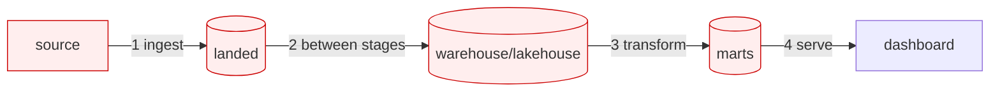

# Day 50 — Data Quality: Why It Matters & Where It Breaks

> Module 5: Data Quality & Observability

Every module so far moved data: ingested it (dlt), stored it (Iceberg), transformed it (dbt). Module
5 asks the harder question — **is it right?** Bad data is worse than no data: no data fails loudly,
bad data flows silently into a dashboard and someone makes a decision on a wrong number. Quality is
the discipline of catching that before it happens.

## Where data breaks

Failures aren't random — they cluster at the **boundaries** between systems, exactly where each
module handed off to the next:

| Break point | What goes wrong | Real cricket example |
|---|---|---|
| **Ingest** | source changes shape/type; nulls; encoding | Play-Cricket adds a column; `'-'` for a wicketless SR |
| **Between stages** | rows lost/duplicated in a load; a merge misfires | a re-run doubles a player's totals |
| **Transform** | a metric divides by zero; a join fans out | conversion % on a batter with zero 50s |
| **Serve** | stale data; a silently-empty table | last week's averages shown as this week's |

## The dimensions of "quality"

"Is it right?" decomposes into checkable properties:

- **Completeness** — are expected rows/values present? (no missing players)
- **Uniqueness** — no unintended duplicates (one row per player per season)
- **Validity** — values in the right range/format (percentages 0–100, `best_bowling` like `4/15`)
- **Consistency** — internal invariants hold (innings = Σ run-range buckets)
- **Timeliness/freshness** — is the data recent enough? (did this week's load actually run?)
- **Accuracy** — does it match reality? (the hardest — usually needs a trusted reference)

Most are *machine-checkable*; accuracy usually isn't, which is why the others matter so much.

## Enforce at every boundary, not one place

The core principle of this module: **quality is checked at multiple points**, because each boundary
fails differently and no single tool sees them all. Module 5 uses three complementary tools:

| Tool | Operates on | Boundary | Day |
|---|---|---|---|
| **Pandera** | Python DataFrames | ingest / in-flight | 54–55 |
| **Soda Core** | warehouse/lakehouse tables (SQL) | between stages (scheduled scans) | 52–53 |
| **dbt tests / dbt-expectations** | model outputs | post-transform | 56 (built in Module 4) |

They overlap deliberately — defence in depth. A contract at ingest (Day 51) stops a bad shape early;
a Soda scan catches a bad *load* even if the shape was fine; dbt tests catch a bad *transform* even
if the load was fine.

## Applied example (🏏)

The cricket pipeline already has one layer — the 39 dbt tests (Module 4) guarding the marts. But
those run *after* transformation. If Saturday's scrape duplicated a player, the dbt `unique`
combination test would catch it in the marts — yet the bad rows already sat in Postgres and Iceberg
for a stage. Module 5 pushes checks **upstream**: validate the scraped DataFrame *before* it loads
(Pandera, Day 54), scan the Postgres/Iceberg tables *between* stages (Soda, Day 52), so a problem is
caught at the boundary where it entered, not three stops later.

## Summary

Bad data is worse than no data because it fails silently. Failures cluster at **boundaries** —
ingest, between-stages, transform, serve — and "quality" decomposes into checkable dimensions
(completeness, uniqueness, validity, consistency, freshness, accuracy). The module's principle:
**enforce quality at every boundary** with complementary tools — Pandera (in-flight), Soda Core
(at rest), dbt tests (post-transform). Next: **Day 51 — data contracts**, making the ingest boundary
a binding agreement.
