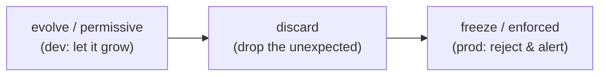

# Day 51 — Data Contracts: Schema as a Binding Agreement

> Module 5: Data Quality & Observability

Tests (Day 43) catch bad *data*. A **contract** catches a bad *shape* — a promise about the columns,
types, and rules of a dataset that producers and consumers both agree to, enforced automatically. If
tests are "did the values pass?", contracts are "is this even the table we agreed on?". They're the
first line of defence, right at the ingest boundary.

## Why a contract, not just a test

Without a contract, a schema change propagates silently: the source adds a column, drops one, or
changes a type; your pipeline either breaks three stages downstream or — worse — quietly loads
garbage. A contract makes the schema an **explicit, versioned agreement** and fails *at the boundary*
the moment reality diverges from it. It turns "the dashboard looks weird" into "the load rejected an
unexpected column at 07:01."

## Contracts at the ingest boundary — dlt

dlt (Day 25) enforces contracts on three axes — `tables`, `columns`, `data_type` — each set to
`evolve` (allow), `discard_row`/`discard_value` (drop), or `freeze` (reject). The workshop example
[`schema_evolution_pipeline.py`](../examples/workshop-dlt/schema_evolution_pipeline.py) proves it:

```python
# source gains an `age` column, but we FREEZE the contract -> dlt rejects it
p.run(res({"city", "country", "age"}), schema_contract={"columns": "freeze"})
# phase 3 (+ age, freeze)  -> rejected by contract (DataValidationError)
```

`evolve` is permissive (great early, when you *want* the schema to grow); `freeze` is strict (great
in production, when a surprise column is a bug, not a feature). Choosing per-axis is the point: freeze
columns but evolve data types, say.

## Contracts at the transform boundary — dbt model contracts

dbt has the mirror image: a **model contract** declares the exact columns and types a model *must*
produce, enforced at build time.

```yaml
models:
  - name: batting_summary
    config:
      contract: { enforced: true }
    columns:
      - name: player      # every column must be listed with its type
        data_type: varchar
      - name: conversion_pct
        data_type: double
```

If the model's SQL stops producing `conversion_pct`, or its type drifts, `dbt build` **fails before
it writes the table** — so a downstream consumer relying on that column never sees it vanish silently.
It's a producer-side promise: "this table will always have these columns, these types."

## The contract spectrum



- **Early development** → permissive (`evolve`): iterate fast, let the schema settle.
- **Production** → strict (`freeze` / `contract: enforced`): a change must be a deliberate, reviewed
  bump of the agreement, not an accident.

The move from one to the other *is* the maturing of a pipeline.

## Applied example (🏏)

Play-Cricket is an uncontrolled source — its stats pages can change without warning. That's exactly
where a contract earns its place: freeze the batting columns at ingest so if a new "Balls Faced"
column appears (or "Total Runs" gets renamed), the Monday load **rejects it and alerts** instead of
silently loading a table the dbt models don't understand. On the output side, a dbt contract on
`batting_summary` guarantees the coaching dashboard's columns (`conversion_pct`, `early_exit_pct`)
never disappear from under it. Producer promises at both ends; the pipeline in between stays honest.

## Summary

A **data contract** is an enforced, versioned agreement about a dataset's shape — columns, types,
rules. dlt enforces it at the **ingest** boundary (`schema_contract` = evolve/discard/freeze per
tables/columns/data_type — verified rejecting a new column), dbt at the **transform** boundary
(`contract: {enforced: true}` fails the build if columns/types drift). Permissive in dev, strict in
prod. Contracts stop bad *shapes*; the next tools stop bad *values*. Next: **Day 52 — Soda Core**,
scanning the tables themselves.
