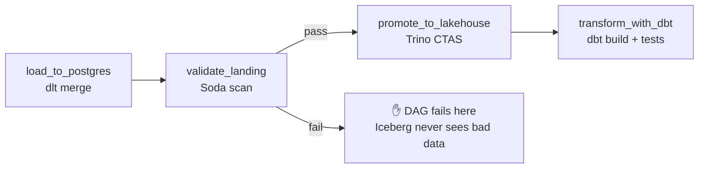

# Day 53 — Soda Core: Integration with Airflow (Quality as a Pipeline Stage)

> Module 5: Data Quality & Observability

A scan you run by hand catches problems *after* someone notices. The point of quality is to catch
them **automatically, in the pipeline, before bad data moves on**. Today we make the Soda scan from
Day 52 a real stage in the `cricket_lakehouse` DAG — a **gate** that runs after the load and blocks
promotion if the landing data is bad.

## The idea: gate, don't just alert

Placement is everything. Put the scan **between** the load and the promotion:



Because Airflow runs tasks in dependency order and a failed task stops its downstream, a red Soda
scan means `promote_to_lakehouse` **never runs** — the bad rows sit quarantined in Postgres landing
and the lakehouse keeps last week's good data. That's the difference between a *gate* and a
dashboard: the gate stops the line.

## The task

Following the DAG's established pattern (KubernetesExecutor pod + `@task.virtualenv`), driving Soda
through its **Python API** — no `soda` binary to shell out to:

```python
@task.virtualenv(requirements=["soda-core-postgres==3.5.6", "requests"], system_site_packages=True)
def validate_landing():
    from airflow.hooks.base import BaseHook
    from soda.scan import Scan

    c = BaseHook.get_connection("postgres_appdb")          # creds from the connection, not hard-coded
    config = f"""
    data_source cricket_pg:
      type: postgres
      host: {c.host}
      username: {c.login}
      password: {c.password}
      database: {c.schema}
      schema: cricket
    """
    checks = requests.get(".../examples/module5-quality/soda/checks/cricket.yml").text  # canonical file

    scan = Scan()
    scan.set_data_source_name("cricket_pg")
    scan.add_configuration_yaml_str(config)
    scan.add_sodacl_yaml_str(checks)
    scan.execute()
    print(scan.get_logs_text())
    scan.assert_no_checks_fail()        # raises -> task fails -> promotion is blocked
```

```python
load_to_postgres() >> validate_landing() >> promote_to_lakehouse() >> transform_with_dbt()
```

Three deliberate choices, all consistent with the rest of the DAG:

- **Creds from the Airflow connection** (`postgres_appdb`) — no secret in the public DAG, same as
  the dlt task.
- **Checks fetched from the repo** — the SodaCL file
  [`examples/module5-quality/soda/checks/cricket.yml`](../examples/module5-quality/soda/checks/cricket.yml)
  is the single source of truth; the task pulls it (the DAG already fetches snapshots this way).
- **`assert_no_checks_fail()`** — turns a failed check into a raised exception, so Airflow marks the
  task failed and halts the branch.

## Verified

The Python API the task relies on is verified against the landing zone:

```python
scan.execute()                 # -> 0
scan.has_check_fails()         # -> False
scan.assert_no_checks_fail()   # -> OK (raises on failure)
```

The DAG parses (`py_compile` clean). The live in-cluster run follows the usual flow — push →
git-sync → trigger — and the first run is slower while the pod pip-installs `soda-core-postgres`.

## Two layers of quality now in one pipeline

The cricket DAG now enforces quality at **two** boundaries: **Soda** on the Postgres landing (before
promotion) and **dbt tests** on the marts (after transform). A bad *load* trips Soda and stops
promotion; a bad *transform* trips dbt and stops the marts shipping. Defence in depth, both automatic.

## Applied example (🏏)

Monday 07:00: dlt merges the weekend's scrape into Postgres, **Soda scans it** — if a re-run doubled
a player's rows or a mangled export produced a 40-runs-per-over economy, the scan fails and the
lakehouse is left untouched with last week's trusted numbers. Only clean landing data gets promoted
to Iceberg and modelled by dbt. The coach never sees a wrong average because a bad load was caught at
the door.

## Summary

Wiring Soda into Airflow turns a check into a **gate**: `validate_landing` scans the Postgres landing
zone between load and promotion, and `assert_no_checks_fail()` fails the task — so bad data never
reaches Iceberg. Creds come from the Airflow connection, checks from the canonical repo file, driven
via Soda's Python API (verified). The pipeline now gates at two boundaries — Soda (load) and dbt
(transform). Next: **Day 54 — Pandera**, pushing validation all the way to the in-flight DataFrame.
