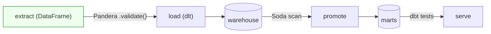

# Day 54 — Pandera: DataFrame Schema Validation in Python

> Module 5: Data Quality & Observability

Soda checks tables at rest; dbt checks model outputs. But the *earliest* place to catch bad data is
the moment it's in memory, right after extraction — before it's loaded anywhere. That's a Python
DataFrame, and **Pandera** is the tool that validates one: declare a schema, call `.validate(df)`,
and get either a clean DataFrame back or a precise list of what's wrong.

## A schema is columns + checks

```python
import pandera.pandas as pa
from pandera import Column, Check

batting_schema = pa.DataFrameSchema(
    {
        "player":     Column(str, Check.str_length(min_value=1), nullable=False),
        "season":     Column(int, Check.ge(2000)),
        "total_runs": Column(int, Check.ge(0)),
        "high_score": Column(int, Check.in_range(0, 400)),
    },
    # frame-level check: a cross-column invariant
    checks=Check(lambda d: d["high_score"] <= d["total_runs"],
                 name="high_score_le_total_runs"),
    strict=False,   # allow extra columns (dlt adds _dlt_id); True = exact shape
    coerce=True,    # coerce types where safe
)
```

- **Column checks** — type + rules per column (`ge`, `le`, `in_range`, `isin`, `str_matches`,
  `str_length`, or any lambda).
- **Frame-level checks** — invariants across columns (`high_score <= total_runs`) — the DataFrame
  equivalent of a dbt singular test.
- **`nullable`, `coerce`, `strict`** — null policy, type coercion, and whether unexpected columns
  are allowed.

## validate — fail fast or collect all

```python
schema.validate(df)              # raises SchemaError on the FIRST problem
schema.validate(df, lazy=True)   # collects EVERY failure -> SchemaErrors.failure_cases
```

`lazy=True` is what you want in a pipeline — one report of everything wrong, not a whack-a-mole.

## Verified live

Against the real cricket landing data (pulled into a DataFrame):

```
✅ batting: 20 rows valid
```

Corrupt one row (`total_runs = -5`) and validate lazily — Pandera pinpoints *both* the column rule
and the cross-column invariant, naming the offending row:

```
check                         column      failure_case
high_score_le_total_runs      player      Ben Jennings
high_score_le_total_runs      total_runs  -5
greater_than_or_equal_to(0)   total_runs  -5
```

That's the value: not "validation failed", but *which check, which column, which row*.

## Class-based schemas (optional)

For reuse, Pandera also offers a class style (`DataFrameModel`) and a decorator that validates
function I/O automatically:

```python
class Batting(pa.DataFrameModel):
    player: str
    total_runs: int = pa.Field(ge=0)

@pa.check_types
def clean(df: pa.typed.DataFrame[Batting]) -> pa.typed.DataFrame[Batting]:
    return df          # inputs/outputs validated at the boundary, for free
```

## Where Pandera fits



Pandera owns the **in-flight** boundary — the leftmost, earliest check. It complements (doesn't
replace) Soda and dbt: catch the malformed record before it's ever written.

## Applied example (🏏)

The committed schema ([`examples/module5-quality/pandera/schemas.py`](../examples/module5-quality/pandera/schemas.py))
encodes what a valid batting row *is*: a named player, a sane season, non-negative runs, a high score
in range and never above the total. Run
[`validate_cricket.py`](../examples/module5-quality/pandera/validate_cricket.py) and the current
scrape passes — but the day a broken export yields a negative total or a high score above the total,
Pandera names the exact player and rule before a single row reaches Postgres.

## Summary

**Pandera** validates DataFrames in Python: a `DataFrameSchema` of column checks + frame-level
invariants, `.validate(df, lazy=True)` returning precise `failure_cases` (verified: 20 cricket rows
valid; a corrupted row flagged on both its column rule and the cross-column invariant). It owns the
**in-flight/ingest** boundary — the earliest catch — alongside Soda (at rest) and dbt (post-transform).
Next: **Day 55 — putting Pandera inside dlt (and Spark) pipelines.**
