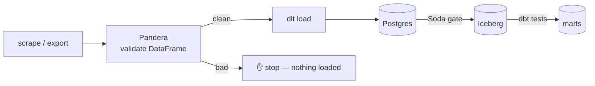

# Day 55 — Pandera: Validating dlt (and Spark) Pipelines

> Module 5: Data Quality & Observability

Day 54 validated a DataFrame in isolation. The payoff is putting that check **inside the ingestion
pipeline** so bad data is rejected at the source boundary — "shift left" as far as it goes. Today:
Pandera as a guard in a dlt pipeline, and a look at the same idea at Spark scale.

## Shift left: validate before you load

dlt already infers schemas and enforces *contracts* (Day 51) on shape. Pandera adds **value**
validation on the content — the two are complementary:

| | dlt contract | Pandera |
|---|---|---|
| Guards | schema/shape (columns, types) | values (ranges, formats, cross-column rules) |
| When | on load | before load, in your code |
| Reports | schema violation | which row, which check |

Put Pandera between extract and load, and a malformed record never becomes a row:

```python
import pandera.pandas as pa
from schemas import batting_schema

def extract_batting() -> "list[dict]":
    ...  # scrape / read the snapshot

def validated_batting():
    df = pd.DataFrame(extract_batting())
    df = batting_schema.validate(df, lazy=True)   # raises SchemaErrors on bad data -> pipeline stops
    yield from df.to_dict("records")

pipeline.run(validated_batting(), table_name="batting")   # only clean rows are loaded
```

If validation raises, `pipeline.run` never executes — nothing lands. That's the strongest placement:
the bad data is stopped *before* it exists in the warehouse, so neither Soda nor dbt ever has to see
it. (You can also validate *non-fatally* — log failures and load the good rows — depending on whether
you'd rather block or quarantine.)

## The layered picture



Three tools, three boundaries: **Pandera** stops bad values in flight, **Soda** catches a bad load
at rest, **dbt** catches a bad transform. A problem is caught at the *earliest* boundary it can be.

## Verified

The committed schema + validator run against the real cricket data:

```
$ python examples/module5-quality/pandera/validate_cricket.py
✅ batting: 20 rows valid       # exit 0
```

Wrapping the dlt resource with `batting_schema.validate(...)` is the same call, just relocated into
the pipeline — so the check that passes here becomes the gate that runs on every ingest.

## The same idea at scale — Spark

Pandera isn't pandas-only. It has a **PySpark** backend (`pandera.pyspark`) that validates
`pyspark.sql.DataFrame`s with the same schema concepts, so when Module 6 introduces Spark for
batch processing, the ingest-time validation pattern carries over unchanged — declare the schema
once, apply it whether the data is a small pandas frame or a distributed Spark one. (Polars is
supported too.) The *tool* scales with the *engine*.

## Applied example (🏏)

The honest cricket reality (Module 2): the extract is a browser scrape you run in your own session,
and "the pipeline starts at the landed file." That file is an *uncontrolled* input — exactly what
Pandera should guard. Wrapping the batting/bowling ingest with `batting_schema`/`bowling_schema`
means a malformed capture (a negative total, a high score above the total, a 40-runs-per-over
economy) is rejected in Python with the offending player named — before dlt writes a single row.
Fail fast, at the true source boundary.

## Summary

Pandera's value is **inside the pipeline**: validate the extracted DataFrame before `dlt` loads it,
so bad values never become rows (`schema.validate(df, lazy=True)` raises and halts the run). It
complements dlt's shape contracts (values vs schema) and completes the three-boundary defence with
Soda and dbt. The same schemas run on **PySpark** DataFrames, so the pattern scales into Module 6.
Next: **Day 56 — dbt tests + dbt-expectations as the post-transform layer** (bringing Module 4's work
into the quality framework).
