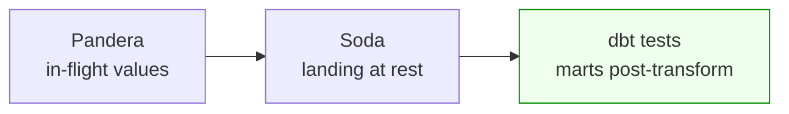

# Day 56 — dbt Tests + dbt-expectations: Post-Transform Quality

> Module 5: Data Quality & Observability

Pandera guards the data going *in* (Day 54–55); Soda guards it *at rest* between stages (Day 52–53).
The last boundary is **after transformation** — the marts people actually query — and that's dbt's
turf. We built the tests back in Module 4 (Days 43, 46); today we place them in the quality framework
and add the pieces that make them a real post-transform gate.

## Why post-transform needs its own layer

Even with clean inputs, the *transform* can introduce errors: a join fans out and duplicates rows, a
`CASE` divides by zero, a metric definition drifts. Pandera and Soda never see the marts — they run
upstream. So the marts need their own assertions, co-located with the logic that produces them, run
every time that logic runs. That's exactly what dbt tests are.

## What the cricket project already asserts (39 tests)

- **Generic** — `not_null`, `unique_combination_of_columns` (one row per player/season),
  `accepted_range` (percentages 0–100), `accepted_values` (role, bowling_style), `relationships`
  (every mart player traces to staging).
- **dbt-expectations** — `expect_table_row_count_to_be_between` (sane squad size),
  `expect_column_values_to_be_between` (runs/economy in human range),
  `expect_column_values_to_match_regex` (`best_bowling` = `4/15`).
- **Singular** — the `-`-cleaning invariant and the range-reconciliation SQL.

`dbt build` runs all 39 alongside the models, in dependency order — **PASS=46** on the live lakehouse.

## The pieces that make it a gate

**Severity — warn vs error.** Not every check should stop the pipeline. `severity: warn` surfaces a
concern without failing the build; `error` (default) blocks it. Use warn for "keep an eye on this",
error for "this must be true".

```yaml
- dbt_expectations.expect_column_values_to_be_between:
    arguments: { min_value: 0, max_value: 15 }
    config: { severity: warn }        # flag a high economy, don't fail the run
```

**Store failures.** `dbt build --store-failures` writes failing rows to a table, so you can inspect
*what* broke, not just that something did — turning a red test into a debuggable dataset.

**Source freshness.** dbt can also assert inputs are *recent* — `dbt source freshness` with a
`loaded_at_field` warns/errors if a source hasn't updated in N hours. (The cricket sources carry no
load timestamp today, so this is the natural next hardening: add one via dlt's `_dlt_load_id`
lineage and gate on it.)

**Runs in the pipeline.** Day 48 already wired `dbt build` into Airflow as `transform_with_dbt` — so
these tests *are* the post-transform gate, automatically, on every scheduled run. A failed test fails
the task; the marts don't ship.

## The three layers, together



Each catches what the others can't see: Pandera never sees the marts, dbt never sees the raw
DataFrame. Post-transform is dbt's boundary, and it's the one closest to the consumer — the last line
before a number reaches a dashboard.

## Applied example (🏏)

The coaching dashboard reads `batting_summary`/`player_season_summary`. Those are the marts dbt tests
guard: if a future model change made `conversion_pct` exceed 100, or the OBT join duplicated a player,
`dbt build` fails at the test step and the dashboard keeps the last good build. Combined with Pandera
at ingest and Soda at landing, a wrong number would have to slip past *three* independent gates to
reach the coach — and each gate is watching a different failure mode.

## Summary

dbt tests + dbt-expectations are the **post-transform** quality layer — assertions co-located with
the marts, run by `dbt build` (39 tests, PASS=46), already gating the Airflow pipeline (Day 48). Make
them production-grade with **severity** (warn vs error), **`--store-failures`** for debugging, and
**source freshness** for timeliness. This completes the three-boundary defence with Pandera and Soda.
Next: **Day 57 — assembling all three into one quality framework across the stack.**
