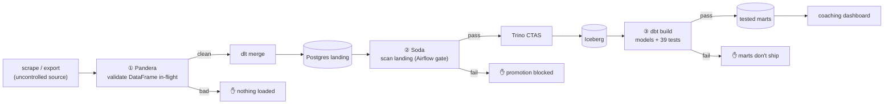
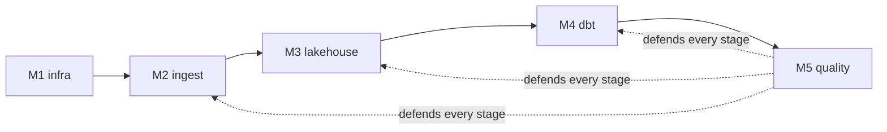

# Day 57 — Hands-On: A Full Quality Framework Across the Stack

> Module 5: Data Quality & Observability

Module 5 introduced three tools at three boundaries. Day 57 assembles them into one **quality
framework** on the cricket pipeline — the worked example of the module's core principle: *enforce
quality at every boundary, because each tool sees what the others can't.*

## The framework

| # | Tool | Boundary | Guards | Verified |
|---|---|---|---|---|
| ① | **Pandera** | in-flight (Python) | values, cross-column rules, before load | 20 rows valid; corrupt row flagged |
| ② | **Soda Core** | landing at rest (SQL) | row counts, dupes, ranges, reconciliation | 11/11 checks pass; exits 2 on fail |
| ③ | **dbt tests** | post-transform (marts) | keys, ranges, formats, invariants | 39 tests, PASS=46 |

Three independent gates, three failure modes. A wrong number would have to beat all three.

## Why overlap is a feature, not waste

The layers deliberately re-check similar things (e.g. "no duplicate players" appears in Soda *and*
dbt). That's **defence in depth**: Pandera catches a malformed *record*, Soda catches a bad *load*
even if each record was fine, dbt catches a bad *transform* even if the load was fine. Remove any one
and a class of failure reaches the consumer. The cost is cheap (checks are fast); the payoff is that
no single bug is a single point of failure.

## Build-it checklist

1. **Contract the source** (Day 51) — dlt `schema_contract` freezes the ingest shape; a surprise
   column is rejected, not silently loaded.
2. **Validate in-flight** (Day 54–55) — wrap the dlt resource with a Pandera schema; bad values never
   become rows.
3. **Gate the landing** (Day 52–53) — a Soda scan as an Airflow task *between* load and promote;
   `assert_no_checks_fail()` blocks promotion on failure.
4. **Test the marts** (Day 56) — `dbt build`'s 39 tests as the post-transform gate, already wired
   into the DAG (Day 48).
5. **Automate + observe** — all of it runs on the weekly schedule; failures fail the run. Add
   alerting (Airflow callbacks / Soda Cloud) so a red gate reaches a human.

## The pipeline, fully gated (🏏)

The `cricket_lakehouse` DAG now enforces two of the three gates in-cluster —
`load → validate_landing (Soda) → promote → transform_with_dbt (dbt tests)` — with Pandera the
natural third at the extract step. So the Monday refresh is not just *scheduled*, it's *defended*: a
doubled player, a mangled economy, a divide-by-zero metric each trips a different gate, and the
coaching dashboard only ever updates from data that cleared all of them.

## What the stack looks like now

Modules 1–5 are a working, *trustworthy* platform: infrastructure, ingestion, an open lakehouse,
tested transformations, and quality gates at every boundary — all on Kubernetes, no cloud, no
lock-in.

## Summary

A full quality framework is **three complementary gates**: Pandera (in-flight values), Soda Core
(landing at rest, an Airflow gate), and dbt tests (post-transform marts) — overlapping on purpose for
defence in depth. The cricket pipeline demonstrates all three, verified live, with two already gating
the scheduled DAG. **Module 5 complete.** Next: **Module 6 — Batch Processing with Spark**, adding
distributed compute over the same Iceberg lakehouse (where Pandera's PySpark backend, Day 55, will
feel right at home).
