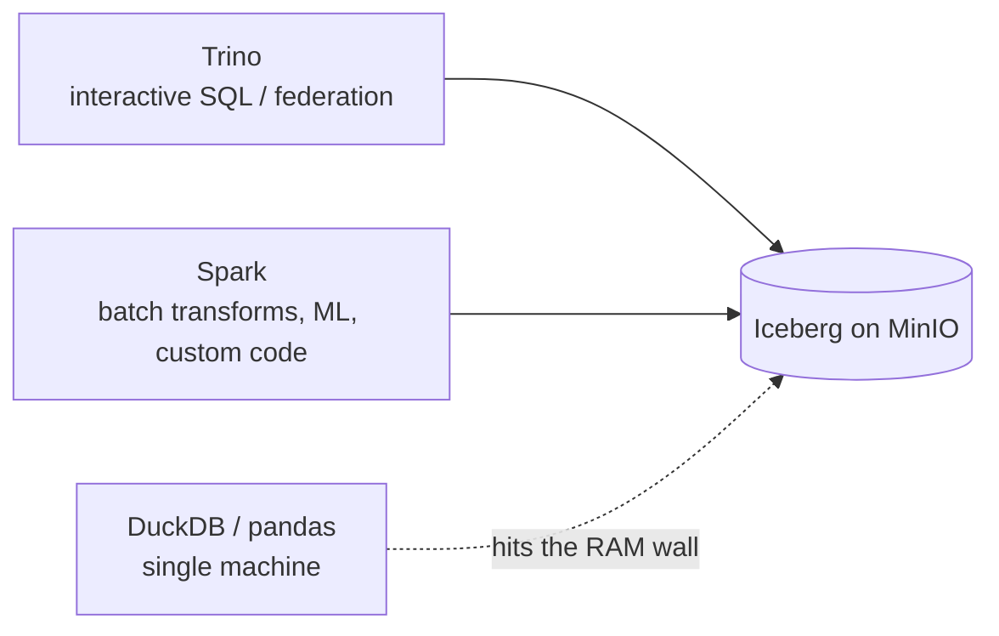

# Day 58 — Distributed Computing Fundamentals: Why Spark Exists

> Module 6: Batch Processing

We already have a distributed engine — Trino (Module 3) fans queries across workers. So why add
Apache Spark? Because they solve different problems. Trino is built for **interactive SQL** over data
that lives elsewhere; Spark is built for **large-scale general-purpose computation** — heavy
transformations, custom Python/Scala logic, ML — over data that may be far bigger than any one
machine's memory. Today: the fundamentals that make "distributed" necessary, and where Spark fits.

## The wall: one machine isn't enough

Every single-machine tool (pandas, DuckDB, a Python script) hits the same wall: the data, or the
work, outgrows one box's RAM/CPU/disk. Two ways out:

- **Scale up** — a bigger machine. Simple, but finite and expensive; there's always a biggest box.
- **Scale out** — many machines working in parallel. Effectively unbounded, but now you have a
  *distributed systems* problem: split the data, coordinate the work, handle a node dying mid-job.

Distributed compute frameworks exist to make scale-out **look like** one machine — you write logic
over "a table", the framework splits it into **partitions**, runs the work in parallel, and handles
the coordination and failures for you.

## The lineage: MapReduce → Spark

- **Hadoop MapReduce** (2000s) pioneered scale-out batch: split data across a cluster, `map` in
  parallel, `shuffle`, `reduce`. It worked but wrote **every intermediate step to disk** — slow for
  anything multi-step (and most real jobs are multi-step).
- **Apache Spark** kept the split-parallel-combine model but keeps intermediate data **in memory**
  across steps, and exposes a far nicer API (DataFrames, SQL) instead of raw map/reduce. For
  iterative and multi-stage work that's often 10–100× faster — which is why Spark won.

Crucially, Spark **decoupled from Hadoop**: no HDFS required (it reads S3/object storage), and no
YARN required (it can schedule on Kubernetes — Module 6's whole point, Day 65).

## Spark vs Trino — not rivals

Both are distributed and both speak SQL, so the overlap confuses people. The split:

| | Trino | Spark |
|---|---|---|
| Built for | interactive SQL, federation | large-scale batch transforms, ML, custom code |
| Latency | seconds (query-optimised) | seconds-to-hours (throughput-optimised) |
| Language | SQL | SQL **+ Python/Scala/Java** (DataFrames, UDFs, MLlib) |
| Typical use | "run this query now" | "reprocess/rebuild/transform this dataset" |
| In our stack | Module 3 query engine | Module 6 batch engine |

Rule of thumb: **Trino to *ask* the lakehouse a question; Spark to *reshape* the lakehouse at scale.**
dbt (Module 4) sits on top of whichever engine runs the SQL.

## When you actually need Spark (and when you don't)

- **Reach for Spark** when: data won't fit in one machine's memory; the job is heavy multi-stage
  transformation; you need Python/Scala logic or ML that isn't expressible in SQL; you're rewriting
  huge tables (big Iceberg maintenance, Day 67).
- **Don't** when: DuckDB/Trino/dbt already handle it. Most analytics on gigabytes doesn't need Spark
  — and Spark's coordination overhead makes it *slower* on small data.

## Applied example (🏏)

Honest scale check: the cricket tables are **kilobytes** — Spark is wildly overkill, and DuckDB
(Day 38) or Trino answer instantly. So in this module cricket is the **teaching vehicle, not the
justification**: we'll run real Spark jobs against `lakehouse.cricket.*` to learn the engine — the
same code and the same SparkApplication that processes 20 cricketers would process 20 billion rows by
adding executors, nothing else changing. That "same code, more nodes" property is exactly what we're
here to understand.

## Summary

Single machines hit a wall; **scaling out** trades that for a distributed-systems problem that
frameworks hide behind "a table" made of **partitions**. Spark improved on Hadoop MapReduce by
keeping intermediate data **in memory** and offering DataFrame/SQL APIs, and decoupled from
Hadoop so it runs on **Kubernetes** reading **object storage**. It complements Trino (batch
transforms vs interactive SQL), not replaces it. Next: **Day 59 — Spark's architecture** (driver,
executors, and how work actually gets distributed).
