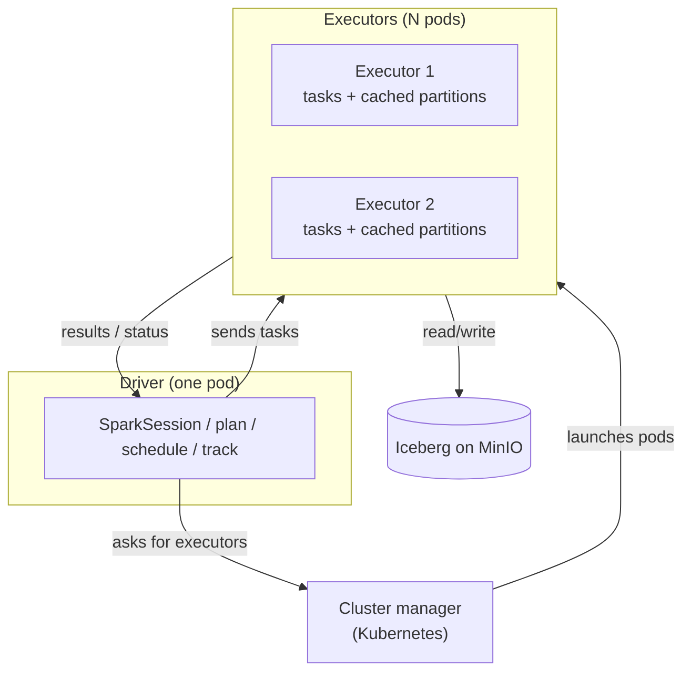

# Day 59 — Apache Spark: Architecture, Executors & the Driver

> Module 6: Batch Processing

Day 58 said Spark hides scale-out behind "a table made of partitions." Today we open that up: the
**driver** that plans the work, the **executors** that do it, and the **cluster manager** that gives
Spark its machines — which, on our stack, is **Kubernetes** (no YARN, no Hadoop). If you understood
Trino's coordinator + workers (Day 35), this is a close cousin with a different job.

## The three roles

- **Driver** — runs your program and the `SparkSession`. It builds the execution plan, splits it into
  tasks, schedules them onto executors, and tracks progress. One per application. If the driver dies,
  the application dies.
- **Executors** — worker processes (pods on K8s) that actually run tasks and hold partitions of data
  in memory/disk. More executors (or more cores each) = more parallelism.
- **Cluster manager** — hands Spark the machines. Spark supports YARN, Mesos, Standalone, and
  **Kubernetes**. On K8s the driver and executors are just **pods** the manager schedules — which is
  why "Spark on K8s" needs no separate cluster (Day 65).

## How work is broken down

Spark turns your code into a hierarchy, and the vocabulary matters for reading the UI and tuning:

| Unit | What it is |
|---|---|
| **Job** | triggered by an *action* (e.g. `.count()`, `.write()`) |
| **Stage** | a set of tasks that run without moving data between executors |
| **Shuffle** | the expensive boundary *between* stages — data is repartitioned across executors (e.g. a `groupBy` or join key) |
| **Task** | the smallest unit — one stage's work on **one partition**, run by one executor core |

**Partitions are the unit of parallelism.** A DataFrame is a set of partitions; Spark runs one task
per partition per stage. Too few partitions → idle executors; too many tiny ones → scheduling
overhead. The **shuffle** — moving data across the network so all rows with the same key land
together — is the costliest thing Spark does, so much of tuning (Day 64) is about minimising it.

## Driver + executors on Kubernetes

When a `SparkApplication` runs on K8s (via the Spark Operator, Day 65):

1. A **driver pod** starts and creates the `SparkSession`.
2. The driver asks K8s for **executor pods** (count/cores/memory from the spec).
3. K8s schedules those pods; tasks run on them; they read/write Iceberg on MinIO.
4. On completion the executor pods are torn down (driver lingers briefly for logs/UI).

Stateless, disposable pods — a killed executor's tasks just reschedule elsewhere, the same failure
model K8s is built for (and the same reason Trino's workers suit K8s).

## Spark vs Trino, structurally

Both are driver/coordinator + workers, but the *shape of the work* differs: Trino streams a query
through a pipeline of operators for **low latency**; Spark breaks a job into **stages separated by
shuffles** for **high throughput** on big, multi-step transforms. Same "one planner, many workers"
skeleton; different optimisation target.

## Applied example (🏏)

A Spark job over `lakehouse.cricket.batting` would spin up a driver pod + a couple of executor pods,
read the Iceberg table's Parquet from MinIO into partitions, and — because it's 20 rows — finish in
**one task on one executor**, the rest idle. That's the honest picture at cricket scale (Day 58's
caveat). But the *structure* is identical at any size: to process billions of rows you'd bump the
executor count and Spark would fan the same code across hundreds of tasks. Watching a trivial cricket
job in the Spark UI is the cheapest way to *see* driver → stages → tasks for real.

## Summary

A Spark application is a **driver** (plans/schedules/tracks) commanding **executors** (run tasks on
**partitions**, the unit of parallelism), with a **cluster manager** — **Kubernetes** for us —
supplying the pods. Work decomposes into jobs → stages → tasks, with **shuffles** as the costly
between-stage boundary. On K8s, driver and executors are disposable pods. Next: **Day 60 — PySpark
DataFrames & the Spark SQL API**, where we actually write against this engine.
