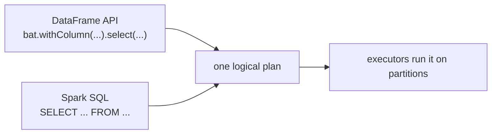

# Day 60 — PySpark: DataFrames & the Spark SQL API

> Module 6: Batch Processing

The driver/executor machinery (Day 59) is invisible when you write Spark — you work with a
**DataFrame**, a distributed table with a schema, using either the Python **DataFrame API** or plain
**SQL**. They compile to the *same* plan, so you pick whichever reads best. Today: the API, run for
real against the cricket Iceberg tables.

## A DataFrame is a distributed table

`spark.table("lakehouse.cricket.batting")` gives you a DataFrame backed by the Iceberg table on
MinIO — its rows spread across partitions on the executors, not pulled to the driver. You transform
it with methods that return **new** DataFrames (`select`, `withColumn`, `filter`, `groupBy`,
`orderBy`), and only an **action** (`show`, `count`, `write`) actually runs anything (Day 61).

From the verified cricket job (`jobs/cricket_batch.py`):

```python
from pyspark.sql import SparkSession, functions as F
spark = SparkSession.builder.appName("cricket-batch").getOrCreate()

bat = spark.table("lakehouse.cricket.batting")
print("rows:", bat.count())                       # -> READ ... rows: 20

ranges = ["_0_9","_10_19", ..., "_150x"]
innings = sum([F.col(c) for c in ranges])         # column expression, not a value yet
summary = (bat
    .withColumn("innings", innings)
    .withColumn("fifty_plus", F.col("_50_59")+ ... +F.col("_150x"))
    .select("player","season","total_runs","innings","fifty_plus")
    .orderBy(F.desc("total_runs")))
summary.show(5, truncate=False)
```

Real output on the cluster:

```
+---------------+------+----------+-------+----------+
|player         |season|total_runs|innings|fifty_plus|
+---------------+------+----------+-------+----------+
|Jonathan Dalley|2026  |754       |30     |7         |
|Nathan Botes   |2026  |275       |26     |1         |
|Harry Carter   |2026  |269       |37     |2         |
+---------------+------+----------+-------+----------+
```

## `F.col` and column expressions

`F.col("total_runs")` is a **column expression** — a description of a computation, not data. That's
why `sum([F.col(c) for c in ranges])` builds an "add these twelve columns" expression that Spark
later runs on every row in parallel. The `pyspark.sql.functions` module (`F`) is the toolbox:
`F.desc`, `F.round`, `F.sum`, `F.when`, `F.rank`, hundreds more — the same vocabulary as SQL.

## Same logic, as SQL

Every DataFrame operation has a SQL equivalent, and they compile to the identical plan:

```python
spark.sql("""
  SELECT player, total_runs,
         (_0_9 + _10_19 + ... + _150x) AS innings
  FROM lakehouse.cricket.batting
  ORDER BY total_runs DESC
""").show(5)
```

Use the **DataFrame API** when logic is dynamic (loops, conditional columns, reuse) — like building
`innings` from a Python list of column names. Use **SQL** when the transform is naturally a query.
Mixing is normal: read a table with `spark.table`, shape it with the API, register it and finish in
SQL.



## Applied example (🏏)

The job reads the 20-row `lakehouse.cricket.batting` Iceberg table, derives `innings` (Σ the twelve
run-range buckets) and `fifty_plus` with the DataFrame API, and orders by runs — Dalley 754 over 30
innings, exactly matching the dbt/DuckDB numbers from Module 4. Same open table, a third engine, same
answer. The 20 rows fit one partition, but the identical code fans across executors at any size.

## Summary

A Spark **DataFrame** is a distributed, schema'd table; you transform it with the **DataFrame API**
(`select`/`withColumn`/`orderBy` over `F.col` **column expressions**) or equivalent **SQL** — both
compile to one plan. Transformations are lazy descriptions; actions (`show`/`count`) run them.
Verified live reading the cricket Iceberg table and matching the Module 4 metrics. Next: **Day 61 —
lazy evaluation & query plans**, the "nothing runs until an action" model made visible.
