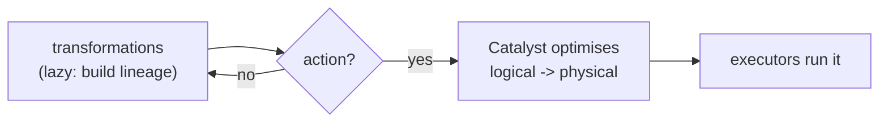

# Day 61 — PySpark: Lazy Evaluation & Query Plans

> Module 6: Batch Processing

Day 60 said transformations return new DataFrames but "nothing runs until an action." That's **lazy
evaluation**, and it's not a quirk — it's what lets Spark *optimise*. Because Spark sees the whole
chain of transformations before running any of it, it can rewrite the plan (prune columns, push down
filters, reorder) before a single byte moves. Today: how to see and read that plan.

## Transformations vs actions

- **Transformations** (`select`, `filter`, `withColumn`, `join`, `groupBy`) are **lazy** — they
  return a new DataFrame describing *what* to compute, and record it in a lineage graph. Nothing
  executes.
- **Actions** (`show`, `count`, `collect`, `write`) are **eager** — they force Spark to build an
  optimised plan from all the accumulated transformations and actually run it.

So a script can chain twenty transformations instantly and only "pause" at the first action. This is
why `bat.count()` and `summary.show()` are where time is spent, not the `withColumn` lines above them.

## Catalyst: logical → optimised → physical

When an action fires, Spark's **Catalyst optimiser** turns your transformations into a runnable plan
in stages: parse → **logical plan** → **optimised logical plan** (filter/projection pushdown,
constant folding) → **physical plan** (concrete operators, join strategies). `explain()` shows it.

From the verified cricket analytics job (`ranked.explain(mode="formatted")`), read **bottom-up**:

```
+- Project (6)
   +- Window (5)
      +- Window (4)
         +- Sort (3)
            +- Exchange (2)
               +- BatchScan lakehouse.cricket.batting (1)
```

1. **BatchScan lakehouse.cricket.batting** — read the Iceberg table (only the needed columns —
   projection pushdown means it scans `player`, `total_runs`, not all 23).
2. **Exchange** — a **shuffle**: repartition so the window can run (the costly step, Day 59).
3. **Sort** → **Window** → **Window** → **Project** — order, compute the window columns, select.

Execution is bottom-up (scan first); the plan text reads top-down. Then the **action** runs it:

```
=== ACTION triggers execution ===        <- .show() is where it actually ran
|Jonathan Dalley|754|1|28.0|
```

## Why lazy is faster

Because Spark holds the whole plan, it can:

- **Projection pushdown** — read only referenced columns from Parquet (huge on wide tables).
- **Predicate pushdown** — push `WHERE` into the Iceberg scan so files/rows are skipped (Day 31's
  stats, now driven by Spark).
- **Reorder & combine** — collapse adjacent operations, avoid materialising intermediates.

An imperative, eager engine can't do this — it would run each step blindly. Laziness is the price of
admission for optimisation.



## A real gotcha the plan revealed

The same job logged, five times:

```
WARN WindowExec: No Partition Defined for Window operation! Moving all data to a single partition
```

That's a genuine performance smell surfaced by the physical plan (the `Exchange` moving everything to
one partition) — a window with no `partitionBy` can't parallelise. Harmless on 20 rows, a disaster on
20 billion. **Reading the plan is how you catch these before they cost you** (more in Day 64).

## Applied example (🏏)

`ranked.explain()` on the cricket data shows Spark scanning only `player`/`total_runs` from the
Iceberg table (projection pushdown), then the `Exchange`/`Sort`/`Window` for the ranking — and only
`show()` triggered it. The optimisation is invisible at 20 rows but the *plan is identical* at scale,
which is exactly why you learn to read it on small data first.

## Summary

Spark transformations are **lazy** (build a lineage graph) and actions are **eager** (trigger
execution) — which lets **Catalyst** optimise the whole plan (projection/predicate pushdown,
reordering) before running. `explain(mode="formatted")` shows the physical plan; read it bottom-up
(`BatchScan → Exchange → Sort → Window`). We even caught a real "no partition defined" window warning
from the plan. Next: **Day 62 — groupBy, joins & window functions**, the transformations that make
shuffles happen.
