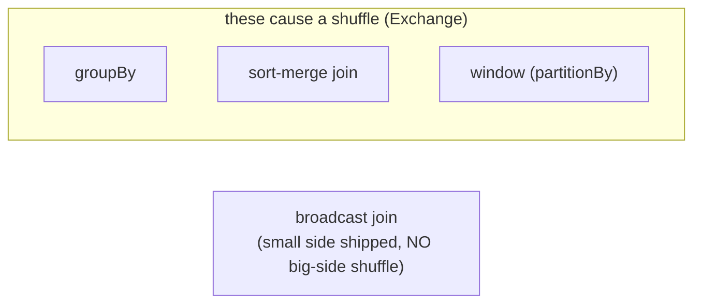

# Day 62 — PySpark: GroupBy, Joins & Window Functions

> Module 6: Batch Processing

The three transformations that do the analytical heavy lifting — **groupBy** (aggregate),
**join** (combine tables), and **window functions** (per-row calculations over a group) — all share
one trait: they usually trigger a **shuffle** (Day 59), the costly step where Spark moves rows across
executors so related data lands together. Understanding them is understanding where Spark spends time.

## groupBy — aggregate to fewer rows

```python
by_season = (bat.groupBy("season")
                .agg(F.count("*").alias("players"),
                     F.sum("total_runs").alias("runs"),
                     F.round(F.avg("total_runs"),1).alias("avg_runs")))
```

Spark shuffles rows so all of one `season` sits on one executor, then aggregates. Group cardinality
matters: few groups = cheap; millions of groups = a big shuffle.

## join — combine DataFrames

```python
batting.join(bowling, on="player", how="inner")     # all-rounders
```

Join strategy is Catalyst's call (visible in `explain()`):

- **Broadcast hash join** — if one side is small, Spark ships it to every executor (no shuffle of the
  big side). The fast path; Spark auto-broadcasts tables under `spark.sql.autoBroadcastJoinThreshold`.
- **Sort-merge join** — both sides shuffled on the key, sorted, merged. The scalable default for two
  large tables.

Picking join keys with even distribution avoids **skew** (one giant partition stalling the job).

## Window functions — per-row over a group

A window computes a value for each row *relative to a set of rows*, without collapsing them (unlike
groupBy). Verified live on the cricket data:

```python
from pyspark.sql.window import Window
w = Window.orderBy(F.desc("total_runs"))
ranked = (bat.withColumn("rank", F.rank().over(w))
             .withColumn("run_share_pct",
                 F.round(100*F.col("total_runs")/F.sum("total_runs").over(Window.partitionBy()),1)))
```

```
+---------------+----------+----+-------------+
|player         |total_runs|rank|run_share_pct|
+---------------+----------+----+-------------+
|Jonathan Dalley|754       |1   |28.0         |    <- 28% of the whole XI's runs
|Nathan Botes   |275       |2   |10.2         |
|Harry Carter   |269       |3   |10.0         |
+---------------+----------+----+-------------+
```

`rank`, `row_number`, `dense_rank`, `lag`/`lead`, running totals — all windows. Common uses:
"top N per group", "each row vs its group's average", "change since last period".

## The shuffle warning — a window gotcha

That job logged, for real:

```
WARN WindowExec: No Partition Defined for Window operation! Moving all data to a single partition,
this can cause serious performance degradation.
```

A window **without `partitionBy`** (a global rank, or my `Window.partitionBy()` for the grand total)
forces *all* rows onto one partition — no parallelism. Fine for a 20-player XI; ruinous at scale.
The fix when you can: `Window.partitionBy("season")` so each season's window runs in parallel. The
plan and the logs tell you when you've tripped it.



## Applied example (🏏)

Windows are perfect for cricket: rank batters by runs, each player's **share of the XI's total runs**
(Dalley a striking 28%), or — with `partitionBy("season")` — rank within each season as history
accumulates. A `batting.join(bowling, "player")` surfaces all-rounders (the OBT idea from Day 42, now
in Spark). At 20 rows it's instant and single-partition; the same code with `partitionBy` scales by
spreading each group across executors.

## Summary

**groupBy** (aggregate), **join** (combine — broadcast for a small side, sort-merge for two big
ones), and **window functions** (per-row over a group: rank, share, lag/lead) are the analytical core
— and each typically triggers a **shuffle**. We ran a live window: Dalley ranks #1 with 28% of the
XI's runs, and hit the real `No Partition Defined` warning that shows why `partitionBy` matters. Next:
**Day 63 — reading & writing Iceberg tables** from Spark.
