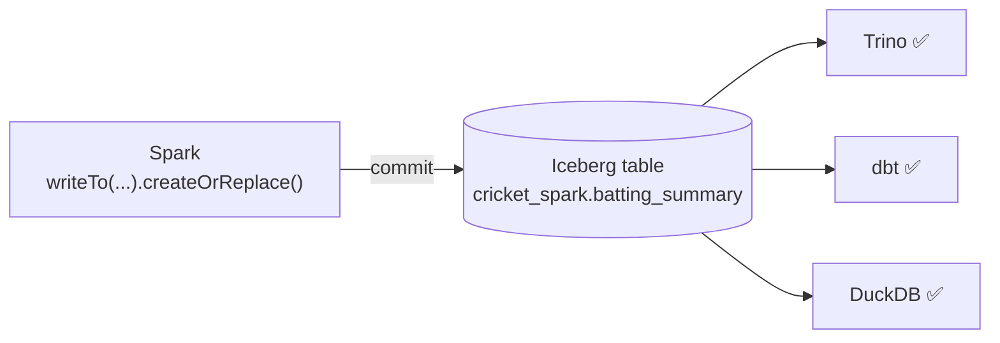

# Day 63 — Spark: Reading & Writing Apache Iceberg Tables

> Module 6: Batch Processing

Everything so far *read* the cricket Iceberg tables. Today Spark **writes** them — and the payoff of
the open lakehouse becomes concrete: Spark and Trino share the exact same tables, so a table Spark
creates is instantly queryable in Trino, dbt, and DuckDB with no export. The glue is Iceberg's
**REST catalog**, wired into Spark exactly as it is into Trino.

## Wiring Spark to the lakehouse catalog

Spark reaches Iceberg through a **catalog** defined in config (the SparkApplication's `sparkConf`).
This mirrors the Trino `lakehouse` catalog one-for-one:

```properties
spark.sql.extensions = org.apache.iceberg.spark.extensions.IcebergSparkSessionExtensions
spark.sql.catalog.lakehouse = org.apache.iceberg.spark.SparkCatalog
spark.sql.catalog.lakehouse.type = rest
spark.sql.catalog.lakehouse.uri = http://lakekeeper.lakehouse.svc.cluster.local:8181/catalog
spark.sql.catalog.lakehouse.warehouse = lakehouse
spark.sql.catalog.lakehouse.io-impl = org.apache.iceberg.aws.s3.S3FileIO
spark.sql.catalog.lakehouse.s3.endpoint = http://minio.minio.svc.cluster.local:9000
spark.sql.catalog.lakehouse.s3.path-style-access = true
spark.sql.catalog.lakehouse.s3.access-key-id = minio-admin
spark.sql.catalog.lakehouse.s3.secret-access-key = ***
```

Two runtime jars make it work (pulled via `spark.jars.packages`): `iceberg-spark-runtime-3.5` (the
connector) and `iceberg-aws-bundle` (S3FileIO + AWS SDK for MinIO). Same catalog, same MinIO, same
static-creds-now / vending-later story as Trino (Day 32).

## Reading

Once the catalog exists, a table is just `catalog.schema.table`:

```python
bat = spark.table("lakehouse.cricket.batting")     # -> READ ... rows: 20
# or: spark.read.format("iceberg").load("lakehouse.cricket.batting")
# time travel (Day 30) works too:
#   spark.read.option("snapshot-id", 4551…).table("lakehouse.cricket.batting")
```

## Writing — the DataFrameV2 API

Iceberg uses Spark's `writeTo` (DataFrameV2) API, which is explicit about intent:

```python
spark.sql("CREATE SCHEMA IF NOT EXISTS lakehouse.cricket_spark")
(summary.writeTo("lakehouse.cricket_spark.batting_summary")
        .using("iceberg").createOrReplace())        # -> WROTE ... rows: 20
```

| Method | Does |
|---|---|
| `.create()` | create a new table (fails if it exists) |
| `.createOrReplace()` | create, or atomically replace (a full-overwrite snapshot) — idempotent |
| `.append()` | add rows (new snapshot) |
| `.overwritePartitions()` | replace only the touched partitions (Day 31) |

Each is an atomic Iceberg commit (Day 30) — readers never see a half-written table. You can also
`CREATE TABLE ... PARTITIONED BY (...)` and Spark honours hidden partitioning.

## Verified: Spark writes, Trino reads — same table

The job wrote `lakehouse.cricket_spark.batting_summary` from Spark. Immediately, over in **Trino** (a
different engine, different pods), no export:

```sql
SELECT player, total_runs, innings, fifty_plus
FROM lakehouse.cricket_spark.batting_summary ORDER BY total_runs DESC LIMIT 3;
--  Jonathan Dalley | 754 | 30 | 7
--  Nathan Botes    | 275 | 26 | 1
--  Harry Carter    | 269 | 37 | 2
```

That interop is the entire thesis of the lakehouse: **one open table, many engines.**



## Applied example (🏏)

The `cricket_batch` job reads `lakehouse.cricket.batting`, derives innings/fifty-plus, and writes
`lakehouse.cricket_spark.batting_summary` — 20 rows in, 20 out, Dalley 754/30/7 — which Trino then
reads back identically. In a real pipeline Spark would own the *heavy* rebuilds (huge reprocessing,
ML feature tables) writing Iceberg, while Trino/dbt serve the interactive/tested layer on top — all
pointing at the same bytes on MinIO.

## Summary

Spark reads and writes Iceberg through a **REST catalog** configured just like Trino's (Lakekeeper +
S3FileIO on MinIO, two runtime jars). Read with `spark.table(...)`; write with the **`writeTo`**
DataFrameV2 API (`create`/`createOrReplace`/`append`/`overwritePartitions`), each an atomic snapshot.
Verified end-to-end: Spark wrote `cricket_spark.batting_summary` and Trino read it back unchanged —
one open table, many engines. Next: **Day 64 — partitioning, caching & performance tuning.**
