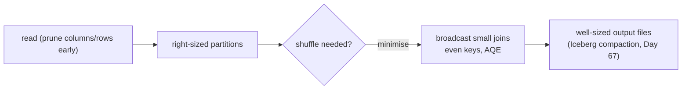

# Day 64 — Spark: Partitioning, Caching & Performance Tuning

> Module 6: Batch Processing

Spark's performance is mostly about one thing: **moving less data**. The two levers are
**partitioning** (how work is split for parallelism) and avoiding/So minimising **shuffles** (the
network step). Caching helps when you reuse a DataFrame. Today: the tuning knobs, and a real warning
the cricket job tripped that shows why they matter.

## Partitions — the unit of parallelism

A DataFrame is a set of partitions; Spark runs one task per partition per stage (Day 59). So:

- **Too few** partitions → idle executors (a 200-core cluster running 4 partitions uses 4 cores).
- **Too many tiny** ones → scheduling/overhead dominates.
- Rule of thumb: aim for partitions in the **hundreds of MB**, and roughly 2–4× your total cores.

Reshape with `repartition(n)` (a full shuffle, even sizing) or `coalesce(n)` (merges without a full
shuffle — for *reducing* partitions cheaply, e.g. before a write). `spark.sql.shuffle.partitions`
(default 200) controls post-shuffle partition count — often the first thing to tune.

## Shuffles are the cost

A **shuffle** (the `Exchange` in a plan, Day 61) moves rows across executors so related data
co-locates — triggered by `groupBy`, joins, and `partitionBy` windows (Day 62). It's the expensive
operation: network + disk + serialization. Minimising shuffles is most of tuning:

- **Broadcast the small side** of a join so the big side isn't shuffled.
- **Filter early** (predicate pushdown) so less data reaches the shuffle.
- **Pick even keys** to avoid **skew** (one huge partition stalling everyone).

## A real warning from the cricket job

The window job logged, verbatim:

```
WARN WindowExec: No Partition Defined for Window operation!
Moving all data to a single partition, this can cause serious performance degradation.
```

A window with no `partitionBy` forces **every row onto one partition** — zero parallelism. On the
20-row XI it's instant; on 20 billion rows it's a job-killer. The fix is to partition the window by a
real key (`Window.partitionBy("season")`) whenever the logic allows. **This is tuning in miniature:
the plan/logs told us where a shuffle collapsed parallelism.**

## Caching — for reuse only

`df.cache()` (or `.persist()`) keeps a DataFrame's computed partitions in executor memory so
**repeated** actions don't recompute from scratch. Worth it when you use the same DataFrame multiple
times (iterative algorithms, several reports off one base); pure waste for a read-once pipeline (it
just costs memory). Always `unpersist()` when done.

## Adaptive Query Execution (AQE)

Modern Spark (3.x, on by default) re-optimises **at runtime** using actual data sizes: it coalesces
shuffle partitions, switches to broadcast joins when a side turns out small, and splits skewed
partitions. It removes a lot of manual tuning — but you still choose partition keys, broadcast
candidates, and file sizes.



## Applied example (🏏)

At kilobytes, the cricket job needs **no** tuning — one partition, one task, done. So Module 6 uses
it to *see* the levers, not to need them: the `No Partition Defined` warning is a genuine tuning
lesson caught on tiny data, and the same `partitionBy("season")` fix is what would keep it parallel
across decades of seasons. Tune when the data earns it (Day 31's lesson, again) — and when it does,
the plan (Day 61) tells you where.

## Summary

Spark performance = **move less data**: right-size **partitions** (`repartition`/`coalesce`,
`spark.sql.shuffle.partitions`), **minimise shuffles** (broadcast small joins, filter early, even
keys), **cache** only for reuse, and let **AQE** re-optimise at runtime. The cricket window's real
`No Partition Defined` warning is tuning-in-miniature. Next: **Day 65 — the Spark Operator**, how all
this actually gets scheduled on Kubernetes.
