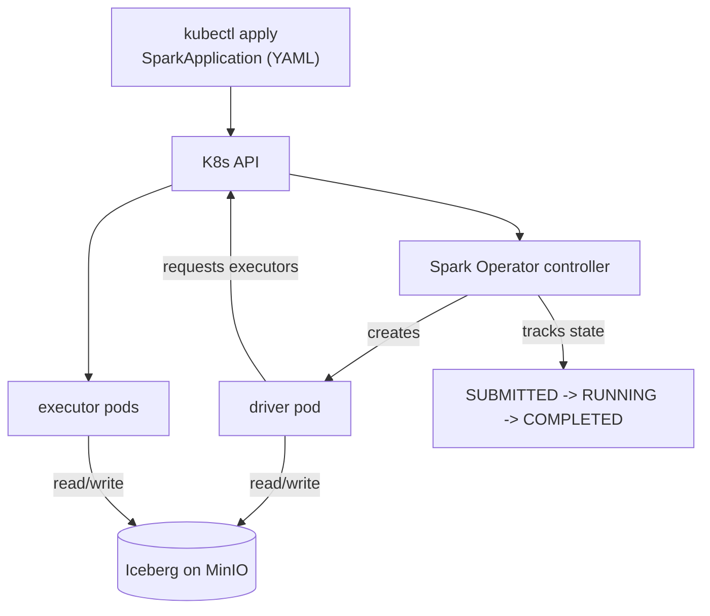

# Day 65 — Spark Operator: Deploying Spark Natively on Kubernetes

> Module 6: Batch Processing

Days 60–64 wrote Spark logic. But *how* does a job run on our cluster — no YARN, no Hadoop, no
standing Spark cluster? The **Kubeflow Spark Operator**: a controller that watches for a
**SparkApplication** custom resource and turns it into driver + executor pods. You declare a job as
YAML; Kubernetes runs it. This is Spark-on-K8s the cloud-native way.

## What the operator is

The Spark Operator is a Kubernetes **controller + CRDs**. Installed via Helm, it adds new resource
kinds and a controller that reconciles them — the same pattern as every other operator on the cluster
(CNPG for Postgres, Strimzi for Kafka later).

Deployed for real (verified):

```bash
helm repo add spark-operator https://kubeflow.github.io/spark-operator
helm upgrade --install spark-operator spark-operator/spark-operator \
  --namespace spark-operator \
  --set "spark.jobNamespaces={spark}" \
  --set webhook.enable=true
```

```
$ kubectl get pods -n spark-operator
spark-operator-controller-...   1/1   Running     # watches SparkApplications, creates pods
spark-operator-webhook-...      1/1   Running     # mutating webhook: injects config/volumes

$ kubectl get crd | grep spark
sparkapplications.sparkoperator.k8s.io            # a one-off job
scheduledsparkapplications.sparkoperator.k8s.io   # a cron job (Day 66)
sparkconnects.sparkoperator.k8s.io
```

Two components: the **controller** (reconciles SparkApplications → pods, tracks state) and a
**mutating webhook** (injects volumes/config/env into the driver & executor pods at creation).

## How a job runs



1. You `kubectl apply` a **SparkApplication**.
2. The operator sees it and creates a **driver pod** (with the injected config).
3. The driver requests **executor pods** from Kubernetes.
4. They run the job against Iceberg/MinIO; the operator tracks the state on the resource.
5. On completion, executors are torn down; the driver lingers (Completed) for logs.

No `spark-submit`, no gateway node — submission *is* creating a Kubernetes object.

## Namespacing & RBAC

`spark.jobNamespaces={spark}` tells the operator which namespace(s) to watch, and the chart creates a
**`spark-operator-spark` service account** there with RBAC to create pods. Each SparkApplication runs
its driver under that SA:

```yaml
driver:
  serviceAccount: spark-operator-spark
```

Separating the operator's namespace (`spark-operator`) from the jobs' namespace (`spark`) is the
tidy, least-privilege layout.

## Why this beats a standing cluster

- **No idle cluster** — pods exist only while a job runs, then vanish. You pay for compute only when
  processing (the same economics as the rest of our stack).
- **K8s-native** — scheduling, resource limits, autoscaling, failure recovery all come from
  Kubernetes, not a separate Spark master/YARN.
- **Declarative & GitOps-able** — a job is a YAML resource you can version, review, and apply like
  any other manifest.

> **Deploy gotcha (real):** a Helm `--wait` that gets interrupted can leave the release stuck
> `pending-install`, which blocks the next upgrade (`another operation in progress`). Fix:
> `helm uninstall` then reinstall — the CRDs persist, so no jobs are lost.

## Applied example (🏏)

The cricket Spark jobs (Days 60–63) ran exactly this way: `kubectl apply` a SparkApplication in the
`spark` namespace, the operator span up a `cricket-batch-driver` pod under `spark-operator-spark`,
that driver requested one executor, they read/wrote the Iceberg tables on MinIO, and the operator
marked the resource `COMPLETED`. Nothing was running before or after — the whole "cluster" existed for
~40 seconds.

## Summary

The **Spark Operator** is a Kubernetes controller + CRDs (installed via Helm) that turns a declared
**SparkApplication** into driver + executor pods — no YARN, no standing cluster, pods only while a job
runs. A **controller** reconciles the resource and a **webhook** injects pod config; jobs run in a
watched namespace under a dedicated service account. Verified: operator healthy, CRDs installed,
cricket jobs completed. Next: **Day 66 — the SparkApplication CRD in depth** (scheduling & resources).
