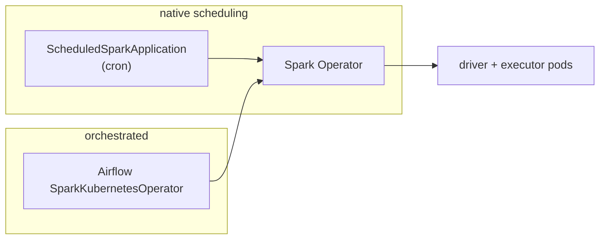

# Day 66 — SparkApplication CRD: Job Scheduling & Resource Management

> Module 6: Batch Processing

Day 65 stood up the operator; today we read the **SparkApplication** resource itself — the YAML that
*is* a Spark job on Kubernetes — plus how to schedule it (natively, or from Airflow) and size its
resources. This is the interface you actually work with day to day.

## Anatomy of a SparkApplication

Every field maps to something Spark needs, all declarative (from the verified cricket job):

```yaml
apiVersion: sparkoperator.k8s.io/v1beta2
kind: SparkApplication
spec:
  type: Python                         # Python | Scala | Java | R
  image: apache/spark:3.5.3            # the Spark runtime image
  mainApplicationFile: local:///opt/spark/app/job.py   # or an https:// / s3a:// URL
  deps:
    packages:                          # jars resolved from Maven at startup (Iceberg here)
      - org.apache.iceberg:iceberg-spark-runtime-3.5_2.12:1.6.1
      - org.apache.iceberg:iceberg-aws-bundle:1.6.1
  sparkConf: { ... }                   # the Iceberg REST catalog + S3 wiring (Day 63)
  driver:   { cores: 1, memory: "1g", serviceAccount: spark-operator-spark }
  executor: { instances: 1, cores: 1, memory: "1g" }
```

Where the code and config come from is flexible: `mainApplicationFile` can be baked in the image
(`local://`), fetched over `https://`, or pulled from `s3a://`; the script itself can be mounted from
a **ConfigMap** (what the standalone example does) so no image rebuild is needed to change logic.

## Resource management

The `driver`/`executor` blocks are the tuning surface that meets Kubernetes:

- **`executor.instances`** — how many executor pods (parallelism; Day 64).
- **`cores` / `memory`** — per-pod requests, which become K8s pod requests/limits — so Spark jobs
  schedule under the same quotas and limits as everything else on the cluster.
- **dynamic allocation** — Spark can add/remove executors based on load (set via `sparkConf`).

Because these are pod resources, a runaway Spark job can't blow past its namespace quota — Kubernetes
is the backstop.

## Lifecycle — states you can watch

The operator tracks the job on the resource's status. Verified live:

```
$ kubectl get sparkapplication -n spark
NAME            STATUS      ...
cricket-batch   SUBMITTED   ->  RUNNING  ->  COMPLETED
```

`SUBMITTED → RUNNING → COMPLETED` (or `FAILED`), with driver/executor pods appearing and tearing down
around it. `kubectl logs <name>-driver -n spark` gives you the driver output (where our `READ`/`WROTE`
lines and the DataFrame `show()` landed).

## Scheduling option 1 — ScheduledSparkApplication (native cron)

For "run this batch every night", the operator has a second CRD — a cron wrapper:

```yaml
kind: ScheduledSparkApplication
spec:
  schedule: "0 2 * * *"           # 02:00 daily
  concurrencyPolicy: Forbid       # don't overlap runs
  template: { ... }               # a SparkApplication spec
```

No Airflow needed for simple periodic jobs — Kubernetes runs it.

## Scheduling option 2 — from Airflow (orchestrated)

When the Spark job is one step in a bigger pipeline (the usual case), submit it from Airflow with
**`SparkKubernetesOperator`** (provider `cncf.kubernetes` 10.1.0), so it sits alongside the dlt/dbt
tasks:

```python
SparkKubernetesOperator(
    task_id="cricket_batch_spark",
    namespace="spark",
    application_file="cricket_batch_sparkapp.yaml",   # git-synced next to the DAG
    kubernetes_conn_id="kubernetes_default",          # in-cluster: airflow-worker SA
    get_logs=True, delete_on_termination=True,
)
```

The operator applies the SparkApplication, streams the driver logs into the Airflow task, and fails
the task if the Spark job fails — identical ergonomics to the dbt task (Day 48). Two things make it
work, applied out of band: **RBAC** letting the `airflow-worker` SA manage SparkApplications in the
`spark` namespace, and a **`minio-creds` Secret** so the git-synced YAML carries no plaintext keys
(Iceberg S3FileIO reads `AWS_*` from the env). Files:
[`spark_cricket_batch.py`](../examples/module2-airflow/dags/spark_cricket_batch.py),
[`cricket_batch_sparkapp.yaml`](../examples/module2-airflow/dags/cricket_batch_sparkapp.yaml),
[`airflow-spark-rbac.yaml`](../examples/module6-spark/airflow/airflow-spark-rbac.yaml).



## Applied example (🏏)

The cricket batch runs both ways: standalone via `kubectl apply` (verified `COMPLETED`, Days 60–65),
and — once pushed — from Airflow via `spark_cricket_batch`, so a Spark step could sit downstream of
the existing `cricket_lakehouse` ingest→promote→dbt pipeline. RBAC + the `minio-creds` secret are
applied; the live Airflow-submitted run is confirmed on the next push→git-sync→trigger (the Day-27
flow).

## Summary

A **SparkApplication** is a declarative Spark job: image, main file (image/`https`/`s3a`/ConfigMap),
`deps.packages`, `sparkConf` (the Iceberg wiring), and `driver`/`executor` resources that become K8s
pod requests. Watch it via `SUBMITTED→RUNNING→COMPLETED`. Schedule it natively
(**ScheduledSparkApplication** cron) or from Airflow (**SparkKubernetesOperator**, with RBAC + a creds
Secret). Next: **Day 67 — Spark + Iceberg maintenance jobs** (compaction & expiry at scale).
