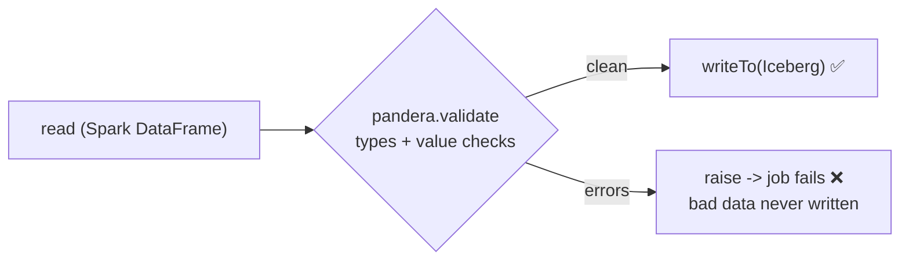

# Day 68 — Spark + Pandera: Validating Data Inside Pipeline Code

> Module 6: Batch Processing

Module 5 put quality at two boundaries: **Soda** scans tables at rest (Day 52), **dbt** tests after
transform (Day 43). **Pandera** fills the third: validation *inside the pipeline code*, on the
DataFrame in flight, before it's ever written. In a Spark job that means `pandera.pyspark` asserting a
schema — types **and** value rules — as part of the transformation itself.

## Pandera in a Spark job

`pandera.pyspark` validates a **native Spark DataFrame** against a `DataFrameSchema`: column types,
nullability, and value `Check`s. It returns the DataFrame annotated with any failures under
`df.pandera.errors` (structured, not an exception by default), so you decide whether to warn or fail.

```python
import pandera.pyspark as pa
from pandera.pyspark import DataFrameSchema, Column

schema = DataFrameSchema({
    "player":     Column(str, nullable=False),
    "season":     Column(int, pa.Check.equal_to(2026)),
    "total_runs": Column(int, pa.Check.greater_than_or_equal_to(0)),
    "high_score": Column(int, pa.Check.greater_than_or_equal_to(0)),
})
errors = schema.validate(df).pandera.errors      # {} = clean
```

## Verified in-cluster — and a real lesson

Run as a SparkApplication ([`jobs/cricket_validate.py`](../examples/module6-spark/jobs/cricket_validate.py)),
**pandera 0.20.4 loaded and executed inside the Spark driver** and enforced the contract. The first
pass flagged this, for real:

```
WRONG_DATATYPE: expected column 'season' to have type IntegerType(), got LongType()
... "greater_than_or_equal_to" was expected to be run for integer but got long instead ...
```

That's the lesson, not a bug: **types are part of the contract.** Iceberg `bigint` is Spark
`LongType`, so declaring `Column(int, ...)` and *not* casting makes pandera correctly reject the
DataFrame — and it won't even run the value checks until the type matches. The fix is to make the
data match the declared contract:

```python
bat = spark.table("lakehouse.cricket.batting").select(
    "player",
    F.col("season").cast("int").alias("season"),
    F.col("total_runs").cast("int").alias("total_runs"),
    F.col("high_score").cast("int").alias("high_score"))
```

With types aligned, the **value** checks do the guarding — a row with `total_runs = -5` trips
`greater_than_or_equal_to(0)`, exactly the in-pipeline catch we want, before any write.

## Fail the job, or just flag it

Because `errors` is data, you choose the policy:

```python
errors = schema.validate(df).pandera.errors
if errors:
    raise ValueError(f"cricket batting failed validation: {errors}")   # hard gate: fail the SparkApplication
# else: proceed to writeTo(...) — only validated data is written
```

Raising turns a bad batch into a red SparkApplication (and, orchestrated, a red Airflow task) — the
same gate philosophy as dbt tests, but *upstream of the write* rather than after it.

## Deployment note (honest)

The `apache/spark` image has no pandera, so the job pip-installs it on the driver at startup. That
**works but is slow** — `pandera[pyspark]` pulls pandas/numpy with no pip cache in the pod. For
production, **bake pandera into a custom Spark image** (or ship it as `deps.pyFiles`) instead of
installing per-run. Runtime-pip is fine for learning; a baked image is right for a scheduled job.



## Applied example (🏏)

The cricket batting contract in code: `player` non-null, `season == 2026`, `total_runs`/`high_score`
`>= 0`. Verified pandera running inside Spark and enforcing it (catching the bigint/int type mismatch
first — a genuine contract check). Wired to `raise`, a scrape that ever produced a negative score or a
null player would fail the Spark job *before* writing `cricket_spark.*` — quality enforced in the
transform code, complementing Soda (at rest) and dbt (post-transform).

## Summary

**Pandera** validates data **inside pipeline code**: `pandera.pyspark` checks a Spark DataFrame's
types and value rules, returning structured `errors` you can flag or `raise` on to gate the write.
Verified running in-cluster (pandera 0.20.4 in the Spark driver), where it enforced the contract —
including that **types are part of it** (Iceberg bigint = LongType; cast to match). Install via a
baked image in production, not per-run pip. That completes the three-layer quality story (Pandera +
Soda + dbt). Next: **Day 69 — the Module 6 hands-on**, assembling the batch pipeline.
