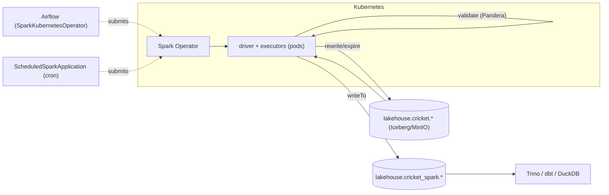
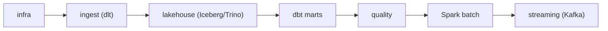

# Day 69 — Hands-On: Large-Scale Batch Processing Pipeline on K8s

> Module 6: Batch Processing

Module 6 built a complete Spark-on-Kubernetes batch capability across Days 58–68. Day 69 assembles it
into one hands-on map: **from an empty namespace to a scheduled, validated, self-maintaining Spark
batch job** on the Iceberg lakehouse — the checklist you'd follow on any cluster, with the cricket
jobs as the worked, verified example.

## The finished shape



## The build checklist

**1. Deploy the operator** (Day 65). Helm `spark-operator/spark-operator`, watching a job namespace;
it installs the SparkApplication CRDs and a controller that turns them into pods.

```bash
helm upgrade --install spark-operator spark-operator/spark-operator \
  --namespace spark-operator --set "spark.jobNamespaces={spark}" --set webhook.enable=true
```

**2. Wire Spark to the lakehouse** (Day 63). In `sparkConf`: the Iceberg **REST catalog** →
Lakekeeper, **S3FileIO** → MinIO, plus the two runtime jars (`iceberg-spark-runtime`, `iceberg-aws-bundle`)
— the exact mirror of the Trino catalog. Keep creds out of git via a Secret + `AWS_*` env.

**3. Write the job** (Days 60–63). PySpark: `spark.table(...)` to read, DataFrame API / SQL to
transform, `writeTo(...).createOrReplace()` to write Iceberg. Read the plan with `explain()` (Day 61);
mind shuffles and `partitionBy` (Days 62/64).

**4. Validate in-flight** (Day 68). `pandera.pyspark` schema on the DataFrame; `raise` on errors to
gate the write.

**5. Submit it** (Day 66). A `SparkApplication` (code from image / `https` / ConfigMap) — run standalone
(`kubectl apply`), on a cron (`ScheduledSparkApplication`), or from Airflow (`SparkKubernetesOperator`,
with RBAC + creds Secret).

**6. Maintain the tables** (Day 67). A scheduled Spark job calling `rewrite_data_files` +
`expire_snapshots` keeps the Iceberg tables healthy at scale.

## What we verified (all real, in-cluster)

| Day | Proof |
|---|---|
| 65 | Spark Operator 2.5.2 deployed; controller + webhook Running; CRDs installed |
| 60–63 | `cricket-batch` read `cricket.batting` (20) → wrote `cricket_spark.batting_summary` (20); **Trino read it back** |
| 61–62 | real physical plan (`BatchScan→Exchange→Sort→Window`) + a genuine `No Partition Defined` warning |
| 67 | `rewrite_data_files` 5 files → 1; `expire_snapshots` snapshots → 1, rows intact |
| 68 | pandera 0.20.4 ran in the Spark driver and enforced the type/value contract |

## Run the cricket jobs

```bash
# batch (read -> transform -> write Iceberg)
kubectl create configmap cricket-batch-code --from-file=job.py=jobs/cricket_batch.py -n spark \
  --dry-run=client -o yaml | kubectl apply -f -
kubectl apply -f cricket-batch-sparkapplication.yaml     # SUBMITTED -> RUNNING -> COMPLETED

# maintenance (compaction + expiry) and validation (Pandera) — same pattern, jobs/cricket_*.py
# orchestrated: examples/module2-airflow/dags/spark_cricket_batch.py (SparkKubernetesOperator)
```

## Where Spark sits in the platform (🏏)

The cricket data honestly doesn't *need* Spark (Trino/dbt handle kilobytes instantly) — Module 6 used
it to learn the engine on real infrastructure. In the platform, Spark is the **heavy-batch** member of
the team: Trino for interactive SQL, dbt for tested marts, **Spark for large reprocessing, ML feature
builds, and table maintenance** — all reading and writing the *same* open Iceberg tables on MinIO, all
schedulable from Airflow. Add executors and the identical cricket code scales to billions of rows.



## Summary

A production Spark batch capability on K8s is six steps: **operator → catalog wiring → job →
in-flight validation → submission (standalone / cron / Airflow) → maintenance**. The cricket jobs
prove each on real infrastructure — read/transform/write Iceberg (Trino reads it back), compaction &
expiry, and Pandera validation, all as SparkApplications the operator runs as disposable pods.
**Module 6 complete.** Next: **Module 7 — Streaming** (Kafka via Strimzi), moving from batch to
real-time.
