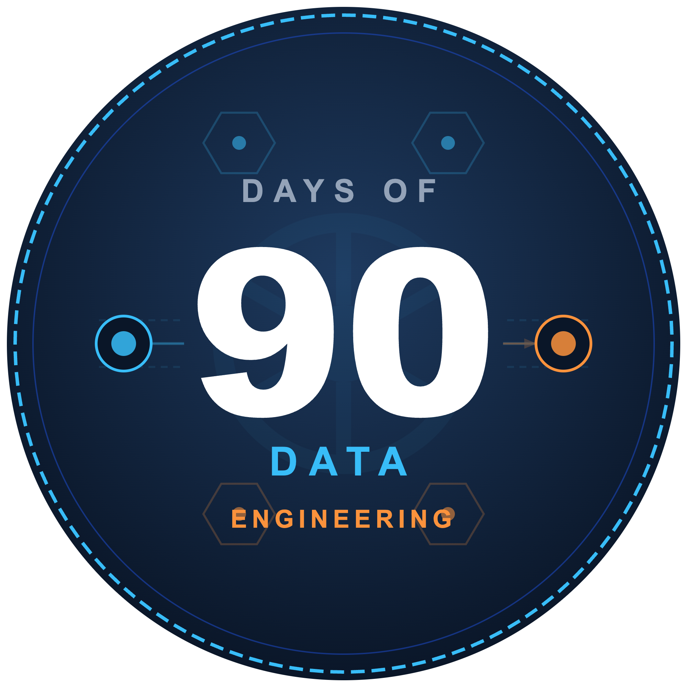
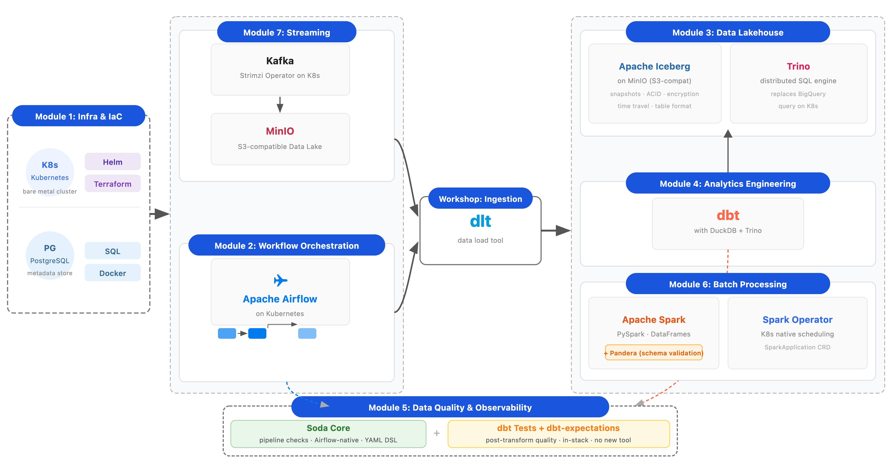

# 90DaysOfDataEngineering



A structured, hands-on 90-day learning journey through modern Data Engineering — built for people who already know DevOps and want to understand the data world without starting from scratch.

This project follows the same spirit as [#90DaysOfDevOps](https://github.com/MichaelCade/90DaysOfDevOps): learn in public, build real things, use open source tooling, and document everything along the way. No vendor lock-in. No managed cloud required. Everything runs on a local Kubernetes cluster.

> If you are new here — the #90DaysOfDevOps project ran for 3 seasons covering all things DevOps, DevSecOps, and platform engineering. This project picks up where that left off, taking the same infrastructure foundations (K8s, Terraform, Helm, CI/CD) and applying them to the data engineering world.

---

## Why Kubernetes as the baseline?

Most data engineering courses teach you to click through a cloud console. That works until you want to understand what's actually happening — or until you need to run things on-premise, in a restricted environment, or without a cloud bill.

This course uses a **local Kubernetes cluster as the foundation** for every module. The tools (Airflow, Spark, Kafka, MinIO, Trino) all have production-grade Helm charts and K8s operators. Running them yourself means you understand the infrastructure, not just the API surface.

If you have access to a cloud environment, everything here maps directly across. The concepts are identical; the deployment target is a choice.

---

## Architecture

The diagram below shows how the modules connect into a complete data platform. Each module introduces a new layer; by the end, you have a working end-to-end pipeline running on Kubernetes.



| Layer | Tool | Replaces (cloud equivalent) |
|---|---|---|
| Object Storage | MinIO | AWS S3 / GCS |
| Table Format | Apache Iceberg | — |
| Query Engine | Trino + DuckDB | BigQuery / Athena |
| Orchestration | Apache Airflow | Cloud Composer / MWAA |
| Ingestion | dlt (data load tool) | Fivetran / Airbyte |
| Transformation | dbt | — |
| Batch Processing | Apache Spark (Spark Operator) | Dataproc / EMR |
| Streaming | Apache Kafka (Strimzi) | Confluent Cloud / MSK |
| Quality | Soda Core + dbt Tests + Pandera | Monte Carlo / GE Cloud |
| Infra | Helm + Terraform + K8s | Cloud IaC |

---

## Prerequisites

This is not a beginner course. It assumes:

- Comfort with the Linux command line
- Basic Python (functions, loops, classes — not data science level)
- Familiarity with Docker and containers
- Some exposure to Kubernetes (you don't need to be an expert)
- Git and GitHub basics

If you need to build those foundations first, the [#90DaysOfDevOps 2022 edition](https://github.com/MichaelCade/90DaysOfDevOps/blob/main/2022.md) covers all of them.

---

## The 90-Day Plan

### Module 1: Infrastructure Foundation (Days 1–10)

The data stack runs on infrastructure. Before writing a single pipeline, we stand up the platform everything else depends on: a local K8s cluster, MinIO for object storage, PostgreSQL for metadata, and the tooling to manage it all.

- [ ] 🏗️ Day 1 > [What is Data Engineering? The Modern Data Stack Explained](#)
- [ ] 🏗️ Day 2 > [Why Kubernetes for Data Engineering?](#)
- [ ] 🏗️ Day 3 > [Setting Up a Local K8s Cluster (k3s / kind / minikube)](#)
- [ ] 🏗️ Day 4 > [Helm — Package Manager for the Data Stack](#)
- [ ] 🏗️ Day 5 > [Terraform for Data Infrastructure](#)
- [ ] 🏗️ Day 6 > [MinIO — S3-compatible Object Storage on K8s](#)
- [ ] 🏗️ Day 7 > [PostgreSQL on K8s — Metadata & Operational Store](#)
- [ ] 🏗️ Day 8 > [Storage Formats Deep Dive — Parquet, Avro, ORC](#)
- [ ] 🏗️ Day 9 > [DuckDB — Local Analytics Without a Cluster](#)
- [ ] 🏗️ Day 10 > [Hands-On: Build Your Local Data Platform Foundation](#)

---

### Module 2: Workflow Orchestration (Days 11–20)

Data pipelines are not scripts you run manually. Orchestration is what turns ad-hoc code into reliable, repeatable, observable pipelines. We use Apache Airflow — the industry standard — deployed on Kubernetes.

- [ ] ✈️ Day 11 > [What is Pipeline Orchestration? DAGs Explained](#)
- [ ] ✈️ Day 12 > [Apache Airflow — Core Concepts & Architecture](#)
- [ ] ✈️ Day 13 > [Deploying Airflow on K8s with Helm](#)
- [ ] ✈️ Day 14 > [Writing Your First DAG](#)
- [ ] ✈️ Day 15 > [Airflow Operators, Hooks & Connections](#)
- [ ] ✈️ Day 16 > [Dynamic DAGs, Templating & XComs](#)
- [ ] ✈️ Day 17 > [CI/CD for Data Pipelines with GitHub Actions](#)
- [ ] ✈️ Day 18 > [Monitoring Airflow — Metrics, Logs & Alerting](#)
- [ ] ✈️ Day 19 > [Idempotency, Backfilling & State Management](#)
- [ ] ✈️ Day 20 > [Hands-On: End-to-End Orchestrated Pipeline](#)

---

### Workshop: Data Ingestion (Days 21–27)

Getting data *into* your platform is the first practical problem. dlt (data load tool) is a lightweight, Python-native ingestion library that handles schema inference, incremental loading, and normalization — without the overhead of a full orchestration platform.

- [ ] 📥 Day 21 > [Data Ingestion Patterns — Batch, Micro-batch & Streaming](#)
- [ ] 📥 Day 22 > [dlt — Introduction & Core Concepts](#)
- [ ] 📥 Day 23 > [dlt — Ingesting from REST APIs](#)
- [ ] 📥 Day 24 > [dlt — Incremental Loading Strategies](#)
- [ ] 📥 Day 25 > [dlt — Schema Evolution & Data Contracts](#)
- [ ] 📥 Day 26 > [dlt — Loading to Iceberg on MinIO](#)
- [ ] 📥 Day 27 > [Hands-On: Build a Production Ingestion Pipeline](#)

---

### Module 3: Data Lakehouse (Days 28–39)

The lakehouse is the architectural pattern that underpins the modern data stack — open table formats on object storage, with multiple compute engines sharing the same data. We use Apache Iceberg on MinIO, with Trino as the SQL engine and DuckDB for local development.

- [ ] 🏔️ Day 28 > [Data Lake vs Data Warehouse vs Lakehouse — What Actually Differs](#)
- [ ] 🏔️ Day 29 > [Apache Iceberg — Architecture & Core Concepts](#)
- [ ] 🏔️ Day 30 > [Iceberg — Snapshots, Time Travel & ACID Transactions](#)
- [ ] 🏔️ Day 31 > [Iceberg — Partitioning Strategies & Performance](#)
- [ ] 🏔️ Day 32 > [Iceberg — Native Encryption & Security](#)
- [ ] 🏔️ Day 33 > [Iceberg — Compaction, Expiry & Table Maintenance](#)
- [ ] 🏔️ Day 34 > [MinIO — Advanced Configuration, Buckets & Policies](#)
- [ ] 🏔️ Day 35 > [Trino — Distributed SQL Engine on K8s](#)
- [ ] 🏔️ Day 36 > [Trino — Querying Iceberg Tables](#)
- [ ] 🏔️ Day 37 > [Trino — Performance Optimization & Cost Awareness](#)
- [ ] 🏔️ Day 38 > [DuckDB with Iceberg — Local Development Workflow](#)
- [ ] 🏔️ Day 39 > [Hands-On: Build a Lakehouse on Kubernetes](#)

---

### Module 4: Analytics Engineering (Days 40–49)

Analytics engineering is the discipline of applying software engineering practices to data transformation. dbt (data build tool) is the standard. It turns SQL into versioned, tested, documented, deployable data models.

- [ ] 🔧 Day 40 > [What is Analytics Engineering? The dbt Philosophy](#)
- [ ] 🔧 Day 41 > [dbt — Core Concepts: Models, Sources & Refs](#)
- [ ] 🔧 Day 42 > [dbt — Data Modeling: Star Schema & OBT Patterns](#)
- [ ] 🔧 Day 43 > [dbt — Generic & Singular Tests](#)
- [ ] 🔧 Day 44 > [dbt — Documentation, Lineage & the DAG](#)
- [ ] 🔧 Day 45 > [dbt — Macros, Packages & Jinja Templating](#)
- [ ] 🔧 Day 46 > [dbt-expectations — Extended Test Coverage](#)
- [ ] 🔧 Day 47 > [dbt with DuckDB — Fast Local Development](#)
- [ ] 🔧 Day 48 > [dbt with Trino — Production Deployment on K8s](#)
- [ ] 🔧 Day 49 > [Hands-On: End-to-End Analytics Engineering Project](#)

---

### Module 5: Data Quality & Observability (Days 50–57)

Bad data is worse than no data. Quality needs to be enforced at multiple points in the pipeline — at ingestion, between stages, and after transformation. This module covers three complementary tools that operate at different levels.

- [ ] ✅ Day 50 > [Data Quality — Why It Matters & Where It Breaks](#)
- [ ] ✅ Day 51 > [Data Contracts — Schema as a Binding Agreement](#)
- [ ] ✅ Day 52 > [Soda Core — Introduction & the SodaCL Check Language](#)
- [ ] ✅ Day 53 > [Soda Core — Integration with Airflow (Quality as a Pipeline Stage)](#)
- [ ] ✅ Day 54 > [Pandera — DataFrame Schema Validation in Python](#)
- [ ] ✅ Day 55 > [Pandera — Validating Spark & dlt Pipelines](#)
- [ ] ✅ Day 56 > [dbt Tests + dbt-expectations — Post-Transform Quality](#)
- [ ] ✅ Day 57 > [Hands-On: A Full Quality Framework Across the Stack](#)

---

### Module 6: Batch Processing (Days 58–69)

Apache Spark is the standard for large-scale data processing. Running Spark on Kubernetes via the Spark Operator means no separate cluster, no YARN, no Hadoop — just a SparkApplication resource submitted to K8s.

- [ ] ⚡ Day 58 > [Distributed Computing Fundamentals — Why Spark Exists](#)
- [ ] ⚡ Day 59 > [Apache Spark — Architecture, Executors & the Driver](#)
- [ ] ⚡ Day 60 > [PySpark — DataFrames & the Spark SQL API](#)
- [ ] ⚡ Day 61 > [PySpark — Lazy Evaluation & Query Plans](#)
- [ ] ⚡ Day 62 > [PySpark — GroupBy, Joins & Window Functions](#)
- [ ] ⚡ Day 63 > [Spark — Reading & Writing Apache Iceberg Tables](#)
- [ ] ⚡ Day 64 > [Spark — Partitioning, Caching & Performance Tuning](#)
- [ ] ⚡ Day 65 > [Spark Operator — Deploying Spark Natively on K8s](#)
- [ ] ⚡ Day 66 > [SparkApplication CRD — Job Scheduling & Resource Management](#)
- [ ] ⚡ Day 67 > [Spark + Iceberg — Compaction & Table Maintenance Jobs](#)
- [ ] ⚡ Day 68 > [Spark + Pandera — Validating Data Inside Pipeline Code](#)
- [ ] ⚡ Day 69 > [Hands-On: Large-Scale Batch Processing Pipeline on K8s](#)

---

### Module 7: Streaming (Days 70–79)

Not everything can wait for a batch job. Streaming is how you process data as it arrives. Kafka is the dominant event streaming platform; Strimzi makes it a first-class Kubernetes workload.

- [ ] 🌊 Day 70 > [Streaming Data — Concepts, Use Cases & Trade-offs vs Batch](#)
- [ ] 🌊 Day 71 > [Apache Kafka — Architecture, Topics, Partitions & Offsets](#)
- [ ] 🌊 Day 72 > [Kafka on K8s — The Strimzi Operator](#)
- [ ] 🌊 Day 73 > [Kafka — Producers, Consumers & Consumer Groups](#)
- [ ] 🌊 Day 74 > [Kafka Streams — Stateful Stream Processing & Windowing](#)
- [ ] 🌊 Day 75 > [Kafka — Schema Management with Avro & Schema Registry](#)
- [ ] 🌊 Day 76 > [Kafka → MinIO — Streaming Data into Object Storage](#)
- [ ] 🌊 Day 77 > [Kafka → Iceberg — The Streaming Lakehouse Pattern](#)
- [ ] 🌊 Day 78 > [Apache Flink on K8s — An Introduction (Kafka Streams Alternative)](#)
- [ ] 🌊 Day 79 > [Hands-On: Real-Time Streaming Pipeline into the Lakehouse](#)

---

### Final Project (Days 80–90)

The capstone ties every module together into a single, end-to-end data product. It ingests from a real source, lands in Iceberg, transforms with dbt, processes at scale with Spark, streams with Kafka, and enforces quality at every stage — all orchestrated by Airflow on Kubernetes.

- [ ] 🎯 Day 80 > [Capstone — Architecture Design & Data Product Scope](#)
- [ ] 🎯 Day 81 > [Capstone — Infrastructure Setup on K8s](#)
- [ ] 🎯 Day 82 > [Capstone — Ingestion Layer with dlt](#)
- [ ] 🎯 Day 83 > [Capstone — Lakehouse Layer: Iceberg on MinIO](#)
- [ ] 🎯 Day 84 > [Capstone — Orchestration: Airflow DAGs](#)
- [ ] 🎯 Day 85 > [Capstone — Transformations with dbt](#)
- [ ] 🎯 Day 86 > [Capstone — Quality Gates: Soda + dbt-tests + Pandera](#)
- [ ] 🎯 Day 87 > [Capstone — Batch Processing with Spark](#)
- [ ] 🎯 Day 88 > [Capstone — Streaming Layer with Kafka](#)
- [ ] 🎯 Day 89 > [Capstone — Metadata, Lineage & Data Product Documentation](#)
- [ ] 🎯 Day 90 > [Wrap-Up — Reflections, What's Next & Community Contributions](#)

---

## Tech Stack Summary

| Module | Tool | Purpose |
|---|---|---|
| 1 | Kubernetes, Helm, Terraform | Infrastructure foundation |
| 1 | MinIO | S3-compatible object storage |
| 1 | PostgreSQL, DuckDB | Metadata store, local analytics |
| 2 | Apache Airflow | Pipeline orchestration |
| Workshop | dlt | Data ingestion & loading |
| 3 | Apache Iceberg | Open table format (lakehouse) |
| 3 | Trino | Distributed SQL query engine |
| 4 | dbt + dbt-expectations | Transformations & testing |
| 5 | Soda Core | Pipeline-level data quality checks |
| 5 | Pandera | DataFrame schema validation |
| 6 | Apache Spark + Spark Operator | Batch processing at scale |
| 7 | Apache Kafka + Strimzi | Event streaming |

All tools are open source. Nothing requires a cloud account or paid licence.

---

## How to Use This Repository

Each day is a standalone markdown file under `/Days/` with:

- A concept explanation
- Hands-on steps you can follow along
- Links to further reading
- A short summary of what was covered

Days marked as **Hands-On** include a working example you can run against your local K8s cluster. The `/examples/` directory contains all supporting code, Helm values files, and Terraform configs.

```
90DaysOfDataEngineering/
├── README.md
├── plan.png
├── Days/
│   ├── Day1.md
│   ├── Day2.md
│   └── ...
└── examples/
    ├── module1-infra/
    ├── module2-airflow/
    ├── module3-lakehouse/
    └── ...
```

---

## Community & Contributions

This project is not sponsored by any vendor. All tool choices are made on merit for learning purposes.

If you are following along and spot something wrong, have a better approach, or want to contribute a day's content — pull requests are welcome.

Share your progress using **#90DaysOfDataEngineering** on LinkedIn or X.

---

## About

This project is part of the [#90Days series](https://github.com/MichaelCade/90DaysOfDevOps) started in 2022 as a learn-in-public initiative. The data engineering edition picks up where the DevOps editions left off — same approach, different domain.

---

## Licence

This work is licensed under a [Creative Commons Attribution-NonCommercial-ShareAlike 4.0 International License](http://creativecommons.org/licenses/by-nc-sa/4.0/).
