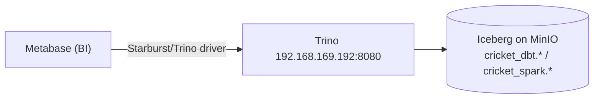

# Bonus — Metabase → Trino (the dashboard / serving layer 📊)

Not in the original 90-day plan, but the missing piece: a **BI tool** so you can actually *see* the
data. Metabase points at **Trino**, so it reads the exact same Iceberg tables the whole platform
produces — the `cricket_dbt` marts (Module 4), the `cricket_spark` tables (Module 6) — with no new
pipeline. Charts and dashboards on top of the lakehouse, zero extra copies.



## What gets deployed (`metabase.yaml`)

| Piece | Detail |
|---|---|
| Metabase | `metabase/metabase:v0.52.2`, ns `metabase`, H2 app-db on a 5Gi `ceph-block` PVC |
| Trino driver | Starburst driver **6.1.0** (matches Metabase 0.52) fetched by an initContainer into `/plugins` |
| Ingress | Traefik `websecure` → `https://metabase.192.168.169.190.nip.io` (same pattern as Airflow) |

```bash
kubectl apply -f metabase.yaml
# wait ~1-2 min for boot; verify:
kubectl get pods -n metabase
curl -sk https://metabase.192.168.169.190.nip.io/api/health   # {"status":"ok"}
```

Verified on deploy: pod Ready, `/api/health` 200, and the **`starburst` driver registered** (so the
Trino connection option appears).

## Finish setup (2 minutes, in the browser)

1. Open **https://metabase.192.168.169.190.nip.io** and complete the first-run wizard — create your
   admin account (your email + password; set these yourself).
2. When it asks to **add your data**, choose **Starburst** and enter:

   | Field | Value |
   |---|---|
   | Display name | `Cricket Lakehouse` |
   | Host | `trino.lakehouse.svc.cluster.local` |
   | Port | `8080` |
   | Catalog | `lakehouse` |
   | Schema (optional) | `cricket_dbt` |
   | Username | `metabase` (any value — cluster Trino has no auth) |
   | Password | *(leave blank)* |
   | Use a secure connection (SSL) | **off** |

   (You can add a second connection with Catalog `lakehouse`, Schema `cricket_spark` to browse the
   Spark-written tables too.)

3. Metabase syncs the schema; now **Browse data → Cricket Lakehouse → batting_summary** etc., or
   **+ New → Question** to chart them.

## Things to try (🏏)

- **Bar chart**: `batting_summary` — `player` vs `total_runs` (who scored most).
- **Scatter**: `bowling_summary` — `economy_rate` (x) vs `strike_rate` (y), coloured by
  `bowling_style` — the econ-vs-strike-rate trade-off, visualised.
- **Table with conditional formatting**: `player_season_summary` — the all-rounder OBT.
- Save a few into a **Dashboard** = your cricket coaching board, refreshed whenever the pipeline runs.

## Make the columns self-explaining

The marts have a lot of *derived* columns (Conversion %, bowling_style, disciplines_contributed…).
Two aids:

- **[Data dictionary](../module4-dbt/DATA_DICTIONARY.md)** — every column in plain English, how it's
  computed, and which raw fields feed it.
- **[`sync_descriptions_to_metabase.py`](sync_descriptions_to_metabase.py)** — pushes those
  descriptions into Metabase so hovering a column (or the ⓘ in a question) explains itself. You run
  it with your own Metabase admin API key (nothing sensitive is committed):

  ```bash
  export METABASE_URL="https://metabase.192.168.169.190.nip.io"
  export METABASE_API_KEY="mb_..."          # Admin > Settings > API Keys
  export METABASE_DB="Cricket Lakehouse"    # the data-source name you created
  python sync_descriptions_to_metabase.py --dry-run    # preview
  python sync_descriptions_to_metabase.py              # apply
  ```

## Notes

- **H2 app-db** (on the PVC) is fine for a personal instance; for a shared/production Metabase use a
  Postgres app-db (a CNPG `metabase` database, same pattern as Airflow/Lakekeeper).
- **PodSecurity**: the cluster warns this deployment isn't `restricted`-compliant. It runs fine (warn
  mode); to harden, add `allowPrivilegeEscalation: false`, `capabilities.drop: [ALL]`,
  `runAsNonRoot: true`, and `seccompProfile: RuntimeDefault` to the containers.
- **Auth boundary**: this repo/deploy never sets your Metabase admin credentials — you create them in
  the wizard.
