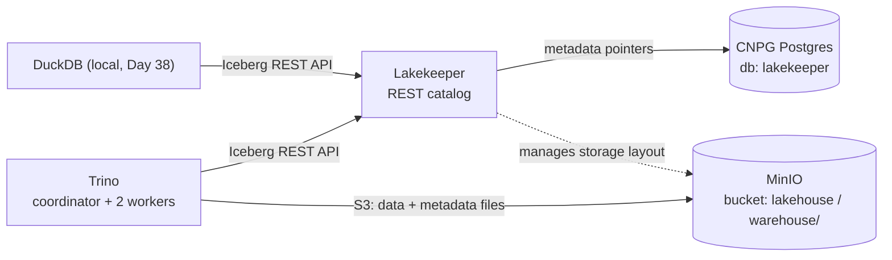

# Module 3 — Data Lakehouse (Apache Iceberg + Trino on MinIO)

An open lakehouse on the cluster: **Apache Iceberg** tables stored in **MinIO**, catalogued by
**Lakekeeper** (an Iceberg REST catalog), queried by **Trino**. No vendor lock-in — the same
Iceberg tables are readable by Trino, DuckDB, Spark (Module 6) and dlt (Day 26).



## What's deployed (namespace `lakehouse`)

| Component | How | Endpoint |
|---|---|---|
| **Lakekeeper** 0.12.2 (Iceberg REST catalog) | Helm `lakekeeper/lakekeeper` 0.11.0, `lakekeeper-values.yaml` | `http://lakekeeper.lakehouse.svc:8181` (`/catalog` = Iceberg REST, `/management` = admin) |
| **Trino** 480 (2 workers) | Helm `trino/trino` 1.42.2, `trino-values.yaml` | `http://192.168.169.192:8080` (MetalLB LB) — Web UI + SQL |
| Catalog metadata store | CNPG Postgres db/role `lakekeeper` (`lakekeeper-database.yaml` + a managed role on the `pg` cluster) | — |
| Object storage | MinIO bucket `lakehouse`, warehouse named `lakehouse` (prefix `warehouse/`) | — |

## Deploy steps (what was done)

1. **MinIO bucket** `lakehouse`.
2. **CNPG**: added a `lakekeeper` managed role (merge-patched onto the `pg` cluster, preserving
   the existing LoadBalancer service) + a `Database` CR (`lakekeeper-database.yaml`); password in
   secret `postgres/lakekeeper-db` (and a copy `lakehouse/lakekeeper-db-lh` for the app).
3. **Lakekeeper** via Helm (external CNPG DB, OSS `core` edition, no bundled Postgres).
4. **Bootstrap + warehouse** via the management API:
   ```bash
   # bootstrap once
   curl -X POST http://lakekeeper:8181/management/v1/bootstrap \
     -H 'Content-Type: application/json' -d '{"accept-terms-of-use": true}'
   # create the MinIO-backed warehouse
   curl -X POST http://lakekeeper:8181/management/v1/warehouse -H 'Content-Type: application/json' -d '{
     "warehouse-name":"lakehouse",
     "storage-credential":{"type":"s3","credential-type":"access-key",
       "aws-access-key-id":"minio-admin","aws-secret-access-key":"<pw>"},
     "storage-profile":{"type":"s3","bucket":"lakehouse","region":"local-01","flavor":"s3-compat",
       "endpoint":"http://minio.minio.svc.cluster.local:9000","path-style-access":true,
       "sts-enabled":false,"key-prefix":"warehouse"},
     "delete-profile":{"type":"hard"} }'
   ```
5. **Trino** via Helm with a `lakehouse` Iceberg-REST catalog (see `trino-values.yaml`).

## Connect & query

```bash
# Python (trino client) or DuckDB or dbt-trino — all speak to the LB:
#   host=192.168.169.192 port=8080 user=admin catalog=lakehouse
python -c "from trino.dbapi import connect; c=connect(host='192.168.169.192',port=8080,user='admin',catalog='lakehouse').cursor(); c.execute('SHOW SCHEMAS FROM lakehouse'); print(c.fetchall())"
```

```sql
CREATE SCHEMA lakehouse.demo;
CREATE TABLE lakehouse.demo.t (id int, name varchar);
INSERT INTO lakehouse.demo.t VALUES (1,'iceberg');
SELECT * FROM lakehouse.demo.t;   -- data + metadata land in s3://lakehouse/warehouse/
```

## Gotchas (learned deploying this)

- **Trino 480 uses `fs.native-s3.enabled=true`** (+ `s3.*`) for the native S3 file system. The
  property was renamed to `fs.s3.enabled` in a *later* release — using the wrong one crash-loops
  the coordinator with "Configuration property … was not used".
- Lakekeeper's `delete-profile` `soft` requires `expiration-seconds`; `hard` doesn't. We used `hard`.
- MinIO needs `path-style-access: true` and `flavor: s3-compat` in the storage-profile, and
  `s3.path-style-access=true` in Trino.
- Trino queries MinIO with **static creds** (simple, reliable). Lakekeeper credential-vending /
  remote-signing is an optional later upgrade.

## Loading data in (Day 26)

dlt's direct-to-Iceberg-catalog support isn't production-ready yet (see [Day 26](../../Days/Day26.md)),
so we land with dlt and **promote with Trino**: a `postgres` catalog (CNPG `appdb`) is added to
Trino, then `CREATE TABLE lakehouse.… AS SELECT * FROM postgres.…` materialises Postgres tables
as real Iceberg tables. See [`promote-cricket-to-iceberg.sql`](promote-cricket-to-iceberg.sql) —
`cricket.batting/bowling/fielding` now live as Iceberg in this lakehouse.

## Next

- **Day 27** — run dlt inside Airflow (scheduled ingestion).
- **Day 38** — DuckDB reads the same Iceberg tables locally.
- **Module 4** — dbt (dbt-trino) turns the cricket lakehouse tables into tested models.
