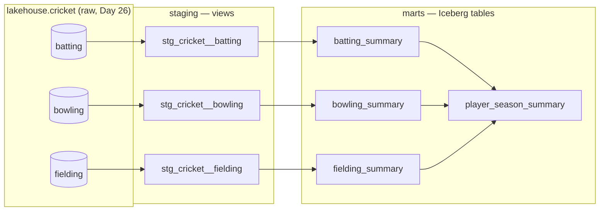

# Module 4 — Analytics Engineering (dbt + dbt-trino)

dbt turns the raw cricket tables in the Iceberg lakehouse into **tested, documented, versioned
models**. Same data, same engine (Trino), but now the transformations are SQL files under version
control with a dependency graph and a test suite — not ad-hoc queries.

The project is [`cricket_lakehouse/`](cricket_lakehouse/). It reads the Iceberg tables promoted in
[Day 26](../../Days/Day26.md) (`lakehouse.cricket.*`) and writes models into a new schema
`lakehouse.cricket_dbt.*` — so the raw landing zone is never touched.



## What each layer does

| Layer | Materialised as | Job |
|---|---|---|
| **sources** | (points at existing tables) | Declares `lakehouse.cricket.{batting,bowling,fielding}` so models `ref` them, not hard-coded names. |
| **staging** (`stg_*`) | **views** | One per source. Light cleaning + the derivations the marts need: batting `innings` (Σ run-range buckets), the bowling `is_wicketless` flag that explains the NULL strike rates, `best_bowling` → `best_wickets`/`best_runs`, a fielding keeper/fielder role. |
| **marts** | **Iceberg tables** | The metrics people query: `conversion_pct`, `early_exit_pct` (batting); economy-vs-strike-rate + `bowling_style` (bowling); `catch_pct` by role (fielding); and `player_season_summary`, a one-big-table row per player joining all three. |

## The metric definitions (the point of Module 4)

- **Conversion %** = hundreds ÷ (fifties + hundreds) — how often a start becomes a big score.
- **Early Exit %** = single-digit (0–9) innings ÷ innings — soft-dismissal risk.
- **Economy vs strike rate** — two ways to bowl well, shown side by side (`bowling_style` labels the mix).
- **Catch %** = catches ÷ total victims, split by keeper/fielder so like compares with like.
- **Cleaning the `-` strike rates** — wicketless bowlers can't have a strike rate. dlt parked the
  literal `'-'` in a `strike_rate__v_text` variant column and left the numeric one NULL; staging
  gives that NULL a *meaning* (`is_wicketless`) and a singular test asserts the NULL appears in
  exactly those rows and nowhere else.

## Tests

`dbt build` runs 35 tests alongside the models:

- **Generic** (in `_*.yml`): `not_null`, `unique_combination_of_columns` (player+season),
  `accepted_range` (percentages 0–100, counts ≥ 0), `accepted_values` (role, bowling_style),
  `relationships` (every mart player traces back to staging). `accepted_range`/`accepted_values`/
  `unique_combination_of_columns` come from the **dbt_utils** package (`packages.yml`).
- **Singular** (`tests/*.sql`): the business invariants —
  [`assert_bowling_strike_rate_null_iff_wicketless`](cricket_lakehouse/tests/assert_bowling_strike_rate_null_iff_wicketless.sql)
  (the `-` cleaning invariant) and
  [`assert_batting_ranges_reconcile`](cricket_lakehouse/tests/assert_batting_ranges_reconcile.sql)
  (0–9 count and milestones can't exceed innings).

## Run it

```bash
pip install -r ../../requirements.txt        # brings in dbt-trino
cd cricket_lakehouse
dbt deps  --profiles-dir .                    # install dbt_utils
dbt build --profiles-dir .                    # run models + tests against the lakehouse
dbt docs generate --profiles-dir . && dbt docs serve --profiles-dir .   # lineage + docs UI
```

`profiles.yml` points at the same Trino LoadBalancer everything else uses
(`192.168.169.192:8080`, catalog `lakehouse`, no auth). Last run:

```
Done. PASS=42 WARN=0 ERROR=0 SKIP=0 TOTAL=42
  (3 view models, 4 table models, 35 data tests)

batting_summary — best conversion (2+ fifty-plus scores):
  Jonathan Dalley  30 inns  754 runs  7×50+  conversion 42.9%  early-exit 33.3%

bowling_summary — economy vs strike rate:
  Harry Carter  37 wkts  econ 3.75  SR 16.95  -> "both — economical strike bowler"
  5 wicketless bowlers -> strike_rate NULL (cleaned from '-'), flagged is_wicketless

fielding_summary:
  Joe Genever (keeper)  13 victims  12 catches  catch 92.3%
```

## Gotchas (learned building this)

- **Staging as views works on the Iceberg REST catalog** — Lakekeeper + Trino support Trino
  views, so `stg_*` are views (cheap) while marts are real Iceberg tables.
- **`100.0` is `DECIMAL` in Trino, not double** — rate columns came back as `Decimal('0E-15')`.
  Use `100e0` (a double literal) so `conversion_pct` etc. render as clean doubles.
- **`boolean` doesn't auto-cast to `integer`** — `disciplines_contributed` uses `if(cond,1,0)`,
  not `(cond)+(cond)`.
- **dbt 1.10 generic-test args** now nest under an `arguments:` key (otherwise a deprecation
  warning per test); the `_*.yml` files use the new form.
- **`+on_table_exists: replace`** (dbt-trino) rebuilds marts with `CREATE OR REPLACE TABLE`,
  which Iceberg supports — simpler than the default rename dance.

## Next

- **Day 41–48** drill into the pieces: refs & sources, star/OBT modelling, generic vs singular
  tests, docs & lineage, macros/packages, dbt-with-DuckDB, then dbt-with-Trino on K8s.
- **Module 5** — quality gates (Soda + dbt tests + Pandera) enforce these invariants in the pipeline.
