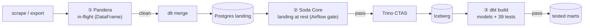

# Module 5 — Data Quality & Observability

Bad data is worse than no data — it fails silently. This module enforces quality at **three
boundaries** with three complementary tools, so a wrong value has to beat all of them to reach a
dashboard.



| # | Tool | Boundary | Guards | Days |
|---|---|---|---|---|
| ① | **Pandera** | in-flight (Python DataFrame) | values, cross-column rules, before load | 54–55 |
| ② | **Soda Core** | landing at rest (SQL) | counts, dupes, ranges, reconciliation | 52–53 |
| ③ | **dbt tests / dbt-expectations** | post-transform (marts) | keys, ranges, formats, invariants | 56 (built in Module 4) |

Overlap is deliberate — **defence in depth**: Pandera catches a bad record, Soda a bad load, dbt a
bad transform. Each sees a failure the others can't.

## What's here

```
examples/module5-quality/
├── soda/
│   ├── configuration.yml        # Postgres landing data source (password via ${POSTGRES_APP_PASSWORD})
│   └── checks/cricket.yml        # SodaCL checks (verified 11/11 pass)
└── pandera/
    ├── schemas.py                # DataFrameSchemas for batting/bowling
    └── validate_cricket.py       # pulls cricket.batting -> validates (verified 20 rows valid)
```

The **dbt** layer lives in [`../module4-dbt/`](../module4-dbt/) (39 tests). The **Airflow gates**
live in the [`cricket_lakehouse` DAG](../module2-airflow/dags/cricket_lakehouse.py):
`load → validate_landing (Soda) → promote → transform_with_dbt (dbt tests)`.

## Run the checks

```bash
pip install -r ../../requirements.txt        # soda-core-postgres, pandera, duckdb
export POSTGRES_APP_PASSWORD='...'

# Soda: scan the Postgres landing zone
cd soda && soda scan -d cricket_pg -c configuration.yml checks/cricket.yml

# Pandera: validate the batting DataFrame in-flight
cd ../pandera && python validate_cricket.py
```

## Gotchas (learned building this)

- **Soda's Trino connector requires HTTPS** — it can't scan our internal plain-HTTP Trino
  (lakehouse). Enable Trino TLS (Day 32) to scan Iceberg directly; until then, gate on the Postgres
  landing zone (the right place to catch a bad load anyway).
- **No secrets committed** — Soda reads the password from `${POSTGRES_APP_PASSWORD}`; the Airflow
  Soda task reads it from the `postgres_appdb` connection. Pre-push secret scan is SOP.
- **`lazy=True` in Pandera** collects *all* failures with row-level detail, not just the first —
  what you want in a pipeline.
- **Soda exits non-zero (2) on failure**, and its Python `assert_no_checks_fail()` raises — both make
  it a real pipeline gate.

## Next

- **Module 6 — Batch Processing (Spark)**: distributed compute over the same Iceberg lakehouse;
  Pandera's PySpark backend (Day 55) applies the same in-flight validation at scale.
