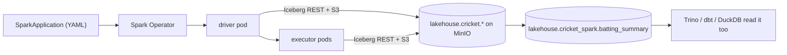

# Module 6 — Batch Processing (Apache Spark on Kubernetes)

**Apache Spark** as the batch/large-scale compute engine, run via the **Kubeflow Spark Operator** —
no YARN, no Hadoop, no standing cluster. A job is a `SparkApplication` resource; Kubernetes turns it
into driver + executor pods that read/write the **same Iceberg tables** (Module 3) as Trino and dbt.



## What's deployed

| Component | How | Namespace |
|---|---|---|
| Spark Operator 2.5.2 | Helm `spark-operator/spark-operator`, `spark.jobNamespaces={spark}` | `spark-operator` |
| SparkApplication CRDs | installed by the chart | cluster-wide |
| Jobs run here | SA `spark-operator-spark` | `spark` |

```bash
helm repo add spark-operator https://kubeflow.github.io/spark-operator
helm upgrade --install spark-operator spark-operator/spark-operator \
  --namespace spark-operator --set "spark.jobNamespaces={spark}" --set webhook.enable=true
```

## The job

[`jobs/cricket_batch.py`](jobs/cricket_batch.py) — reads `lakehouse.cricket.batting`, derives innings
+ fifty-plus (DataFrame API), writes `lakehouse.cricket_spark.batting_summary` (Iceberg). The Spark
↔ Iceberg wiring (REST catalog → Lakekeeper → MinIO, mirroring the Trino catalog) is in the
SparkApplication's `sparkConf`.

**Run it standalone** ([`cricket-batch-sparkapplication.yaml`](cricket-batch-sparkapplication.yaml)):

```bash
kubectl create namespace spark --dry-run=client -o yaml | kubectl apply -f -
kubectl create configmap cricket-batch-code --from-file=job.py=jobs/cricket_batch.py -n spark \
  --dry-run=client -o yaml | kubectl apply -f -
# set the MinIO secret in the YAML (or use the env-var pattern below), then:
kubectl apply -f cricket-batch-sparkapplication.yaml
kubectl get sparkapplication -n spark -w        # SUBMITTED -> RUNNING -> COMPLETED
kubectl logs cricket-batch-driver -n spark      # READ ... 20 / WROTE ... 20
```

Verified run:

```
READ  lakehouse.cricket.batting rows: 20
+---------------+------+----------+-------+----------+
|player         |season|total_runs|innings|fifty_plus|
|Jonathan Dalley|2026  |754       |30     |7         |
+---------------+------+----------+-------+----------+
WROTE lakehouse.cricket_spark.batting_summary rows: 20
```

…then in **Trino**: `SELECT * FROM lakehouse.cricket_spark.batting_summary` returns the same rows —
one open table, many engines.

## Run it from Airflow (orchestrated)

[`../module2-airflow/dags/spark_cricket_batch.py`](../module2-airflow/dags/spark_cricket_batch.py)
submits [`cricket_batch_sparkapp.yaml`](../module2-airflow/dags/cricket_batch_sparkapp.yaml) via
`SparkKubernetesOperator`. Two one-time prereqs:

```bash
kubectl apply -f airflow/airflow-spark-rbac.yaml          # airflow-worker may submit to ns spark
kubectl create secret generic minio-creds -n spark \      # creds via env (no plaintext in git)
  --from-literal=AWS_ACCESS_KEY_ID=minio-admin --from-literal=AWS_SECRET_ACCESS_KEY=<pw>
```

The git-synced SparkApplication carries **no** secret — Iceberg S3FileIO reads `AWS_*` from the
`minio-creds` Secret, and the PySpark code is fetched over HTTPS (`mainApplicationFile`).

## Gotchas (learned deploying this)

- **Helm `--wait` interrupted → release stuck `pending-install`** (blocks upgrades). Fix:
  `helm uninstall` + reinstall; CRDs persist.
- **Secrets out of git**: the standalone YAML uses a placeholder; the Airflow one uses a K8s Secret +
  `AWS_*` env (S3FileIO default credential chain) so nothing sensitive is committed.
- **Window without `partitionBy`** logs `No Partition Defined ... moving all data to a single
  partition` — fine on 20 rows, a perf killer at scale (Day 62/64).

## Lessons

Days [58](../../Days/Day58.md)–[66](../../Days/Day66.md): distributed fundamentals, architecture,
PySpark DataFrames/lazy-eval/joins-windows, reading & writing Iceberg, performance, the Spark
Operator, and the SparkApplication CRD. Days 67–69 (maintenance jobs, Pandera-in-Spark, hands-on) to
come.
